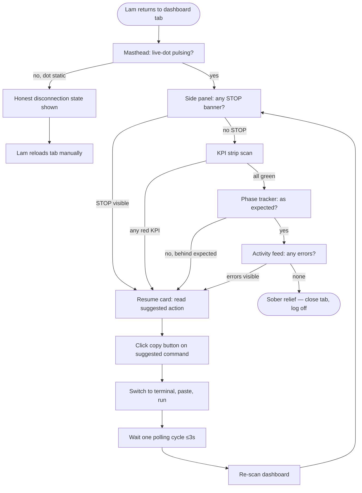
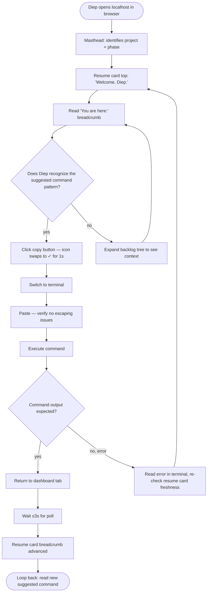
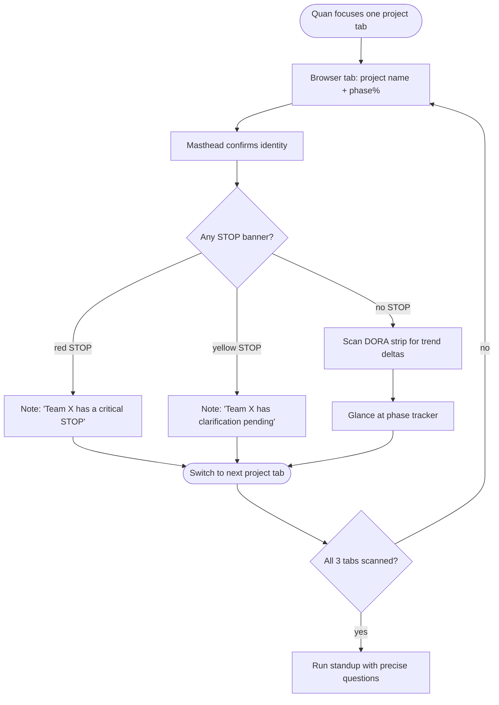

# UX Design Specification — SDLC-Framework Ops Console

**Author:** Vuonglq01685
**Date:** 2026-05-07
**Status:** Complete v1.0 — Workflow signed off 2026-05-07

---

## Executive Summary

### Project Vision

The SDLC-Framework dashboard is a first-class product surface — an "editorial ops console" for software development governance. Unlike typical developer-tool dashboards, it adopts a magazine-register design language (serif headings via Fraunces, monospace technical labels via JetBrains Mono, dark paper-tone palette) to elevate trust, calm, and information density. It is read-only by design in v1: the dashboard reports state but never mutates it. Mutations happen through CLI slash commands; the dashboard surfaces "where you are" and "what to run next" through a primary resume card affordance.

### Target Users

- **Lam (primary)** — Tech lead managing 3-7 engineers across multiple concurrent projects. Uses the dashboard to verify auto-loop progress, spot STOP triggers requiring human judgment, and audit phase signoffs. Trust UX is paramount; ambiguity is the failure mode.

- **Diep (secondary)** — Mid-level engineer joining mid-stream. Uses the resume card to answer "where am I, and what do I run?" without asking teammates. Onboarding success = first commit by lunch on day one.

- **Quan (secondary)** — Project manager overseeing multiple teams. Uses the dashboard before standup to scan DORA metrics and STOP banners across project ports. Goal: never interrupt engineers mid-flow.

- **Khanh (validated, not v1-driving)** — Brownfield maintainer using adopt-mode. Reads adopt-report surfaces but does not drive layout decisions in v1.

### Key Design Challenges

1. **Codify, don't invent.** A working prototype (`docs/ux/dashboard-prototype/dashboard.html`) already expresses the intended visual language. The UX spec's job is to formalize it into deterministic tokens, components, and states — not to redesign.

2. **Read-only paradox.** v1 has no write endpoints, yet the dashboard must drive next-action behavior. The resume card carries the interactive weight through command-as-text + copy affordance.

3. **STOP-outranks-routine hierarchy.** PRD requires STOP banners to "visually outweigh" routine activity. This must be operationalized as concrete token deltas (size, weight, color contrast, position, absence of decay animation) — not described in adjectives.

4. **3-second polling under no animation budget.** With state.json refreshing every 3s and partial DOM updates, expensive transitions will break. Motion language must favor stillness, with state transitions handled by content swap rather than choreography.

5. **Multi-project ergonomics for PM-as-reader.** Each project runs on its own localhost port. Visual project identity (name, phase color accent) must be unambiguous so Quan never reads the wrong tab.

6. **Local-first asset constraint.** No Google Fonts CDN, no icon font CDN, no build step, vanilla JS only, Chart.js vendored. Every design choice must survive these constraints.

### Design Opportunities

1. **Editorial register as competitive moat.** The "newspaper of operations" treatment differentiates from generic dashboard templates. Spec should protect this register through explicit anti-pattern guidance (no rounded shadcn cards, no neon-accent gradients, no centered hero CTA).

2. **Resume card as signature pattern.** Frame, accent border, syntax-highlighted command, and explicit copy affordance can elevate "you are here" into the framework's most recognizable surface.

3. **Signoff 4-state cell as visual signature.** The four states (awaiting / drafted / approved / invalidated) expressed as four distinct cell treatments is novel. Treat as a documented, reusable visual pattern across phase tracker, audit history, and any future approval surfaces.

4. **Serif-on-numbers reliability cue.** Fraunces for KPI/DORA values creates a typographic trust signal absent from typical "Inter everywhere" dashboards.

### Locked Design Decisions (from discovery)

These decisions are captured up-front to constrain the rest of the specification work. Each decision below is binding unless explicitly revised in a later step or workflow.

| ID | Decision | Rationale |
|---|---|---|
| **DD-01** | **Dark mode only.** No light theme ships in v1. | Stakeholder decision (2026-05-07). **Supersedes PRD §381–388** which committed to light editorial palette as v1 default; PRD will be updated for traceability in a separate workflow. |
| **DD-02** | **No external brand.** Accent token derives from prototype value (`oklch` equivalent of `#E27858` warm-coral) and is treated as the framework's de-facto brand color. | No brand assets exist; prototype color already validated by stakeholder. |
| **DD-03** | **Inline SVG icon system, 12-icon minimum set.** Stroke-only, 1.5px, square caps. Vendored as a single `sprite.svg` referenced via `<use>`. | Local-first constraint forbids icon-font CDNs; text-first bias preserves editorial register. |
| **DD-04** | **Desktop-only.** Minimum viewport width 1280px; no mobile or tablet layouts in v1. | All target users (Lam, Diep, Quan) work on laptops/desktops; SDLC work itself requires a coding workstation. |

## Core User Experience

### Defining Experience

The SDLC-Framework dashboard serves a **dual-core** user experience. Both cores are equal-priority; the spec must optimize for both simultaneously.

**Core 1 — Trust Scan (Lam, Quan).** Within 5 seconds of arrival, a returning user must answer: *"Is everything OK, or do I need to act?"* This is satisfied by the masthead (project + phase + percent), the KPI strip (DORA, change failure rate, MTTR), and the STOP-banner side panel. No interaction required; reading is the action.

**Core 2 — Resume Onboarding (Diep, Lam after a context-loss break).** Within 30 seconds, a fresh-context user must answer: *"Where am I, and what do I run next?"* This is satisfied by the resume card, which shows the literal CLI command verbatim, ready to copy and paste in a terminal. The dashboard does not execute commands; it surfaces them.

These two cores are not in tension — they share the same surfaces (masthead, phase tracker, resume card, backlog tree). The spec's job is to ensure no design decision favors one core at the cost of the other.

### Platform Strategy

| Decision | Value |
|---|---|
| Surface | Local web dashboard, browser-rendered |
| Scope | **Single project per dashboard instance** (DD-05) |
| Theme | **Dark mode only** (DD-01) |
| Minimum viewport | **1280px desktop only** (DD-04) |
| Input | Mouse + keyboard (no touch optimization) |
| Stack | stdlib `http.server` + vanilla HTML/JS + Chart.js (vendored) |
| Update model | 3-second polling on `/state.json` with ETag/304 |
| Multi-project (Quan) | Solved by **multiple browser tabs**, each bookmarked to a different `localhost:<port>`. No in-dashboard project switcher in v1. |

### Effortless Interactions

Two interactions must feel weightless:

1. **Backlog tree keyboard navigation.** The Epic → Story → Task tree is fully navigable without a mouse:
   - `Arrow Down` / `Arrow Up` — move focus to next / previous visible row
   - `Arrow Right` — expand a collapsed parent
   - `Arrow Left` — collapse an expanded parent (or move focus to parent if already collapsed)
   - `Enter` — focus the current node and surface its detail (no navigation; read-only highlight)
   - `Home` / `End` — jump to first / last visible row
   - Visible focus ring required (not just hover styling).

2. **Phase tracker state transition.** When a signoff progresses (`awaiting → drafted → approved`, or `→ invalidated`), the cell updates **synchronously on the next poll** via content swap:
   - Icon, label, and color tokens for the new state replace the previous treatment in a single DOM update.
   - No transition animation, no flicker, no spinner.
   - The four distinct cell treatments (per signoff visual contract) make the change perceivable at a glance without choreography.

Other interactions (text selection, copy, anchor links) rely on native browser behavior and require no special design.

### Critical Success Moments

These are the moments that determine whether the dashboard succeeds for its primary journeys. Each is paired with the failure mode it must defeat.

| Moment | Success | Failure to defeat |
|---|---|---|
| **Diep's first arrival** (Journey 4, Wednesday 9:00 AM) | Resume card readable in under 5 seconds; suggested command obvious and copyable; she runs it without asking. | She lands and asks teammates "where do I start?" — meaning the resume card failed to ground her. |
| **Lam's auto-loop check** (Journey 2) | A new STOP banner is unmissable from any scroll position; semantic color *and* text label ensure perception under any color-vision profile. | **STOP-blends-in** — STOP banner is lost in the activity feed; Lam scrolls past it; trust UX collapses. |
| **Phase signoff approval** (Journey 1) | Phase tracker cell switches from `drafted-not-approved` to `approved` on the next poll; visual change is immediate, no refresh required, no animation needed. | User sees stale `drafted` state, manually refreshes browser, loses confidence in liveness. |
| **Resume card freshness** | Card always reflects the latest `state.json`; an "as of HH:MM:SS" timestamp + the live-dot pulse confirm freshness; on poll diff, content swaps in place. | **Stale-command** — User runs an outdated suggested command, hits an error, blames the framework. |
| **Multi-tab project clarity** (Journey 5, applied to single-project mode) | Browser tab title and masthead carry unambiguous project identity (name + phase + port); user running multiple project tabs never reads the wrong one. | User acts on the wrong project's data thinking it's another's. |

### Experience Principles

These seven principles guide every subsequent design decision in this specification. Where two decisions conflict, the lower-numbered principle wins.

1. **Glance before click.** Every screen state must answer "is everything OK?" within 2 seconds of arrival. Information density per pixel is optimized for scanning, not for drill-down.

2. **Hierarchy enforces trust.** STOP banners visually outweigh everything else through position (sticky side panel), typography weight (heavier than body), size (1.25× body minimum), color (semantic with text label — never color-only, per WCAG 2.2 A), and absence of decay (no auto-dismiss).

3. **Stillness with substance.** No animation theatrics. State changes via content swap, not choreography. The only motion permitted is the live-indicator dot pulse and the STOP-banner severity dot pulse.

4. **Command-as-affordance.** When the dashboard suggests an action, the literal CLI string is shown verbatim in JetBrains Mono with explicit copy treatment. Never paraphrase a command into prose.

5. **Freshness over fancy.** Polling is invisible. Stale data is the worst sin. If `state.json` ETag matches, skip render; if it differs, swap content immediately. Never show a "refreshing..." spinner.

6. **Keyboard parity for navigation.** Backlog tree and phase tracker must be fully keyboard-navigable. Mouse is supplementary, not required, for any read-only task.

7. **Editorial sobriety.** Treat the dashboard as a newspaper of operations, not a video-game UI. No rounded shadcn cards, no neon-accent gradients, no centered hero CTAs, no decorative illustrations. Typography and rhythm carry the work.

### Locked Design Decisions Update

| ID | Decision | Rationale |
|---|---|---|
| **DD-05** | **Single-project per dashboard instance.** No in-dashboard project switcher, no multi-project aggregation surfaces in v1. Quan's multi-team workflow uses one browser tab per project (one `localhost:<port>` each). | Stakeholder decision (2026-05-07). Aligns with architecture: one dashboard server per project. Simplifies layout decisions; removes the "project identity" failure mode at the in-dashboard level (it remains at the browser-tab level). |

## Desired Emotional Response

### Primary Emotional Goals

Two primary emotions, equal weight, applied to different surfaces:

1. **Earned satisfaction** — *moments-based.* When a user completes a meaningful action (signoff approved, story merged, phase locked), the dashboard reflects the state change immediately and accurately. The satisfaction comes from "the tool tells me what I just accomplished, without theatrics."

2. **Competent control** — *continuous state.* While the dashboard is open, the user feels they have all the information needed to act, and nothing more is being hidden. The dashboard is honest, complete, and quiet — three qualities that compound into a sense of mastery.

**Secondary feelings:** trust, calm, oriented, included (Diep), alert (when STOP fires).

**Forbidden feelings:** delight, surprise, excitement, anxiety, condescension, dependence, gamified accomplishment.

### Emotional Journey Mapping

**Lam — Friday auto-loop check (Journey 2)**

1. *Approach (browser tab open):* watchful preparedness — "what did the loop produce?"
2. *First scan (under 5 s):* either earned satisfaction (all green, STOP-free) or alerted control (STOP banner visible, semantic + textual signal).
3. *Resolution:* sober relief — "the framework didn't waste my time."

**Diep — first arrival Wednesday (Journey 4)**

1. *Initial state:* slight uncertainty (new to project, not new to coding).
2. *Resume card read:* warm orientation — "Welcome, Diep. You are here:" (greeting is once per session, then drops to "You are here:" alone).
3. *Command copied + run:* belonging through clarity — she contributes within the team's flow on day one without having to ask.

**Quan — pre-standup scan (Journey 5)**

1. *Time pressure:* prepared — "I have 5 minutes to gather facts."
2. *DORA + STOP scan:* informed control — every team's status is legible at a glance.
3. *Standup conducted:* respect for engineers' flow — he didn't ping anyone in Slack; he asked precise questions only.

### Micro-Emotions

**To cultivate:**

- *Confidence over confusion* — every state has a label and a reason.
- *Trust over skepticism* — timestamps, hashes, and signoff records make provenance visible.
- *Calm focus over anxious checking* — polling is invisible; freshness is signaled by the live-dot.
- *Earned satisfaction over reward animation* — a green check is sufficient.
- *Inclusion over isolation* (Diep) — "you are here" is informational, not performative.

**To prevent:**

- *Anxiety* — never leave the user wondering "is this still working?"; if the backend is unreachable, show an explicit "disconnected" state, never silence.
- *Frustration* — never show stale data without a freshness signal.
- *Overwhelm* — high information density is allowed, but the visual hierarchy must be unambiguous.
- *Cynicism* — no fake "AI thinking..." spinners, no dishonest progress bars, no infinite spinners on stable state.
- *Condescension* — no exclamation marks, no emojis, no "Welcome back, Lam! 👋", no badges, no "Great job!".
- *Dependence* — the dashboard never withholds information to incentivize return visits.

### Design Implications

How emotional goals translate to concrete design rules for subsequent steps:

| Emotional goal | Design rule |
|---|---|
| Earned satisfaction (on state change) | **DD-06.** Acknowledge state changes through content delta only — never via CSS transitions, transforms, fade-ins, or scale animations. The four distinct signoff treatments + backlog tree position shifts + paired text updates carry perception of change. |
| Competent control (continuous) | KPI strip is always full and current; if a metric cannot be computed, display `n/a` with the reason on hover — never a blank cell. |
| Calm focus | No notification system in v1. STOP banners are persistent surfaces, not toasts. No sound. No browser-notifications-API usage. |
| Alert without alarm | STOP severity is conveyed through semantic color + text label + persistent dot pulse (the only motion permitted) + sticky position. No shake, no flash, no auto-scroll. |
| Inclusion (Diep) | **DD-07.** Resume card opens with "Welcome, {user}." once per browser session, then drops to "You are here:" only. Identifier resolved from `$USER` or `project.yaml`. No emojis, no exclamation marks. |
| Trust through provenance | Every actionable surface (signoff states, KPI numbers, resume card command) is paired with a freshness timestamp or "as of HH:MM:SS" footer. |
| Anti-cynicism | No spinners on operations that complete in under 100 ms (per NFR-PERF-3, that's every dashboard read). |

### Emotional Design Principles

These principles supplement the seven from §Core User Experience. Where they conflict, the lower-numbered principle from §Core wins.

1. **Sober trust over delight.** Aim for "of course it works", never "wow, it works".
2. **Earned, not given.** Acknowledgment is reserved for actual state changes — not for arrival, not for idle viewing, not for page load.
3. **Alert without alarm.** Severity is conveyed through semantic + textual + positional cues; never through theatrics.
4. **Honest disconnection.** When the dashboard cannot reach state, it says so explicitly. Silence is forbidden.
5. **Once is enough.** Per-session greetings and welcomes appear once and then yield to functional content. Daily users are not patronized.
6. **No sentiment in UI copy.** No exclamation marks, no emojis, no "Great job!", no "Awesome!". Copy is informational; sentiment is a leak from consumer UX.

### Locked Design Decisions Update

| ID | Decision | Rationale |
|---|---|---|
| **DD-06** | **Acknowledge state changes via content delta only.** No CSS transitions, transforms, fade-ins, or scale animations. The four distinct signoff cell treatments + backlog-tree position shifts + paired text updates carry perception. | Honors principle #3 (stillness) while addressing the concern that users may miss silent swaps. If the four treatments are not visibly distinct enough, the fix is in token contrast — not in motion. |
| **DD-07** | **Resume card greeting: "Welcome, {user}." once per browser session, then "You are here:" only.** User identifier resolved from `$USER` or `project.yaml`. No emojis, no exclamation marks, no time-of-day variants. | Stakeholder decision (Q11): warm tone for new joiners (Diep) without patronizing daily users (Lam). Session-scoping resolves the tension. |

## UX Pattern Analysis & Inspiration

The reference for this dashboard is **the existing prototype** (`docs/ux/dashboard-prototype/dashboard.html`). It is not "one of several inspirations" — it is the canonical visual contract that this specification codifies.

The purpose of this section is to **decode** the UX patterns already present in the prototype: name them, attribute them to the broader design lineage they came from, and decide what each pattern contributes to the spec. This decoding makes the prototype's implicit choices explicit so engineers and future contributors can extend the design without breaking its DNA.

### Patterns present in the prototype (decoded)

| Pattern | Where in the prototype | Lineage | Role in the spec |
|---|---|---|---|
| **Editorial masthead** | Top bar with project name + phase + arrow accent + uppercase mono sub-line + live-dot | Newspaper / broadsheet (NYT, FT) | Project identity surface; carries trust register |
| **Serif numerals on KPI** | KPI strip values in Fraunces, oversized; mono labels above; bordered-rule strip | Stripe-style developer dashboards using serif accents on numbers | KPI strip pattern; signals reliability without flash |
| **Tabular data discipline** | KPI strip with vertical rules instead of cards; horizontal rule top/bottom | Bloomberg Terminal / financial tooling | Information density without "card spam" |
| **Tree-of-records navigation** | Backlog tree with collapsible Epic → Story → Task | Linear / GitHub repo view | Backlog navigation; keyboard parity attaches here |
| **Mono technical labels in caps** | Section labels uppercase, JetBrains Mono, letter-spacing widened | Linear / GitHub / OS-native ops tools | Information taxonomy without iconography load |
| **Color tokens by phase + semantic** | Accent (`#E27858` warm coral) + green/amber/red/blue/purple, all with `oklch` or `color-mix` soft variants | Newspaper editorial pulled-quote color rules | Phase color discipline; semantic color discipline |
| **Live-dot pulse** | Small dot in masthead pulsing every 2.4s | Status pages (Statuspage, Linear status) | Liveness indicator; only motion on the page |
| **Bordered rules over shadows** | Hairline borders (`rule`, `rule-strong`) replace box shadows | Print-design grid; opposite of shadcn | Section separation without depth illusions |
| **Fraunces hero typeset on hero numerals** | KPI value sizing 44px in Fraunces, very tight letter-spacing | NYT data-journalism display style | Visual weight on the numbers that matter |

### Anti-patterns to avoid

These are patterns that would dilute the prototype's identity if imported in subsequent steps:

- **Generic shadcn-Tailwind dashboards** — rounded cards, default-blue accent, lucide-icon spam, centered hero CTA. Conflicts with editorial sobriety (principle #7 of §Core).
- **Vercel-style "dark + neon gradient"** — wrong register for SDLC governance and audit-grade trust.
- **Notification stacks** — toasts, popups, browser-notifications API. Forbidden by emotional principle #3 ("Alert without alarm") and emotional principle #4 ("Honest disconnection" but no decay).
- **Gamified DORA** — badges, streaks, "your team is awesome!" copy. Forbidden by emotional principle #6 ("No sentiment in UI copy").
- **AI-themed visuals** — sparkles, generative-art backgrounds, "AI thinking..." spinners. Triggers cynicism; conflicts with "Anti-cynicism" design implication.
- **3D chart effects, drop shadows, neon glow** — editorial sobriety; also breaks performance budget (NFR-PERF-3).
- **Right-rail tooltips / onboarding tours** — patronizing for daily users; the resume card already carries the orientation load.
- **Skeleton loaders / "refreshing..." spinners** — forbidden by principle #5 ("Freshness over fancy"); polling is invisible.
- **Fade-in animations on data refresh** — forbidden by DD-06 (content delta only).

### Design Inspiration Strategy

**The prototype is the reference.** Subsequent steps (design system, visual foundation, component strategy) operate within this rule:

- **What to codify:** every pattern decoded above becomes a documented component or token in §Design System and §Component Strategy. The prototype's choices are treated as decisions, not suggestions.
- **What to extend:** patterns that are present in the prototype but incomplete (e.g., backlog tree shows hierarchy but does not yet specify keyboard-focus visuals; STOP banners exist but the four severity levels are not yet drawn). Extensions must remain consistent with the prototype's design DNA.
- **What to refuse:** any pattern from the anti-pattern list above, even if "everyone else does it." When a contributor proposes adding such a pattern, this section is the cited authority for the refusal.

When in doubt during later steps, the test is: *"Is this consistent with how the prototype already solves a similar problem?"* If yes, adopt or extend. If no, refuse.

## Design System Foundation

### 1.1 Design System Choice

**Custom design system, vanilla CSS, token-driven, single-theme (dark), zero third-party UI framework.**

The dashboard ships its own design system implemented as CSS custom properties on `:root`. No third-party component library is used. The only vendored runtime UI dependency is Chart.js (for DORA charts); all other UI is handwritten HTML, CSS, and small vanilla JavaScript modules.

### Rationale for Selection

This choice is **derived, not invented**: every constraint that fed into it was already locked by upstream decisions.

| Constraint | Source | Implication |
|---|---|---|
| No build step | Architecture ADR E1, F1 | Excludes Tailwind (build-time), MUI (peer-dep React), Chakra (React) |
| No npm / no `node_modules` | PRD §577 | Excludes any npm-distributed UI library at install time |
| Vanilla JS only, Chart.js vendored | Architecture | UI framework cannot be added without violating ADR |
| Local-first asset constraint | PRD §385 | No CDN-served design tokens, no remote font loads, no remote icon fonts |
| Editorial register, single source of truth (prototype) | Decoded in §UX Pattern Analysis | Established design systems (Material, Ant, shadcn) all come with their own visual register that conflicts with the editorial DNA |
| Dashboard < 100 ms response, < 1 s load on 10 K records | NFR-PERF-3 / NFR-PERF-4 | Heavy framework runtimes risk the budget |

The prototype already implements this approach successfully. The spec's job is to formalize the prototype's implementation, not to choose between alternatives.

### Implementation Approach

**Token storage.** Design tokens are CSS custom properties declared at the top of a single global stylesheet (`dashboard/static/dashboard.css`), under the `:root` selector. **The light-mode `:root` block in the prototype is removed; the prototype's `[data-theme="dark"]` block becomes the canonical `:root`** (per DD-01, dark mode only). No `data-theme` attribute is read or set anywhere in v1.

**Token categories (formalized in §Visual Foundation):**

- Color (background, ink, rule, accent, semantic phase, semantic state)
- Typography (font families, font sizes, line heights, letter spacing)
- Spacing (4 px / 8 px scale)
- Border (rule weights and rule colors)
- Motion (only the live-dot pulse and STOP-dot pulse durations)
- Layout (shell max-width, gutter widths, minimum viewport)

**Component implementation.** Each component (masthead, KPI strip, phase tracker, backlog tree, resume card, STOP banner, activity feed, KPI value cell, signoff cell, etc.) is implemented as a plain HTML structure plus CSS class selectors. No custom elements, no Web Components in v1; component reuse comes from class naming discipline.

**File layout.**

```text
dashboard/
├── static/
│   ├── dashboard.css        # Global stylesheet: tokens + components
│   ├── dashboard.js         # Vanilla JS: polling, tree expand, copy
│   ├── chart.min.js         # Chart.js vendored (no CDN)
│   ├── sprite.svg           # Inline-able SVG icon sprite (12 icons)
│   └── fonts/
│       ├── Fraunces-{weights}.woff2     # 400, 500, 600 only
│       ├── Inter-{weights}.woff2        # 300, 400, 500, 600, 700
│       └── JetBrainsMono-{weights}.woff2  # 400, 500, 600
└── templates/
    └── index.html           # Single SPA shell (no Jinja in v1; static HTML)
```

**Font loading.** Fonts are declared via `@font-face` in `dashboard.css`, served from `dashboard/static/fonts/`, `font-display: swap`. **The prototype's Google Fonts `<link>` tags must be removed** before production: they violate PRD §385 ("no Google Fonts CDN — preserves the local-first promise").

**Icon system.** A single SVG sprite at `dashboard/static/sprite.svg` contains the 12 icons from DD-03. Icons are rendered via `<svg><use href="/static/sprite.svg#icon-name"/></svg>`. No icon fonts, no per-icon SVG files, no icon library at runtime.

**Chart.js usage.** Chart.js is the only third-party UI runtime. It is vendored at v4.x as `chart.min.js` (no CDN). It is used **only** for DORA strip line/bar charts; all other UI (gauges, progress bars, status pills, etc.) is handwritten CSS — Chart.js is not a general-purpose drawing dependency.

### Customization Strategy

This is not a "customize a third-party system" scenario; the entire visual system is bespoke. The customization strategy is therefore about **how the bespoke system absorbs change** without losing identity:

1. **Tokens are the only API.** All component CSS reads from CSS custom properties. A token rename or value change cascades automatically; no component-level overrides.

2. **No `!important`, no inline styles, no scoped overrides.** Every override should resolve through token modification or selector specificity. If a component needs an exception, that exception becomes a new token (e.g., `--stop-banner-bg`), not a hardcoded value buried in markup.

3. **Adding a component is adding a class block.** Components are added by appending a new selector group to `dashboard.css`, reading from existing tokens. No per-component stylesheet, no CSS-in-JS, no scoped styles in v1.

4. **Adding a token is a documented decision.** New tokens require a one-line entry in §Visual Foundation explaining what they represent and which component(s) read them. This prevents token sprawl.

### Locked Design Decisions Update

| ID | Decision | Rationale |
|---|---|---|
| **DD-08** | **No third-party UI framework or component library at runtime.** Chart.js is the sole vendored UI runtime; all other components are handwritten vanilla HTML/CSS/JS. | Already implied by architecture ADR (no build step, no npm) but stated here as a positive design rule so future contributors don't reach for shadcn/MUI/Tailwind. |
| **DD-09** | **Strip prototype's light-mode `:root` tokens; promote `[data-theme="dark"]` block to canonical `:root`. Remove all `data-theme` reads/writes.** | DD-01 (dark-only) reduces the system to a single theme; dual-theme infrastructure is dead weight. |
| **DD-10** | **Remove prototype's Google Fonts `<link>` tags; serve all fonts from `dashboard/static/fonts/` via `@font-face`.** Ship only the weights actually referenced (Fraunces 400/500/600, Inter 300/400/500/600/700, JetBrains Mono 400/500/600). | PRD §385 forbids Google Fonts CDN. Limiting weights keeps wheel `package_data` size reasonable. |

## 2. Core User Experience — Defining Interaction

### 2.1 Defining Experience

**The Resume Loop.** The defining interaction of the SDLC-Framework dashboard is a four-step cycle, executed many times per work session:

1. **Read the resume card** — state breadcrumb (Phase / Epic / Story / Task / status) tells the user *where they are*.
2. **Recognize the suggested command** — a literal CLI string (JetBrains Mono, full-width, copyable) tells them *what to run next*.
3. **Run it in a terminal** — outside the dashboard. The dashboard is read-only; mutation happens via the CLI.
4. **Return to the dashboard** — within one polling cycle (≤ 3 s), the breadcrumb advances and a new suggested command appears, ready to copy.

This loop is what makes the dashboard a first-class product surface rather than a passive status page. Other ops dashboards report state; this one reports state **and the deterministic next move**. The dashboard does not execute commands, but it removes the cognitive work of figuring out which command to execute.

If we get this loop right, every other surface (KPI strip, phase tracker, backlog tree, STOP banners, activity feed) inherits its trust register from the loop's reliability.

### 2.2 User Mental Model

The closest existing mental models users bring to this interaction:

| Mental model | Match | Mismatch |
|---|---|---|
| Shell MOTD / SSH login banner | "System tells me what's relevant when I arrive" | Static — never updates after login |
| AI assistant suggesting next command in chat | "Suggestion of literal command for me to run" | Conversational, narrative — too verbose for repeated use |
| AWS CLI / kubectl docs with copyable examples | "Literal command, copyable, in mono" | Documentation, not live state |
| Linear / Jira "next task to work on" | "System tells me the prioritized next item" | Suggests the *task*, not the *command* |
| `git status` output | "Tells me where I am, what to do next" | Passive text in terminal, not a navigable surface |

The dashboard's resume card sits at the intersection of all five — **a live-updated, copy-paste-ready, single-command suggestion paired with a state breadcrumb**. None of the five existing models nail it; the dashboard combines their best parts.

**No user education is required.** Engineers immediately recognize the pattern from `git status`, AWS docs, and shell MOTDs. The combination is novel as a dashboard primitive but familiar as discrete affordances.

### 2.3 Success Criteria

The Resume Loop is successful when all five conditions hold:

1. **Breadcrumb legibility** — state path (Phase / Epic / Story / Task) is readable in under 5 seconds at a single glance.
2. **Command authenticity** — the user trusts the suggested command without verification (no fear it's stale, no impulse to double-check the docs).
3. **One-click copy** — copy affordance is a button next to the command, not "select text + Cmd-C". Single click puts the command on the clipboard.
4. **Paste-and-run integrity** — the copied command runs verbatim in a terminal with no escaping issues, no truncation, no hidden whitespace.
5. **Freshness signal** — the user can confirm the card reflects current state (visible timestamp + live-dot pulse) before deciding to copy.

A failure on any one of these collapses the entire defining experience — the dashboard becomes "yet another status page" and loses its differentiator.

### 2.4 Novel UX Patterns

**Resume card is the novel pattern.** Component-by-component, none of its parts is original; the **combination treated as a dashboard primitive** is.

| Component | Existing precedent | What's novel here |
|---|---|---|
| State breadcrumb | Linear, Jira, IDE breadcrumbs | Renders a *deterministic-state-machine* path (phase / epic / story / task / status), not just a navigation breadcrumb |
| Suggested-command surface | AWS / kubectl docs, shell MOTD, AI chat | Live-updates per state; not static documentation |
| Copy-button affordance | GitHub code blocks, docs sites | Pairs with state — copy what's *currently relevant*, not a static example |
| Freshness footer | Status pages | Confirms the suggestion is fresh, not just the page |

Education burden is minimal. The pattern is novel-as-composition but each part is recognized within milliseconds.

### 2.5 Experience Mechanics

The Resume Loop is the dashboard's most carefully specified interaction. Each phase has explicit mechanics:

#### Phase 1 — Initiation

- User opens or returns to the dashboard tab (`localhost:<port>`).
- The resume card is positioned in the **side panel, top of the panel, full panel width**, immediately below the masthead. It is always visible without scrolling at the minimum 1280 px viewport (DD-04).
- On first arrival within a browser session, the card opens with "Welcome, {user}." (DD-07); on subsequent visits, the greeting is absent.

#### Phase 2 — Interaction

The card layout is fixed (no variants in v1):

```text
┌────────────────────────────────────────────────────────┐
│ Welcome, {user}.                  ← first session only │
│                                                        │
│ You are here:                                          │
│ Phase 3 / EPIC-stripe-webhook / S04-idempotency / pending │
│                                                        │
│ Suggested next:                                        │
│ ┌────────────────────────────────────────────┐ [copy] │
│ │ /sdlc-task EPIC-stripe-webhook-S04-…-T01-… │        │
│ └────────────────────────────────────────────┘        │
│                                                        │
│ as of 09:42:13                          ● live        │
└────────────────────────────────────────────────────────┘
```

- The **breadcrumb** uses Inter regular at 14 px; the slash separators are visible (`/`), not chevrons or arrows.
- The **suggested-command line** uses JetBrains Mono at 13 px in a token-distinct surface (subtle accent border or subtle ink contrast — exact treatment locked in §Visual Foundation).
- The **copy button** is a single SVG icon (`copy` from sprite, DD-03) on the right edge of the command line. Click area extends at least 36 × 36 px for hit-target ergonomics.
- The **freshness footer** ("as of HH:MM:SS") and the live-dot are at the bottom row, mono small caps.

#### Phase 3 — Feedback

When the user clicks the copy button:

- The clipboard receives the command verbatim (no leading/trailing whitespace, no escaping artifacts, no shell-comment markers).
- The icon swaps from `copy` to `check` for **1.0 seconds**, then swaps back. This is a **content delta**, not an animation (DD-06): the SVG `<use href>` reference is changed via JavaScript, with no CSS transition. (`setTimeout` reverts after 1 s.)
- No toast, no banner, no sound, no "Copied!" text label. The icon swap is the entire feedback.

When the user runs the command in a terminal and it produces a state change:

- Within the next 3-second poll, the resume card receives new content from `state.json`.
- The breadcrumb, the suggested-command, and the freshness footer **all update via content swap** — no transition, no flicker, no spinner. The card's structural shell is unchanged; only the content inside swaps.

#### Phase 4 — Completion

- The user observes the breadcrumb advance (e.g., from `pending` to `red`, from `red` to `green`, from `S04-T01` to `S04-T02`).
- The suggested-command updates to the next step (e.g., `/sdlc-task ...-T02-...`).
- The user copies again. The loop repeats.

There is no "completion" terminator within a single dashboard session — the loop continues until the user closes the tab. Completion is at the *cycle* level, not the *session* level: each iteration of the loop is a complete defining experience.

### Locked Design Decisions Update

| ID | Decision | Rationale |
|---|---|---|
| **DD-11** | **Resume card is the dashboard's defining surface.** Mandatory layout: greeting (first session only) → state breadcrumb → suggested-command line with explicit copy button → freshness footer with live-dot. Always visible without scroll at 1280 px. | The Resume Loop is the dashboard's primary differentiator (PRD §389 names it a "primary surface"); locking the layout prevents future drift toward generic "status card" treatments. |
| **DD-12** | **Copy feedback = icon-swap to `check` for 1.0 second, then swap back. No toast, no animation, no text label.** | Honors principle #3 (stillness) and DD-06 (content delta only). The icon swap is unambiguous; toast/text would introduce sentiment that violates emotional principle #6. |
| **DD-13** | **Suggested command is rendered with no prefix marker (no `$`, no `>`, no `❯`).** The copyable string is the literal command exactly as it should be pasted into a terminal. Whitespace is normalized; trailing newlines are stripped. | Q7(c) failure mode: "stale-command" extends to "command with hidden artifacts that fail when pasted". Prefix markers and trailing whitespace are common copy-paste-failure causes. |

## 3. Visual Design Foundation

This section codifies the design tokens implemented in the prototype into a formal token specification. Every token below is derived from existing CSS in `docs/ux/dashboard-prototype/dashboard.html`, with three modifications already locked in earlier steps:

- DD-09: light-mode `:root` block is stripped; the prototype's `[data-theme="dark"]` becomes the canonical `:root`.
- DD-10: `@font-face` self-hosted; no Google Fonts CDN.
- DD-14 (new, below): prototype's CSS transitions and animations beyond the live-dot pulse are removed in production.

All tokens are CSS custom properties on `:root` (no theme switcher in v1, per DD-01).

### 3.1 Color System

#### Surface tokens

| Token | Value | Usage |
|---|---|---|
| `--bg` | `#0E0F13` | Application background; the "deepest paper" |
| `--paper` | `#161922` | Card / panel surface; sits on `--bg` |

Both render as near-black warm-blue. Contrast between `--bg` and `--paper` is intentionally subtle (depth via tonal shift, not heavy elevation).

#### Ink tokens (text)

| Token | Value | Usage |
|---|---|---|
| `--ink` | `#ECEEF3` | Primary text; headings, numerals, KPI values |
| `--ink-soft` | `#C2C7D2` | Secondary text; body copy, descriptions |
| `--ink-mute` | `#8B92A2` | Tertiary text; labels, metadata, tab inactive |
| `--ink-dim` | `#5C6273` | Quaternary text; disabled, dimmed, placeholder |

Four-step ink ladder. WCAG 2.2 Level A contrast on `--bg` background:

| On `--bg` | Contrast ratio | WCAG (4.5:1 AA / 3:1 large) |
|---|---|---|
| `--ink` | ~14.4:1 | AA ✓, AAA ✓ |
| `--ink-soft` | ~9.6:1 | AA ✓, AAA ✓ |
| `--ink-mute` | ~5.6:1 | AA ✓ for body |
| `--ink-dim` | ~3.1:1 | A only — restrict to large text or non-essential metadata |

#### Rule tokens (borders / dividers)

| Token | Value | Usage |
|---|---|---|
| `--rule` | `rgba(255,255,255,0.08)` | Hairline border, vertical divider, dashed separator |
| `--rule-strong` | `rgba(255,255,255,0.18)` | Emphatic border, focus ring, highlighted edge |

#### Accent token (brand)

| Token | Value | Usage |
|---|---|---|
| `--accent` | `#E27858` | Brand color (warm coral); active tab underline, CTA, current-state highlight |
| `--accent-soft` | `rgba(226,120,88,0.12)` | Tinted background for accent-tagged surfaces |

Per DD-02, this is the framework's de-facto brand color.

#### Semantic state tokens

Each semantic color has a solid value and a soft (12% alpha) tinted variant. The soft variant is used for backgrounds; the solid value is used for text, borders, and dot indicators.

| State | Solid | Soft | Meaning |
|---|---|---|---|
| Green | `#4ADE80` | `rgba(74,222,128,0.12)` | Success, approved, completed, healthy |
| Amber | `#FBBF24` | `rgba(251,191,36,0.12)` | Warning, drafted, awaiting, attention |
| Red | `#F87171` | `rgba(248,113,113,0.12)` | Error, invalidated, failed, blocked |
| Blue | `#60A5FA` | `rgba(96,165,250,0.12)` | Info, story, neutral-in-progress |
| Purple | `#A78BFA` | `rgba(167,139,250,0.12)` | Epic, organizational level above story |

#### Color usage rules

1. **Never color-only signaling** — every semantic-color usage must pair with a text label or icon (WCAG 2.2 Level A, also driven by emotional principle #6 from §Emotional Response).
2. **Backgrounds use soft variants only** — solid semantic colors are reserved for text, dots, borders, and 1–2px accent strokes. A solid `--green` background for an entire card is forbidden.
3. **`color-mix(in srgb, ...)` is permitted** for interpolating border colors against `--rule`, as the prototype already does (e.g., `color-mix(in srgb, var(--green) 30%, var(--rule))`).

#### PRD §386 oklch note

PRD §386 specifies "paper-tone background in `oklch`". The prototype uses hex; since the hex values render correctly and oklch was a forward-looking PRD note, this spec keeps the hex values as ground truth. Conversion to oklch is a non-blocking future task; it does not change rendering at the precision required.

### 3.2 Typography System

#### Font families

| Token | Value | Role |
|---|---|---|
| `--font-serif` | `'Fraunces', Georgia, serif` | Display headings, KPI numerals, masthead, hero numbers |
| `--font-sans` | `'Inter', -apple-system, BlinkMacSystemFont, sans-serif` | Body, UI labels, story names, longform copy |
| `--font-mono` | `'JetBrains Mono', ui-monospace, 'Menlo', monospace` | Technical labels (uppercase), IDs, commands, metadata, mono numerals |

All three are self-hosted per DD-10. Weight subsets shipped:

- Fraunces: 400, 500, 600 (variable-font axis pinned)
- Inter: 300, 400, 500, 600, 700
- JetBrains Mono: 400, 500, 600

#### Type scale

The prototype uses a non-modular scale derived from editorial / broadsheet practice — sizes are chosen for legibility at intended contexts, not from a strict ratio.

| Token | Value | Family | Where |
|---|---|---|---|
| `--type-display-hero` | 44px / 1.05 | serif 500, `letter-spacing: -0.02em` | KPI value (the "newspaper hero numeral") |
| `--type-display-1` | 32px / 1 | serif 600, `letter-spacing: -0.015em` | Masthead H1 (project name) |
| `--type-display-2` | 30px / 1.15 | serif 500, `letter-spacing: -0.015em` | Focus card section heading |
| `--type-display-3` | 22px / 1.2 | serif 500, `letter-spacing: -0.01em` | Flow / section heading |
| `--type-display-4` | 20px / 1.25 | serif 500, `letter-spacing: -0.01em` | Tree / hier section heading |
| `--type-display-5` | 18px / 1.2 | serif 500 | Phase-cell heading |
| `--type-display-6` | 17px / 1.25 | serif 500, `letter-spacing: -0.01em` | Tree epic name |
| `--type-body` | 14px / 1.55 | sans 400 | Default body |
| `--type-body-strong` | 13px / 1.4 | sans 600 | Emphasized body, story names |
| `--type-body-small` | 12px / 1.45 | sans 400 | Detail rows, metadata |
| `--type-label-mono` | 11px | mono 500, `letter-spacing: 0.12–0.14em`, uppercase | Section labels, masthead sub |
| `--type-label-mono-sm` | 10px | mono 500, `letter-spacing: 0.14em`, uppercase | KPI label, smallest section label |
| `--type-mono-md` | 12px | mono 400 | IDs, command surfaces inline |
| `--type-mono-data` | 11px | mono 500 | KPI delta, metadata, freshness footer |
| `--type-mono-pill` | 10px | mono 500–700, `letter-spacing: 0.12–0.14em` | Kind badges (EPIC, STORY, TASK), status pills |
| `--type-mono-tag` | 9px | mono 700, `letter-spacing: 0.12–0.14em` | Smallest tag (task kind) |

#### Pairing rules

1. **Numerals:** serif (Fraunces) for all hero/display numerals; mono (JetBrains Mono) for inline data and IDs. Inter numerals are not used; tabular alignment is handled by `font-feature-settings: "tnum"` if needed (mono families have inherently tabular figures).
2. **Body:** Inter only. Never serif for prose.
3. **UI labels:** mono uppercase for section headers; sans for inline labels and form-like UI.
4. **Mixing:** the masthead is the canonical mixing surface — serif H1, mono sub-line, mono right-rail. Other surfaces follow the same rule of "serif for what matters, mono for taxonomy, sans for prose."

#### Font features

`html, body` declares `font-feature-settings: "ss01", "cv11"` (per prototype). Stylistic Set 01 (`ss01`) and Character Variant 11 (`cv11`) of Inter are preserved for the editorial register.

### 3.3 Spacing & Layout

#### Spacing scale

The prototype uses a 2-pixel base scale (informal). Codified scale:

| Token | Value | Purpose |
|---|---|---|
| `--space-1` | 4px | Hairline gaps |
| `--space-2` | 6px | Chip / pill internal gap |
| `--space-3` | 8px | Tight gap between paired elements |
| `--space-4` | 10px | Row internal padding |
| `--space-5` | 12px | Compact element gap |
| `--space-6` | 14px | Standard small gap |
| `--space-7` | 16px | Standard gap |
| `--space-8` | 18px | Card vertical padding |
| `--space-9` | 20px | Card horizontal padding |
| `--space-10` | 22px | KPI vertical padding |
| `--space-11` | 24px | Wide internal gap |
| `--space-12` | 28px | Section margin |
| `--space-14` | 32px | Grid gap, focus card padding |
| `--space-16` | 36px | Tree indent |
| `--space-18` | 40px | Tree second-level indent, shell horizontal padding |
| `--space-shell-top` | 28px | Shell top padding |
| `--space-shell-bottom` | 80px | Shell bottom padding (generous for editorial breathing) |

Most components combine 1–3 of these tokens; the granularity matches editorial layout practice (size relationships matter more than a strict ratio).

#### Layout tokens

| Token | Value | Purpose |
|---|---|---|
| `--layout-shell-max-width` | 1360px | `.shell` max-width |
| `--layout-shell-padding-x` | 40px | Shell horizontal padding |
| `--layout-min-viewport` | 1280px | Minimum supported viewport (DD-04) |
| `--layout-grid-gap` | 32px | Standard grid gap |

#### Grid patterns

The prototype uses a small set of grid patterns — these are the canonical layouts:

1. **5-column even** — `grid-template-columns: repeat(5, 1fr)` — KPI strip and Phase tracker.
2. **Asymmetric 1.6 / 1** — `grid-template-columns: minmax(0, 1.6fr) minmax(0, 1fr)` — overview-grid (focus + alerts).
3. **Asymmetric 2 / 1** — `grid-template-columns: minmax(0, 2fr) minmax(0, 1fr)` — work-grid (main + side).
4. **Tree row layouts** — `grid-template-columns` with auto-sized columns for chevron + kind + name + meta + pct.

### 3.4 Border, Radius, Elevation

#### Border tokens

| Token | Value | Purpose |
|---|---|---|
| `--border-hairline` | `1px solid var(--rule)` | Default card / divider border |
| `--border-strong` | `1px solid var(--ink)` | Masthead bottom rule (the "broadsheet rule line") |
| `--border-dashed` | `1px dashed var(--rule)` | Within-tree separators, tree-body top |
| `--border-accent` | `2px solid var(--accent)` | Tab underline, "why" inline-quote bar |
| `--border-state-left` | `3px solid <semantic>` | Alert left edge (warn / crit / info) |

#### Radius tokens

| Token | Value | Purpose |
|---|---|---|
| `--radius-none` | 0 | Rules, KPI strip, masthead |
| `--radius-sm` | 3px | Small badges, chips, inline code |
| `--radius-md` | 4px | Inline command code, copy buttons |
| `--radius-lg` | 6px | Cards (story-card, alert, phase-cell, phase-detail) |
| `--radius-xl` | 8px | Major panels (focus card, tree-epic, story-card.current) |
| `--radius-pill` | 999px | Pills (stage-pill, progress bars) |

The radius scale is intentionally **tight** — the editorial register favors hairline borders and modest rounding over heavy chip shapes.

#### Elevation

**No box shadows in v1**, except:
- Live-dot color-mix glow ring (functional, not decorative)
- `box-shadow: 0 0 0 3px var(--accent-soft)` on `.phase-cell.active` and `.story-card.current` (functional ring focus, not depth)

The prototype's `box-shadow: 0 1px 0 rgba(20,22,27,0.02)` on `.focus` is light-mode artifact — removed under DD-09. Depth comes from border + tonal shift, not shadow.

### 3.5 Motion Tokens

Per principles #3 (Stillness with substance) and DD-06 (content delta only), motion is restricted:

| Token | Value | Permitted use |
|---|---|---|
| `--motion-pulse-live` | `2.4s ease-in-out infinite` | Live-dot pulse only (masthead, resume card freshness) |
| `--motion-pulse-stop` | `2.4s ease-in-out infinite` | STOP-banner severity dot pulse only |
| `--motion-copy-feedback` | `1.0s` (timeout, not transition) | Copy-button icon swap (DD-12) |

**All other prototype transitions and animations are stripped in production** (DD-14):

- `.tab { transition: color 0.15s, border-color 0.15s }` → removed
- `.panel.active { animation: fadein 0.25s ease }` → removed; tab content swap is instant
- `.focus .progress-bar i { transition: width 0.6s ease }` → removed; bar width swaps instantly on poll
- `.phase-cell .pbar i { transition: width 0.5s }` → removed
- `.tree-epic-bar i { transition: width .5s }` → removed
- `.tree-story-bar i { transition: width .5s }` → removed
- `.epic-bar i { transition: width 0.5s }` → removed
- `.story-bar i { transition: width 0.5s }` → removed
- `.stage-pill.current .ring { animation: spin 0.9s linear infinite }` → removed; replaced with static "current" treatment + text label
- `.tree-epic-head .chev { transition: transform .2s }` → removed; chevron icon swaps glyph (DD-03 sprite has both `chevron-right` and `chevron-down`)
- `.tree-story-head .chev { transition: transform .2s }` → removed; same as above
- `.focus .copy-btn { transition: transform 0.1s }` → removed; DD-12 governs copy feedback
- `.phase-detail .pd-head .chev { transition: transform 0.2s }` → removed; chevron icon glyph swap

### 3.6 Accessibility Considerations

Drawn from architecture §138 ("Dashboard WCAG 2.2 Level A; STOP banners use color + text").

1. **Contrast** — every text token's contrast against its intended background is documented (§3.1). `--ink-dim` is restricted to large text or non-essential metadata.
2. **Color-only signaling forbidden** — every semantic-color usage pairs with a text label or icon. Verified in component spec (§Component Strategy).
3. **Focus visibility** — all interactive elements (tab buttons, copy buttons, tree expanders, anchor links) must show a 2 px focus ring using `--rule-strong` on focus-visible. Browser default focus is preserved if native; custom focus uses `box-shadow: 0 0 0 2px var(--rule-strong)`.
4. **Keyboard parity** (per principle #6) — every read-only interaction is keyboard-reachable. Tab order follows DOM order; tree, tabs, and copy buttons participate in standard focus order.
5. **Motion-reduced** — `prefers-reduced-motion: reduce` disables the live-dot pulse and STOP-dot pulse (the only motion in v1). Falls back to a static dot.
6. **Font sizing** — minimum 10 px (`--type-mono-pill`, `--type-mono-tag`) is reserved for uppercase labels, where x-height is naturally smaller. Body and prose remain ≥ 12 px.
7. **Touch targets** — desktop-only (DD-04), so 36 × 36 px minimum click area for primary affordances (copy button, tree expander); other surfaces follow standard mouse-pointer ergonomics.

### Locked Design Decisions Update

| ID | Decision | Rationale |
|---|---|---|
| **DD-14** | **Strip all prototype CSS transitions and animations except `--motion-pulse-live` and `--motion-pulse-stop`.** Specifically: tab color/border transitions, panel fadein, all progress-bar width transitions, `.stage-pill.current .ring` spinner, all chevron transforms, and copy-btn transform. Replace chevron transitions with icon-glyph swaps (DD-03 sprite). | Honors principle #3 (stillness) and DD-06 (content delta only). The prototype's transitions were prototyping conveniences; production must enforce strict stillness to preserve trust register. |
| **DD-15** | **Custom focus ring: `box-shadow: 0 0 0 2px var(--rule-strong)` on focus-visible** for all interactive elements. Browser default focus retained where it provides equivalent visibility. | Keyboard parity (principle #6) requires visible focus; `--rule-strong` is bright enough on dark surfaces while staying within the editorial register. |
| **DD-16** | **`prefers-reduced-motion: reduce` disables both pulse animations** (live-dot and STOP-dot). Falls back to static dots. | WCAG 2.3.3; accessibility floor; aligns with principle #3 by removing all motion if the user requests it. |

## 4. Design Direction Decision

### Design Directions Explored

**One direction was explored: the existing prototype** at `docs/ux/dashboard-prototype/dashboard.html`. No alternative directions were generated, by deliberate choice.

The prototype embodies a clear, internally cohesive design direction — the editorial ops console — that was vetted by the stakeholder before this UX workflow began. Generating 6–8 alternative directions would have been performative work; per the inspiration analysis (§UX Pattern Analysis & Inspiration), the prototype *is* the reference, and the spec's role is to codify it, not to substitute it.

### Chosen Direction

**Editorial ops console (the prototype).**

The direction's defining traits, all already present in the prototype and decoded throughout this specification:

1. **Editorial register, not dashboard register.** Newspaper / broadsheet treatment via Fraunces serif headlines, JetBrains Mono uppercase taxonomy labels, Inter for prose. Hairline rules replace card shadows. Information density per pixel optimized for scanning, not drill-down.

2. **Dark, near-black warm-blue surface** (`#0E0F13` / `#161922`). Single theme (DD-01); no theme switcher.

3. **Warm coral accent** (`#E27858`) used surgically — active tab underline, current-state highlight, tag-pill backgrounds. Not a gradient, not a button-fill, not a hero color.

4. **Five semantic colors** (green / amber / red / blue / purple) each with solid + 12 %-alpha soft variant. Solid for text, dots, borders. Soft for tinted backgrounds. Never color-only.

5. **Strict stillness** (DD-06, DD-14). Only the live-dot pulse and STOP-dot pulse animate; everything else updates via content swap.

6. **Three repeating layout patterns** (5-column even, 1.6 / 1 asymmetric, 2 / 1 asymmetric). No bespoke layouts; new surfaces compose from these three primitives.

7. **Tree of records as primary navigation** for the backlog, with keyboard parity (per §Core Experience effortless interactions).

8. **Resume card as defining surface** (DD-11), with literal CLI command and explicit copy affordance (DD-12, DD-13).

### Design Rationale

The prototype's direction was selected because:

1. **It was already chosen by the stakeholder** before this workflow began. The PRD §Visual Design Constraints explicitly names Fraunces / Inter / JetBrains Mono and the editorial register as v1 commitments. The prototype implements that commitment.

2. **It internally honors every constraint downstream of the PRD:** local-first asset constraint (DD-10 makes this compliant), no-build-step (already vanilla), no-framework (DD-08), trust register (editorial sobriety), dark-only (DD-01 makes this canonical).

3. **It is internally cohesive.** The editorial register is carried through every component decoded so far — masthead, KPI strip, phase tracker, tree, alerts, resume card. There are no surfaces that "fight" the direction.

4. **It is a competitive moat.** Per §Inspiration Analysis, the editorial ops-console treatment is rare in B2B developer tooling; adopting a different direction (Linear-clone, Datadog-clone, shadcn-clone) would produce a forgettable product.

### Implementation Approach

Subsequent steps operate inside this direction:

- **§5 User Journeys** — annotate the five PRD-defined journeys with the specific surfaces and interactions they exercise within this direction.
- **§6 Component Strategy** — turn each prototype-decoded pattern into a documented component (HTML structure, CSS class, token references, states, keyboard contract).
- **§7 UX Patterns** — codify cross-component patterns (the signoff 4-state cell, the kind-badge family, the live-dot family, the freshness footer).
- **§8 Responsive & Accessibility** — desktop-only contract (DD-04), WCAG 2.2 Level A audit per token, focus-ring enforcement (DD-15), reduced-motion behavior (DD-16).

There is no "design direction debate" left to have. The remaining steps are codification, not exploration.

## 5. User Journey Flows

This section maps the five PRD-defined user journeys onto the dashboard's surfaces, components, and interactions. The journeys themselves were authored in the PRD (§User Journeys); the goal here is to specify *which surface answers which moment* of each journey, and to produce flow diagrams that designers and engineers can use as test scenarios.

Three journeys are dashboard-primary (Journey 2, Journey 4, Journey 5) — these get full flows with Mermaid diagrams. Two are dashboard-secondary (Journey 1, Journey 3) — these are documented briefly with the dashboard touchpoints they trigger.

### 5.1 Journey 2 — Lam's Friday auto-loop trust check

**PRD reference:** Journey 2 in `prd.md` §255–267.

**Surface entry point.** Existing browser tab on `localhost:<port>`, which Lam left open earlier in the day. The 3-second polling has kept the dashboard fresh; he returns to a current view, no manual refresh.

**Surfaces touched (in scan order):**

1. **Masthead** — confirms project identity (which auto-loop is this) and live indicator (is the system still polling?).
2. **STOP banner column / side panel** — the make-or-break surface. Lam scans for any STOP banner.
3. **KPI strip** — DORA snapshot (deployment frequency, lead time, change failure rate, MTTR) confirms broad health.
4. **Phase tracker** — confirms the loop is in Phase 3 and at the expected progress percentage.
5. **Activity feed** — last 50 agent runs; Lam scans for any `outcome: error` entries.
6. **Resume card** — only consulted if a STOP fires; surfaces the suggested action.

**Decision tree.**



**Failure recovery.**
- *Live dot static (disconnection state).* Lam sees an explicit "disconnected from state" message replacing the live indicator (per §Emotional Response, "Honest disconnection"). He knows the dashboard is the broken party, not the auto-loop.
- *STOP banner ignored.* Mitigated structurally — DD principles ensure STOP visually outweighs everything; Lam cannot scan past it without effort.

**Success criteria.**
- Lam decides "leave it" or "act on it" within 30 seconds of arriving.
- Every STOP that requires action is acted on within the same session; no STOP is left "for later" because it was misjudged.

### 5.2 Journey 4 — Diep first-arrival onboarding

**PRD reference:** Journey 4 in `prd.md` §283–295.

**Surface entry point.** Fresh browser tab, first time in this project's localhost port, first time in the workflow.

**Surfaces touched (in priority order):**

1. **Masthead** — establishes "what project is this" (project name + phase).
2. **Resume card** — the defining surface (DD-11). Diep reads this in under 5 seconds.
3. **Phase tracker** — peripheral context. Diep glances to confirm the phase the resume card claims.
4. **Backlog tree** — Diep optionally expands the current epic to see neighbors of her assigned task.
5. **Terminal** — Diep copies the suggested command from the resume card and runs it in a separate terminal app. (Outside the dashboard.)

**Decision tree.**



**Failure recovery.**
- *Pasted command fails to run* (Q7c failure mode). Diep re-checks the freshness footer ("as of HH:MM:SS"), reads the live-dot, and verifies she copied current state. DD-13 (clean command rendering) prevents most copy-paste artifacts.
- *Diep doesn't recognize the suggested command pattern.* The backlog tree provides surrounding context; she clicks to expand the epic and reads adjacent stories. The pattern becomes recognizable through context.
- *Diep wants to start somewhere else.* The dashboard does not block this — she can run any command in her terminal. The resume card is a *suggestion*, not a gate.

**Success criteria.**
- Diep completes her first command run within 30 seconds of arrival.
- Diep does not Slack a teammate to ask "where do I start?"
- Diep's first PR is merged before lunch on day one.

### 5.3 Journey 5 — Quan pre-standup multi-tab scan

**PRD reference:** Journey 5 in `prd.md` §297–309.

**Surface entry point.** Quan opens 3 bookmarks (one per project) at roughly 9:55 AM. Each tab is a distinct port; each runs an independent dashboard instance (DD-05).

**Surfaces touched (per tab, in scan order):**

1. **Browser tab title** — must carry project identity (name + phase + percentage). Quan scans tab strip first.
2. **Masthead** — confirms tab content matches tab title (no risk of "wrong-project" confusion).
3. **STOP banner column** — Quan's primary read; "is anyone blocked?"
4. **KPI strip** — DORA at-a-glance; "is the team's velocity trending where I expect?"
5. **Phase tracker** — "where is each team in their phase?"
6. **Activity feed** — peripheral; only consulted if a STOP needs context.

**Decision tree (per tab).**



**Failure recovery.**
- *Wrong-tab read.* Mitigated by tab title + masthead redundancy; both must agree before Quan asks a question.
- *STOP missed.* Mitigated structurally by DD-15 (STOP outweighs); reduced-motion fallback (DD-16) keeps STOP visible without animation.
- *DORA shows misleading data.* Server-side computation cached 30s (architecture ADR E4); Quan's read is from a known-fresh source.

**Success criteria.**
- Quan's standup runs ≤10 minutes for 3 teams.
- Quan asks no "any updates?" questions in Slack before standup.
- Quan does not interrupt any engineer mid-flow.

### 5.4 Journey 1 — Lam greenfield happy path (dashboard-secondary)

**PRD reference:** Journey 1 in `prd.md` §241–253.

**Dashboard touchpoints.** Mostly CLI workflow over multiple weeks. Dashboard surfaces appear at three moments:

- **Phase 1 signoff approval** — Lam runs `/sdlc-signoff 1`; the phase tracker cell transitions from `awaiting` → `drafted-not-approved` → `approved` over the polling cycle. The four signoff treatments (codified in §7 UX Patterns) make this transition perceivable without animation.
- **Phase 2 signoff approval** — same pattern.
- **Auto-loop running** — same as Journey 2.

**Flow not diagrammed here** — this is multi-week CLI work where the dashboard is consulted intermittently, not a single coherent flow.

### 5.5 Journey 3 — Khanh brownfield adopt-mode (dashboard-secondary)

**PRD reference:** Journey 3 in `prd.md` §269–281.

**Dashboard touchpoints.** Adopt-mode is primarily a CLI workflow that produces an `adopt-report.json`. The dashboard's role:

- **Activity feed** — surfaces `sdlc init --adopt` as a journal entry; Khanh confirms framework saw the adopt event.
- **Backlog tree** — once Khanh starts new feature work, the tree is populated; legacy code is conspicuously absent (per the source-untouched invariant).

**Flow not diagrammed here** — this journey's primary surface is the CLI; dashboard interactions are confirmatory, not driving.

### 5.6 Journey Patterns

Across the three primary dashboard journeys (2, 4, 5), reusable patterns emerge that are codified in §6 Component Strategy and §7 UX Patterns. Naming them here for traceability:

- **The Resume Loop** (§2.5) — read breadcrumb → copy command → run in terminal → return. Used in Journeys 2 and 4.
- **STOP-first scan** — every dashboard arrival begins with a STOP-banner check before any other surface is consulted. Used in all three primary journeys.
- **Tab-as-project-identity** — the browser tab title and masthead together encode project identity for multi-instance use (Journey 5). Standardized in §6.
- **Live-dot freshness contract** — every fresh-data surface (resume card, masthead, KPI strip on poll-update) is paired with the live-dot. If the live-dot is static, the data is suspect.
- **Editorial scanning rhythm** — sections are read in declared order (masthead → STOP → KPI → phase → tree → activity). Section ordering is part of the spec, not arbitrary.

### 5.7 Flow Optimization Principles

These principles supplement §Core Experience principles. Where they conflict, the §Core principle wins.

1. **Steps to value ≤ 5 seconds for the primary read.** Trust Scan completes in ≤5 s; Resume Loop completes in ≤30 s.
2. **No mandatory drilldowns.** Every primary journey can be answered without expanding any tree, opening any modal, or clicking any tab. Drilldowns are optional context, not gates.
3. **STOP-banner-first design.** Every screen state must answer "is there a STOP?" before any other read. No layout permits a STOP banner to be visually outranked by routine content.
4. **Tab integrity.** Every dashboard instance carries unambiguous identity in (a) the browser tab title and (b) the masthead. The two must match.
5. **Honest disconnection over silence.** When polling fails, an explicit disconnection state replaces live UI. The dashboard refuses to display stale data as if it were fresh.
6. **Recovery requires no special UI.** Error recovery flows reuse the same surfaces as success flows — STOP banner + resume card. There is no "error mode" UI in v1.

## 6. Component Strategy

DD-08 locks no third-party UI framework. **Every dashboard component is custom.** This section enumerates them, specifies the six most load-bearing in detail, and captures the rest as brief specs.

The components below are decoded directly from the prototype. Where the prototype omits a state (e.g., focus-visible, disconnected, reduced-motion fallback), the spec adds it.

### 6.1 Component Inventory

| # | Component | Surface | Detailed in |
|---|---|---|---|
| 1 | Masthead | Top of every page | §6.2 |
| 2 | KPI strip + KPI value cell | Below masthead | §6.3 |
| 3 | Resume card (Focus card) | Side panel top, primary surface | §6.4 |
| 4 | Phase tracker + Phase cell | Main column | §6.5 |
| 5 | Backlog tree (Epic / Story / Task) | Main column | §6.6 |
| 6 | STOP banner / Alert | Side panel | §6.7 |
| 7 | Tabs | Section navigation | §6.8 |
| 8 | Activity feed | Side panel | §6.8 |
| 9 | Kind badge (`EPIC` / `STORY` / `TASK`) | Inside tree rows | §6.8 |
| 10 | Status pill (`done` / `in-progress` / `pending`) | Story head | §6.8 |
| 11 | Stage pill (workflow stage) | Focus card stage row | §6.8 |
| 12 | Flow pill (`fp`) | Tree epic header | §6.8 |
| 13 | Priority pill (`high` / `medium` / `low`) | Story card | §6.8 |
| 14 | Item row (check + label + badge) | Phase detail body | §6.8 |
| 15 | Progress bar (thin) | Phase / tree / story | §6.8 |
| 16 | Inline code | Anywhere | §6.8 |
| 17 | Copy button | Resume card; KPI; tree | §6.8 (already DD-12) |
| 18 | Live dot | Masthead, resume freshness | §6.8 (already in §3.5) |
| 19 | Empty state | Alert column when no STOP | §6.8 |
| 20 | Disconnected state | Replaces live indicator on backend failure | §6.8 (new) |

### 6.2 Masthead

**Purpose.** Establishes project identity, current phase, and liveness on every page load. The "broadsheet masthead" — sets the editorial register the rest of the dashboard inherits.

**Usage.** Always present. Always at the top. Single instance per page. Carries unambiguous project identity (DD-05 multi-tab correctness).

**Anatomy.**

```text
┌────────────────────────────────────────────────────────────────┐
│ Project Name → Phase 3                  PORT 8765 · LIVE ●     │
│ PROJECT · OWNER LAM · UPDATED 09:42                            │
└────────────────────────────────────────────────────────────────┘
[border-bottom: 1px solid var(--ink)]
```

| Part | Token / class | Notes |
|---|---|---|
| Title (`h1`) | `--type-display-1` (Fraunces 32px 600) | Project name + arrow + phase label |
| Arrow | `--accent` color | The right-pointing arrow between project and phase |
| Sub-line (`.sub`) | `--type-label-mono` uppercase | Project · owner · last-updated |
| Right rail | `--type-label-mono` uppercase | Port + LIVE indicator |
| Live dot | See §6.8 Live dot | Pulses (or static under DD-16) |
| Bottom rule | `--border-strong` (1px solid `--ink`) | The "broadsheet rule line" |

**States.**
- *Default* — green live-dot, pulsing (or static under DD-16).
- *Warn* — amber live-dot (e.g., poll succeeded but with stale data).
- *Disconnected* — red live-dot, sub-line shows `DISCONNECTED · LAST POLL HH:MM:SS` instead of `UPDATED`. No silence — DD principle "Honest disconnection" enforced.

**Variants.** None.

**Browser tab title.** The browser `<title>` element is set by JavaScript on each poll to `{project_name} · Phase {N} {P}%` so the masthead and tab title agree (Journey 5 success criterion).

**Accessibility.**
- `role="banner"` on the masthead container.
- Live region (`aria-live="polite"`) on the right rail to announce poll updates and disconnection state changes (rate-limited to once per 60s).
- Focus order: project link (if linked) → port info → none for live-dot (decorative).

**Keyboard contract.** No interactions. Read-only.

### 6.3 KPI Strip + KPI Value Cell

**Purpose.** Present DORA + project KPIs in editorial weight. Carries the trust register through Fraunces serif numerals.

**Usage.** One strip per dashboard, immediately below masthead. Five cells, equal width.

**Anatomy of one cell.**

```text
DEPLOYMENT FREQUENCY   ← --type-label-mono-sm uppercase
4.2/wk                 ← --type-display-hero (Fraunces 44px)
↑ +0.8 vs last 7d      ← --type-mono-data with up/down/neutral color
```

| Part | Token | Notes |
|---|---|---|
| Cell | `--space-10` × `--space-12` padding; `--rule` right-border (except last) | 5 even columns |
| Label | `--type-label-mono-sm` (mono 10px 500), `--ink-mute`, uppercase, letter-spacing 0.14em | Above the value |
| Value | `--type-display-hero` (Fraunces 44px 500), `--ink`, letter-spacing -0.02em | The serif hero numeral |
| Unit | inline 16px Inter, `--ink-mute`, weight 400 | After value, e.g., `/wk`, `h`, `%` |
| Delta | `--type-mono-data` with up/down/neutral color | Trend below value |

**States.**
- *Default (full data)* — all parts rendered.
- *No-data* — value renders `n/a` in `--ink-dim`; delta omitted; tooltip explains why (per emotional principle "Anti-cynicism", never blank).
- *Stale* — if metric is older than 30s cache window, value is rendered with `--ink-mute` instead of `--ink`; delta line shows `as of HH:MM:SS`.

**Variants.** None — every KPI cell uses the same treatment. Differentiation is by content, not visual variant.

**Accessibility.**
- `role="region"` on the strip; `aria-label="Project KPIs"`.
- Each cell has `aria-labelledby` linking the label and value.
- The value's semantic meaning (number) is preserved without ARIA gymnastics; screen readers will read label + value + delta naturally.

**Keyboard contract.** No interactions. Read-only.

### 6.4 Resume Card (Focus card)

**Purpose.** The dashboard's defining surface (DD-11). Carries the Resume Loop (§2 Defining Experience).

**Usage.** Always visible without scroll at 1280 px. Top of the side panel, full panel width, immediately below masthead.

**Anatomy.** Specified verbatim in §2.5; reproduced here for component reference:

```text
┌─────────────────────────────────────────────────────────┐
│ Welcome, {user}.                  ← first session only  │
│                                                         │
│ You are here:                                           │
│ Phase 3 / EPIC-stripe-webhook / S04-idempotency / pending │
│                                                         │
│ Suggested next:                                         │
│ ┌────────────────────────────────────────────┐ [copy]  │
│ │ /sdlc-task EPIC-stripe-webhook-S04-…-T01-… │         │
│ └────────────────────────────────────────────┘         │
│                                                         │
│ as of 09:42:13                          ● live         │
└─────────────────────────────────────────────────────────┘
```

| Part | Token | Notes |
|---|---|---|
| Container | `--paper` background, `--border-hairline`, `--radius-xl` (8px), `--space-12` × `--space-14` padding | Editorial card, no shadow |
| Greeting (conditional) | `--type-body` Inter 14px 500 `--ink-soft` | Once per session via sessionStorage; DD-07 |
| "You are here:" eyebrow | `--type-label-mono-sm` `--accent` uppercase | Editorial pulled-quote register |
| Breadcrumb | `--type-body` Inter 14px regular `--ink` | Slash separators visible |
| "Suggested next:" eyebrow | `--type-label-mono-sm` `--ink-mute` uppercase | Below breadcrumb, with `--space-6` gap |
| Command surface | `--ink` background (inverted from card), `--bg` text color, `--radius-md`, `--type-mono-md` JetBrains Mono 13px, `--space-5` × `--space-6` padding | The command-as-affordance, DD-13 |
| Copy button | See §6.8 Copy button | Right edge of command surface |
| Freshness footer | `--type-mono-data` `--ink-mute` | "as of HH:MM:SS" + live-dot |

**States.**
- *Default* — all parts rendered with current state.
- *First session* — greeting line included.
- *Subsequent session visit* — greeting omitted; spec ensures the layout shifts cleanly without a placeholder.
- *Disconnected* — entire card is wrapped in a soft amber outline; freshness footer shows `DISCONNECTED — last poll HH:MM:SS`; copy button is disabled (`aria-disabled="true"` + visual `--ink-dim` treatment); the suggested command is preserved (last known) but with explicit warning text "may be stale".
- *Phase-complete* — when project reaches Phase 3 100%, the suggested-command surface is replaced with `Project complete. No further commands.` in `--type-body-strong` `--green`. Copy button hidden.

**Accessibility.**
- `role="region"` `aria-label="Resume position and suggested command"`.
- Breadcrumb: ordered by phase → epic → story → task; each segment is plain text (not links in v1).
- Command surface: `<code>` element wrapped in a focusable `<div role="group">` with `aria-label="Suggested command, click to copy"`; copy button is `<button>` with explicit `aria-label="Copy suggested command"`.
- Live region (`aria-live="polite"`) wraps the breadcrumb and command, so screen readers announce updates after polling.

**Keyboard contract.**
- Tab order: copy button → (next focusable element).
- `Enter` or `Space` on copy button: invoke copy (DD-12).
- No keyboard focus on the breadcrumb itself (read-only text).

### 6.5 Phase Tracker + Phase Cell

**Purpose.** Visualize the three SDLC phases (Requirement / Architecture / Implementation) plus their two signoff gate cells, for five total cells. Each cell encodes one of four signoff visual states.

**Usage.** One tracker per dashboard, in the main column, below tabs.

**Anatomy of the strip.** 5-column even grid (`--layout-grid-gap`):

```text
[ Phase 1 ] [ Signoff 1 ] [ Phase 2 ] [ Signoff 2 ] [ Phase 3 ]
```

**Anatomy of one Phase cell.**

```text
┌──────────────────────────┐
│ PHASE 01                 │  ← --type-label-mono-sm uppercase
│ Requirement              │  ← --type-display-5 (Fraunces 18px)
│ stories • epics • signoffs │  ← --type-body-small ink-mute
│                          │
│ S04-T01     0%           │  ← --type-mono-data
│ ▱▱▱▱▱▱▱▱▱▱               │  ← progress bar (3px)
└──────────────────────────┘
```

| Part | Token | Notes |
|---|---|---|
| Container | `--paper` bg, `--border-hairline`, `--radius-lg`, min-height 120px | One cell |
| Phase number | `--type-label-mono-sm` uppercase | "PHASE 01" |
| Phase name | `--type-display-5` Fraunces 18px 500 | Right of number |
| Tag line | `--type-body-small` `--ink-mute`, min-height 30px (prevents layout shift between cells) | Description |
| Meta row | `--type-mono-data` flex space-between | Current item + percentage |
| Progress bar | 3px height, `--rule` track, `--ink-soft` fill (or `--green` when complete, `--accent` when active) | DD-14 strips transition |

**Signoff cell variants.** Within the strip, two cells are signoff gates with the four-state contract (§7 UX Patterns will codify the shared pattern; the Phase tracker is one of its consumers).

| Signoff state | Cell treatment |
|---|---|
| `awaiting-signoff` | Default cell: hairline border, neutral progress bar; no check mark |
| `drafted-not-approved` | `--amber` left-edge accent (3px), amber progress bar, label text "DRAFTED" in amber |
| `approved` | `--green` left-edge accent, green progress bar 100%, check mark glyph at top-right |
| `invalidated-by-replan` | `--red` left-edge accent, dashed progress bar, label "INVALIDATED" in red, slash-circle glyph at top-right |

**Phase-cell states.**
- *Future* (default) — no special accent.
- *Active* — `--accent` border (1px), `--accent-soft` 3px ring (functional, not decorative; the only accepted box-shadow per §3.4 Elevation).
- *Complete* — `--green` border-color via `color-mix`; `--green-soft` 50% blend bg; check-mark glyph top-right (16px).

**Accessibility.**
- `role="region"` `aria-label="Phase tracker"`.
- Each cell has `role="status"` and `aria-label` summarizing its state (e.g., "Phase 2 Architecture, signoff approved, 100% complete").
- Color alone is never the signal — every state pairs with a glyph or text label (§3.1 Color usage rules).

**Keyboard contract.** No interactions in v1. Read-only.

### 6.6 Backlog Tree (Epic / Story / Task)

**Purpose.** Navigate the project's deterministic backlog hierarchy. Carries the keyboard parity contract (Effortless Interaction #1 in §Core User Experience).

**Usage.** Main column, below the phase tracker. Single tree component; expands and collapses via keyboard or click.

**Anatomy (three nesting levels).**

```text
▶ EPIC stripe-webhook              owner: Lam   60%
  ▶ STORY S04 idempotency-handling  status: in-progress  35%
    • TASK T01 redis-key-design   agent: developer  done
    • TASK T02 ttl-window         agent: test-author  pending
```

| Part | Class | Token references |
|---|---|---|
| Tree-epic container | `.tree-epic` | `--paper`, `--border-hairline`, `--radius-xl`, `--space-3` margin-bottom |
| Tree-epic header | `.tree-epic-head` | grid (auto chev + auto kind + 1fr name + auto meta + auto pct), `--space-7` × `--space-9` padding, `cursor: pointer` |
| Chevron | inline SVG `chevron-right` (collapsed) or `chevron-down` (expanded), DD-03 sprite | Glyph swap, no transform (DD-14) |
| Kind badge | `.tree-epic-head .kind` (purple bg, white text, `--type-mono-pill`) | EPIC pattern |
| Name | `.tree-epic-head .name` | `--type-display-6` (Fraunces 17px) |
| Meta line | `.tree-epic-head .meta-line` | `--type-mono-data` `--ink-mute` |
| Percentage | `.tree-epic-head .pct` | `--type-mono-md` 600, min-width 40px right-aligned |
| Tree-epic body | `.tree-epic-body` | indented `--space-18` left, `--border-dashed` top, expanded only when parent open |
| Tree-story container | `.tree-story` | `--paper` bg, hairline, `--radius-lg` |
| Tree-story head | `.tree-story-head` | similar grid, smaller scale |
| Tree-story body | `.tree-story-body` | indented further, dashed top |
| Tree-task row | `.tree-task` | grid 5-col, `--type-body-small`, dashed bottom |

**States per tree node.**
- *Collapsed* — chevron `right` glyph; body hidden via `display: none`.
- *Expanded* — chevron `down` glyph; body visible.
- *Current* — purple border (epic level) / blue border (story level) / `--accent` text on task name; `--accent-soft` 3px ring (functional).
- *Hover* — `--bg` background swap on the head row (no transition, instant).
- *Focus-visible* — `box-shadow: 0 0 0 2px var(--rule-strong)` (DD-15).

**Accessibility.**
- `role="tree"` on root container.
- Each row: `role="treeitem"`, `aria-expanded="true|false"` for parents, `aria-level="1|2|3"`, `aria-setsize` and `aria-posinset`.
- `aria-current="true"` on the row matching the resume card's current task.

**Keyboard contract** (specified in Effortless Interaction #1 in §Core; reproduced for component reference):
- `Arrow Down` / `Arrow Up` — focus next / previous visible row.
- `Arrow Right` — expand collapsed parent; on expanded parent or leaf, no-op.
- `Arrow Left` — collapse expanded parent; on collapsed parent or leaf, focus parent.
- `Enter` — toggle expand on parent; no-op on leaf (read-only).
- `Home` / `End` — jump to first / last visible row.
- `*` — expand all sibling parents at the focused node's level (optional, per WAI-ARIA tree pattern).

### 6.7 STOP Banner / Alert

**Purpose.** The visually-outweighing alert surface that demands human judgment (PRD §387). The trust UX of Journey 2 hinges on this.

**Usage.** Side panel column, between resume card and activity feed. Stack vertically when multiple alerts exist, **never as toasts** (emotional principle "Calm focus" forbids notification stacks).

**Anatomy of one alert.**

```text
┌───────────────────────────────────────────┐
│ ▌ S05 clarification-pending               │
│   Lam awaiting answer from product on …   │
│   /sdlc-clarify S05-Q1                    │
│   [Run command] / [Mark resolved]         │
└───────────────────────────────────────────┘
```

| Part | Class | Token references |
|---|---|---|
| Container | `.alert` | `--paper` bg, `--border-hairline` + `--border-state-left` (3px solid semantic), `--radius-lg`, `--space-6` × `--space-7` padding, `--space-4` margin-bottom |
| Title | `.a-title` | `--type-body-strong` Inter 13px 600 |
| Detail | `.a-detail` | `--type-body-small` `--ink-mute` |
| Inline code | `.alert code` | `--type-mono-data`, `--bg` background, `--radius-sm`, monospace |
| Action row | `.a-action` | inline buttons (link-style, no full button chrome) |

**Severity variants** (left-edge color, dot color, optional dot pulse).

| Severity | Left-edge color | Dot | Pulse |
|---|---|---|---|
| `info` | `--blue` | `--blue` | optional, slow |
| `warn` | `--amber` | `--amber` | yes (`--motion-pulse-stop`) |
| `crit` | `--red` | `--red` | yes (`--motion-pulse-stop`) |
| neutral (default) | `--ink-mute` | none | none |

**States.**
- *Default* — alert visible, action buttons enabled.
- *Resolved* — alert is removed from DOM on next poll (no transition, content delta only per DD-06). The activity feed records the resolution.
- *Reduced motion* (DD-16) — pulse animation disabled; severity is conveyed by color + text + position alone.

**Accessibility.**
- `role="alert"` (assertive — STOP banners interrupt screen-reader queue) for `crit`; `role="status"` (polite) for `info` / `warn`.
- Each alert has a unique `aria-labelledby` referencing its title.
- Action buttons are `<button>` with explicit text labels (no icon-only buttons in alerts).
- Color is never the only signal: every alert has a text severity tag in its title (e.g., "CRITICAL: …", "WARNING: …", "INFO: …") in addition to the colored left-edge.

**Keyboard contract.**
- Tab order: each alert's action buttons are reachable in DOM order.
- No global hotkeys to dismiss; v1 alerts are not user-dismissible (they vanish only when the underlying state resolves).

### 6.8 Supporting Components (brief specs)

#### Tabs

Editorial tab bar above the main content panel. Active tab carries `--border-accent` underline; inactive tabs are `--ink-mute`. Counter pill follows tab text, swapping bg between `--rule` (inactive) and `--accent` (active). No transition (DD-14); state changes are content-class swaps. `role="tablist"` + `role="tab"` + `aria-selected`. Arrow-key navigation per WAI-ARIA tabs pattern.

#### Activity Feed

List of last 50 agent runs (PRD FR42). Each row: timestamp (mono), agent name, outcome glyph (`check` for approved, `slash-circle` for rejected, `alert-triangle` for error), one-line summary. Container is a scroll region with fixed max-height. New entries prepend on poll; positional shift is the perception of change (DD-06). No fade-in.

#### Kind Badge

Tiny uppercase pill identifying record type. Three variants:
- `EPIC` — `--purple` background, white text.
- `STORY` — `--blue` background, white text.
- `TASK` — `--ink-soft` background, white text.

`--type-mono-pill` (10px, 700, letter-spacing 0.14em), `--space-2` × `--space-3` padding, `--radius-sm`.

#### Status Pill (story status)

Inline pill on story head, three variants:
- `done` — green-soft bg, green text.
- `in-progress` — amber-soft bg, amber text.
- `pending` — `--rule` bg, `--ink-mute` text.

Always paired with text label. `--type-mono-pill`, `--radius-sm`.

#### Stage Pill / Flow Pill

Workflow-step pills used in the focus card (`stage-pill`) and tree epic header (`fp`). States: `default`, `done` (green), `current` (accent / amber). Stage pills can be 5–7 wide; flow pills join at edges to look like a connected pipeline (no `border-radius` between adjacent pills, only on first/last).

#### Priority Pill

Story priority indicator: `high` (red-soft / red), `medium` (amber-soft / amber), `low` (blue-soft / blue). `--type-mono-pill` 9px.

#### Item Row (with check)

Row in the phase detail body. Anatomy: 16×16 check glyph + label + optional badge. Check variants:
- `done` — green bg, white tick.
- `drafted` — amber bg, white half-tick or text.
- `gate` — amber bg.
- `dirty` — red bg.
- `pending` — outlined, `--ink-dim` border.

#### Progress Bar (thin)

Horizontal bar 2–4px tall (component-dependent). Track = `--rule`, fill = phase-color-appropriate (purple for epic, blue for story, `--accent` for active phase, `--green` for complete). No CSS transition (DD-14); width swaps instantly on poll.

#### Inline Code

Used inline in alerts, captions, and metadata. `--bg` background, `--ink` text, `--radius-sm`, JetBrains Mono. Padding `--space-1` × `--space-2`.

#### Copy Button

Specified in DD-12. SVG `copy` icon from sprite (DD-03), 14px inline. Click area extends to 36×36 px. On click: clipboard write, icon swaps to `check` for 1.0 s via `setTimeout`, then back. No animation. `aria-label="Copy command"`.

#### Live Dot

Specified in §3.5 Motion Tokens. 7×7 px circle, `--green` / `--amber` / `--red` background, `box-shadow` glow at 25 % alpha, `--motion-pulse-live` animation. Reduced-motion fallback (DD-16): static dot.

#### Empty State

Used in alert column when no STOP exists. `--paper` bg, `--border-hairline` (dashed), `--ink-dim` text, centered: "No active alerts". The dashed border distinguishes it from an active alert; no celebratory copy ("All clear!", "✓ Healthy") — that would violate emotional principle #6.

#### Disconnected State (new, prototype-absent)

When polling fails repeatedly (≥ 3 consecutive failures), the masthead live-dot turns red, the live label changes to `DISCONNECTED · LAST POLL HH:MM:SS`, and a thin red banner appears below the masthead: "Dashboard cannot reach state. Last successful poll HH:MM:SS." The resume card and other live surfaces are dimmed (`--ink-mute` text, no copy interactions). Pulse stops on the live-dot (replaced with a static red dot). The dashboard does not auto-retry silently; honest disconnection per emotional principle #4.

### 6.9 Component Implementation Strategy

1. **Tokens are the only API.** Every component reads from CSS custom properties (§3). No hardcoded values, no `!important`, no inline style.
2. **One global stylesheet.** All components live in `dashboard.css` (§Design System). Class-name discipline (BEM-like, but informal) prevents collisions.
3. **HTML structures are documented per component.** The anatomy diagrams above are normative — the production templates must reproduce them.
4. **No JavaScript components.** v1 has no client-side framework, no Web Components, no custom elements. Interactivity (poll, expand, copy) is plain DOM event handlers in `dashboard.js`.
5. **Server renders initial HTML.** First load returns full HTML with current state baked in (no client-side hydration needed). Subsequent updates are diff-applied via JavaScript on poll response.

### 6.10 Implementation Roadmap

**Phase 1 — Core (supports Journeys 2, 4, 5 end-to-end):**

- Masthead (§6.2) — required by every journey for project identity
- Resume card (§6.4) — required by Journeys 2, 4 (defining surface)
- KPI strip + KPI value cell (§6.3) — required by Journeys 2, 5
- Phase tracker + Phase cell (§6.5) — required by Journey 1's signoff moments and visible in 2, 5
- Backlog tree (§6.6) — required by Journey 4's neighbor-context lookup
- STOP banner (§6.7) — required by Journeys 2, 5 (the trust-UX surface)

**Phase 2 — Supporting:**

- Tabs (§6.8) — section navigation
- Activity feed (§6.8) — Journey 5 secondary read
- All pill variants: kind, status, stage, flow, priority (§6.8)
- Item row + check variants (§6.8)
- Progress bar (§6.8)
- Inline code (§6.8)

**Phase 3 — Atoms and edge states:**

- Copy button (§6.8) — already DD-12; implementation is small
- Live dot (§6.8) — already in §3.5
- Empty state (§6.8)
- Disconnected state (§6.8) — new, prototype-absent

The roadmap aligns with PRD MVP scope (§212): "Local dashboard — all sections present: masthead, DORA strip (per-project), phase tracker, backlog tree, activity feed, side panel with resume card and STOP banners." Phase 1 of this roadmap delivers exactly that.

## 7. UX Consistency Patterns

This section codifies the cross-cutting patterns that span multiple components. A pattern is included here when:

- It appears in two or more components (e.g., the live-dot is on the masthead AND the resume card),
- The pattern's behavior must remain identical wherever it appears (consistency contract), or
- The pattern is conspicuously *absent* (forbidden) and that absence must be documented to prevent later regression.

Conventional UX-pattern categories (button hierarchy, forms, modals, search, loading) are addressed under §7.12 (Forbidden Patterns) — v1 deliberately does not have most of them.

### 7.1 Pattern Inventory

| # | Pattern | Components that use it |
|---|---|---|
| 1 | Signoff 4-state cell | Phase tracker (§6.5); future audit surfaces |
| 2 | Kind badge family | Backlog tree (§6.6), story card |
| 3 | Live dot family | Masthead, resume card freshness, STOP banner severity |
| 4 | Freshness footer | Resume card, KPI strip (stale state), masthead sub-line |
| 5 | Editorial eyebrow | Resume card "You are here:", focus card section labels, every section heading with a label-mono uppercase |
| 6 | Inverted command surface | Resume card suggested-command line; any "literal CLI text to be copied" surface |
| 7 | Section-block heading | Every main section ("Phase tracker", "Backlog", "Activity", "Alerts") |
| 8 | Pill family | Kind / status / stage / flow / priority pills |
| 9 | Editorial scanning rhythm | Page-level section ordering |
| 10 | Honest-disconnection treatment | Masthead, resume card, every live surface |

### 7.2 Signoff 4-State Cell Pattern

**Purpose.** A reusable visual contract for any cell that represents the four signoff states (PRD §388). The pattern is applied wherever a signoff appears: the phase tracker today, audit history surfaces in v1.x, and any future approval queue.

**The four states.**

| State | Border | Fill | Glyph | Label color | Progress bar |
|---|---|---|---|---|---|
| `awaiting-signoff` | `--border-hairline` | `--paper` | none | `--ink-mute` | `--rule` track only |
| `drafted-not-approved` | left edge `3px solid var(--amber)` | `--paper` | none | `--amber` ("DRAFTED") | `--amber` fill |
| `approved` | left edge `3px solid var(--green)` (or border `--green` via color-mix for cards) | `--paper` (or `--green-soft` blended for cards) | `check` glyph top-right, 16px, `--green` | `--green` ("APPROVED") | `--green` 100% |
| `invalidated-by-replan` | left edge `3px solid var(--red)` | `--paper` | `slash-circle` glyph top-right, 16px, `--red` | `--red` ("INVALIDATED") | `--red` dashed |

**Consistency contract.** Anywhere a signoff state is rendered, **all four** treatments must be implemented even if some appear rarely. This guarantees content-delta swaps work cleanly across state transitions (DD-06).

**Glyph mapping** (DD-03 sprite icons):
- `awaiting` → `circle` (hollow)
- `drafted` → `circle` (filled)
- `approved` → `check`
- `invalidated` → `slash-circle`

### 7.3 Kind Badge Family

**Purpose.** Identify record type (EPIC / STORY / TASK) at a glance across all surfaces. The badge is a **typographic** affordance, not a decorative one.

**Shared shape.** Uppercase mono pill, `--type-mono-pill`, 700 weight, `letter-spacing: 0.14em`, `--space-2` × `--space-3` padding, `--radius-sm` (3 px), white text on a colored solid background.

**Variants.**

| Kind | Background | Text | Where |
|---|---|---|---|
| `EPIC` | `--purple` | white | Tree-epic head, focus card eyebrow when current task is at epic level |
| `STORY` | `--blue` | white | Tree-story head, story-card head |
| `TASK` | `--ink-soft` | white | Tree-task row, focus card item-id |

**Consistency contract.** A kind badge always appears immediately to the **left** of the record's name in any header row. Badges never appear without an adjacent name. Badges never decorate prose (no inline "this is an EPIC" labels in body copy).

### 7.4 Live Dot Family

**Purpose.** Indicate liveness or severity of a surface. Same shape across all uses; semantic color carries meaning.

**Shared shape.** 7 × 7 px circle, `--space-3` (8 px) center-to-center distance from its label, with a `box-shadow` glow at 25 % alpha of the dot color. Animation: `--motion-pulse-live` when green, `--motion-pulse-stop` when amber/red. Disabled under DD-16.

**Variants by surface.**

| Surface | Color states | Pulse |
|---|---|---|
| Masthead live indicator | `--green` (default) / `--amber` (warn) / `--red` (disconnected) | yes |
| Resume card freshness | `--green` (fresh) / `--amber` (stale > 30 s) / `--red` (disconnected) | yes |
| STOP banner severity | `--blue` (info) / `--amber` (warn) / `--red` (crit) | yes for warn/crit only |

**Consistency contract.** A live dot is **always** paired with a text label adjacent (e.g., "LIVE", "DISCONNECTED", "WARN"). Dot-only indication is forbidden (color-only signaling rule, §3.1).

### 7.5 Freshness Footer Pattern

**Purpose.** Confirm to the user that a surface reflects current state (Resume Loop success criterion #5).

**Shared shape.** A bottom row, `--type-mono-data` `--ink-mute`, two parts:
- Left: `as of HH:MM:SS` (the local time of the last successful poll).
- Right: live dot + "live" label (or `disconnected` label per §7.4).

**Where used.**
- Resume card (always)
- KPI strip (only when stale; otherwise the masthead's freshness covers the whole page)
- Any future card that shows live data

**Consistency contract.** When a surface displays state from `/state.json`, it must either (a) carry a freshness footer, or (b) inherit freshness from the masthead's footer (which is the default). Surfaces that show state without any freshness signal are forbidden (anti-cynicism rule).

### 7.6 Editorial Eyebrow Pattern

**Purpose.** Label a section or content block in the editorial register — small uppercase mono text in either accent or muted color, sitting **above** the content it labels.

**Shared shape.** `--type-label-mono-sm` (10 px) or `--type-label-mono` (11 px), `letter-spacing: 0.14em`–`0.18em`, `text-transform: uppercase`, no font weight stronger than 500.

**Color variants.**
- *Accent* (`--accent`) — for surfaces that carry the "you are here" or "current focus" register (resume card "You are here:", focus card eyebrow).
- *Mute* (`--ink-mute`) — for routine section labels (KPI labels, "Suggested next:", section-block titles' counts).

**Consistency contract.** Eyebrows label content **above** their content block, with `--space-3` to `--space-6` margin below. Eyebrows never appear inline mid-paragraph.

### 7.7 Inverted Command Surface Pattern

**Purpose.** Visually distinguish a literal CLI string that the user is meant to copy and run from regular content. The "this is a real command, not a description" affordance.

**Shared shape.**
- Background: `--ink` (the text color of the rest of the dashboard, inverted).
- Text: `--bg` (the page background color).
- Font: `--font-mono` (JetBrains Mono).
- Padding: `--space-5` × `--space-6`.
- Radius: `--radius-md` (4 px).
- Adjacent: copy button on the right edge (DD-12).

**Where used.**
- Resume card suggested-command (DD-13).
- Activity feed: any row that surfaces a command for review or replay.
- STOP banner: when the suggested resolution is a literal command (e.g., `/sdlc-clarify S05-Q1`), it uses the inverted surface in compact form.

**Consistency contract.** The inverted surface is reserved for **runnable commands**, not for code samples, not for inline IDs, not for general mono-text decoration. Inline mono content uses the inline-code pattern (§6.8 Inline Code) instead.

### 7.8 Section-Block Heading Pattern

**Purpose.** Open a major section with a serif heading and an optional mono count to the right.

**Shared shape.**
- Heading: `--type-display-3` or `--type-display-4` (Fraunces 22 / 20 px), `letter-spacing: -0.01em`.
- Count (right): `--type-mono-data` `--ink-mute` (e.g., "12 stories", "3 alerts").
- Layout: flex with `justify-content: space-between`, `align-items: baseline`.
- Bottom margin: `--space-6` to `--space-7` before the section content.

**Where used.** Phase-tracker section, Backlog section, Alerts section, Activity feed section, Phase-detail section.

**Consistency contract.** Every main page section opens with this heading. Sections without headings are forbidden — the editorial rhythm depends on labeled sections.

### 7.9 Pill Family

**Purpose.** Compact inline status / classification indicator. Used extensively across the dashboard.

**Shared shape.** Inline-flex container with `--space-2` gap, `--type-mono-pill` (10 px) or `--type-mono-tag` (9 px), `letter-spacing: 0.04em`–`0.14em` (varies by sub-pattern), `--radius-sm` (3 px) or `--radius-pill` (999 px) depending on family, small padding (`--space-1` to `--space-2` vertical, `--space-3` to `--space-4` horizontal).

**Sub-patterns.**

| Sub-pattern | Shape | Color rule | Example use |
|---|---|---|---|
| Kind badge (§7.3) | `--radius-sm` rectangle | Solid color bg, white text | EPIC / STORY / TASK |
| Status pill | `--radius-sm` rectangle | Soft-color bg, solid text | done / in-progress / pending |
| Stage pill | `--radius-pill` | Border + soft bg | Workflow steps |
| Flow pill (`fp`) | `--radius-sm` first/last only (joined edges) | Soft bg, solid text | Workflow pipeline |
| Priority pill | `--radius-sm` rectangle | Soft-color bg, solid text | high / medium / low |

**Consistency contract.** Pills always have **text** content; never purely color or purely glyph. Pill content is uppercase for kind badges, lowercase for status / stage / flow / priority. Mixed-case pills are forbidden.

### 7.10 Editorial Scanning Rhythm

**Purpose.** A page-level pattern for section ordering. The eye scans top-to-bottom in a fixed sequence; reordering breaks the trust register.

**Canonical order (top to bottom).**

1. **Masthead** — project identity.
2. **KPI strip** — DORA + project KPIs.
3. **Tabs** (if present) — section nav.
4. **Phase tracker** — phase-level state.
5. **Main content area** — split into:
   - Main column: backlog tree, phase detail, story focus.
   - Side column: resume card → STOP banners → activity feed.
6. *(no footer in v1)*

**Consistency contract.** Sections appear in this order on every dashboard page. New sections must be added in a position that preserves the rhythm (e.g., a "release notes" section would go between activity feed and bottom of side column, never above the resume card).

### 7.11 Honest-Disconnection Treatment

**Purpose.** When `/state.json` polling fails repeatedly, the dashboard must communicate this **explicitly** across all live surfaces (emotional principle #4: Honest disconnection).

**Application.**

- **Masthead** — live-dot turns red and stops pulsing; sub-line shows `DISCONNECTED · LAST POLL HH:MM:SS`.
- **Below masthead** — a thin red banner appears: `"Dashboard cannot reach state. Last successful poll HH:MM:SS."`.
- **Resume card** — wrapped in a soft amber outline; freshness footer shows the disconnected timestamp; copy button is disabled.
- **KPI strip** — values dim to `--ink-mute`; freshness footer (per cell) shows the disconnected timestamp.
- **Phase tracker / Backlog tree** — content is preserved (last known state) but rendered in `--ink-mute` to signal staleness.
- **Activity feed** — does not append new entries; existing entries dim slightly.
- **STOP banner column** — preserved as-is; alerts that existed before disconnection remain visible (they are still real).

**Consistency contract.** Disconnection is a **page-wide** state, not a per-component state. Once polling fails ≥ 3 consecutive times, all live surfaces enter the disconnected treatment simultaneously. When polling recovers, all surfaces exit simultaneously on the next successful poll. There is no per-surface "stale" treatment in v1 (that's a v1.x refinement).

### 7.12 Forbidden Patterns

The following conventional UX patterns are **deliberately absent** from v1 and must not be added without explicit specification revision. This list exists so contributors know to refuse PRs that introduce them.

| Pattern | Why forbidden | If you think you need it |
|---|---|---|
| Button hierarchy (primary / secondary / tertiary) | v1 has no in-dashboard mutation; the only button is the copy button (DD-12). | The mutation likely belongs in the CLI. Revisit the read-only contract. |
| Form patterns (validation, helper text, field groups) | v1 has no forms; mutations happen in the CLI. | Revisit the read-only contract. |
| Modals / dialogs | Conflicts with emotional principle #4 (Calm focus); also breaks the always-visible scan model. | Use a STOP banner or a side-panel surface instead. |
| Toasts / notification stacks | Forbidden by emotional principle #4 ("Alert without alarm"). | Persistent alerts use STOP banners. |
| Browser-notifications API | Forbidden by emotional principle #4. | The dashboard never pings the user; the user pings the dashboard. |
| Search / filter / sort UI | Out of MVP scope per PRD §219 (Growth feature). | Revisit when v1.x includes search. |
| Drag-and-drop | Read-only; nothing to drag. | The mutation belongs in the CLI. |
| Edit-in-place | Read-only contract. | The mutation belongs in the CLI. |
| Skeleton loaders | Forbidden by principle #5 ("Freshness over fancy"). | If a surface needs to render before data arrives, render with `n/a` and the freshness footer. |
| Loading spinners | Forbidden by NFR-PERF-3 — every dashboard read is < 100 ms; spinners signal a problem that doesn't exist. | If something genuinely takes > 100 ms, the spec is wrong; revisit the architecture. |
| Tooltips with delayed reveal | Conflict with editorial sobriety; tooltips obscure the scan model. | If users need explanation, put it inline as eyebrow text or footnote. |
| Right-rail onboarding tours | Forbidden by emotional principle "Once is enough" / DD-07. | The resume card greeting is the entire onboarding affordance. |
| Animated chart transitions | Forbidden by DD-14 (no transitions). | Charts re-render with content swap. |
| "Live region" toast announcements for routine polls | Would create constant ARIA noise. | The masthead live region announces only **changes** in connection state, rate-limited to 60 s. |
| Mobile/tablet-specific layouts | Forbidden by DD-04 (desktop-only). | All target users work on coding workstations. |
| Theme switcher / light mode | Forbidden by DD-01 (dark only). | Production strips the prototype's `[data-theme]` infrastructure (DD-09). |
| Internationalization / RTL layouts | Out of v1 scope. | The framework is internal to the owner's company; localization is v2+. |

### 7.13 Pattern Application Matrix

For traceability, this matrix shows which §6 components consume which §7 patterns. Useful when a pattern is updated — find every component that must re-render to absorb the change.

| Component (§6) | Patterns consumed |
|---|---|
| Masthead | Editorial eyebrow (sub-line), Live dot, Freshness footer (sub-line), Honest-disconnection treatment |
| KPI strip / KPI cell | Editorial eyebrow (label), Section-block heading (none — strip is its own surface), Freshness footer (when stale), Honest-disconnection treatment |
| Resume card | Editorial eyebrow ("You are here:", "Suggested next:"), Inverted command surface, Freshness footer, Live dot, Honest-disconnection treatment |
| Phase tracker / Phase cell | Signoff 4-state cell, Section-block heading, Editorial eyebrow ("PHASE 01"), Honest-disconnection treatment |
| Backlog tree | Kind badge, Pill family (status, priority), Editorial scanning rhythm (top→bottom), Honest-disconnection treatment |
| STOP banner / Alert | Live dot (severity), Inverted command surface (when alert action is a literal command), Pill family (severity tag) |
| Tabs | Editorial scanning rhythm |
| Activity feed | Pill family (outcome), Editorial scanning rhythm |
| Empty state | (none — its absence of patterns is the point) |
| Disconnected state | Honest-disconnection treatment (it *is* the pattern) |

## 8. Responsive Design & Accessibility

DD-04 locks the dashboard as **desktop-only with a 1280 px minimum viewport**. Architecture §138 locks **WCAG 2.2 Level A** as the accessibility floor. This section codifies both into testable specs and consolidates the per-component accessibility checklist.

### 8.1 Responsive Strategy

**There is no responsive design in v1.** The dashboard ships a single layout optimized for desktop coding workstations.

**Rationale (already documented; restated for completeness).**

- Every target user (Lam, Diep, Quan) operates from a coding workstation.
- SDLC work itself requires a coding workstation (terminal, IDE, browser tabs side-by-side).
- The information density needed for the editorial scanning rhythm cannot collapse into a single-column mobile layout without losing the trust UX.
- Mobile / tablet support is a v2+ concern with its own design workflow; speculative responsive code in v1 would be dead weight.

**Single-layout contract.**

| Property | Value |
|---|---|
| Minimum supported viewport | 1280 px wide |
| Optimal viewport | 1360 px–1920 px |
| Maximum content width | `--layout-shell-max-width` (1360 px); the shell centers within wider viewports |
| Layout | Three primary patterns from §3.3 (5-column even, 1.6/1, 2/1); no breakpoint variants |
| Touch optimization | None |
| Orientation handling | None — assumes landscape; portrait is unsupported |

### 8.2 Viewport Behavior Below 1280 px

The dashboard does not crash or hide content below 1280 px; it simply renders sub-optimally. The behavior is **explicit and documented** so users who accidentally hit narrow viewports know what they're seeing.

**Below 1280 px (degraded but functional):**

- Horizontal scroll appears on the body. The shell does not collapse.
- All content remains readable at its native sizes.
- A small **persistent banner** at the top of the page reads:

  > `Dashboard is optimized for screens ≥ 1280 px. Some elements may overflow below this width.`

- The banner uses the same treatment as the disconnection banner (§7.11) but with `--blue` (info) severity instead of `--red`.
- The banner can be dismissed for the current session via a single `×` close button (one of the few buttons in the dashboard); it reappears on next page load until the viewport reaches ≥ 1280 px.

**Below 768 px (unsupported):**

- Same horizontal-scroll behavior.
- The banner copy is upgraded to:

  > `This dashboard is desktop-only. Mobile / tablet are unsupported. Open on a screen ≥ 1280 px.`

- No layout-collapse logic, no hamburger menu, no card stacking. The dashboard is read in horizontal-scroll mode.

This explicit treatment **honors emotional principle #4 (Honest disconnection / no silence)**: the dashboard tells the user what's wrong rather than silently breaking.

### 8.3 Accessibility Strategy

**Target compliance: WCAG 2.2 Level A** (architecture §138).

Where Level AA is achievable without scope creep, the spec aims for AA (e.g., color contrast ratios in §3.1 already meet AA for body text; only `--ink-dim` is restricted to Level A use). Level AAA is not a target for v1.

**Compliance scope.**

| Surface | WCAG target | Notes |
|---|---|---|
| All read-only content (masthead, KPI strip, phase tracker, backlog tree, activity feed, alerts) | Level AA contrast, Level A everything else | Body text ratios in §3.1 confirm AA |
| Interactive controls (copy button, tree expanders, tabs) | Level A | Focus visible (DD-15), keyboard reachable, accessible names |
| Live regions (masthead live indicator, disconnection banner) | Level A | `aria-live="polite"` + rate limiting |
| Color signaling | Level A (color + text label) | Per §3.1 color usage rules — never color-only |

**What's deliberately not in scope for v1.**

- Voice interface support (no v1 voice UI).
- Switch-control / single-switch input devices (out of scope; requires custom keyboard mapping work).
- Screen-magnifier optimization (large-fonts mode would conflict with the editorial type scale; deferred to v2).
- Cognitive accessibility patterns (timeouts, simplified mode) — not relevant since the dashboard has no timeouts and the simplified mode would require its own design pass.

### 8.4 Per-Component Accessibility Checklist

This is the consolidated checklist for Level A audit. Each component in §6 must satisfy every applicable line. The checklist below is formatted so an a11y reviewer can use it as a sign-off form.

**Masthead (§6.2)**

- [ ] `role="banner"` on container.
- [ ] `<h1>` carries the accessible name; project name + phase are concatenated for screen readers.
- [ ] Live region (`aria-live="polite"`) on the right rail; rate-limited to 60 s between announcements.
- [ ] Live-dot is decorative (`aria-hidden="true"`); its semantic state is conveyed by the adjacent text label.
- [ ] Disconnection state: live region announces the change exactly once when entering / exiting disconnected state.

**KPI Strip + KPI Cell (§6.3)**

- [ ] `role="region"` `aria-label="Project KPIs"` on the strip container.
- [ ] Each cell uses semantic `<dl>`/`<dt>`/`<dd>` or `aria-labelledby` linking label and value.
- [ ] No-data state: `n/a` is real text, not a glyph; the reason is in `aria-describedby`.
- [ ] Stale state: the freshness footer is screen-reader-readable.

**Resume Card (§6.4)**

- [ ] `role="region"` `aria-label="Resume position and suggested command"`.
- [ ] Breadcrumb is plain text; slash separators are real `/` characters (not glyphs).
- [ ] Command surface: `<code>` element wrapped in a focusable group with `aria-label="Suggested command, click button to copy"`.
- [ ] Copy button: `<button>` with `aria-label="Copy suggested command"`.
- [ ] Live region (`aria-live="polite"`) wraps breadcrumb + command for poll-update announcements.
- [ ] Disabled state: `aria-disabled="true"` on the copy button when the card is in disconnected state.

**Phase Tracker + Phase Cell (§6.5)**

- [ ] `role="region"` `aria-label="Phase tracker"`.
- [ ] Each cell has `role="status"`; `aria-label` summarizes the cell's state in plain language (e.g., "Phase 2 Architecture, signoff approved, 100% complete").
- [ ] Color is never the only signal (§3.1 — every state has a glyph + text label).
- [ ] Glyphs are inline SVGs with `<title>` elements or `aria-label`.

**Backlog Tree (§6.6)**

- [ ] `role="tree"` on root container.
- [ ] Each row: `role="treeitem"`, correct `aria-expanded`, `aria-level`, `aria-setsize`, `aria-posinset`.
- [ ] `aria-current="true"` on the row matching the resume card's current task.
- [ ] Full keyboard contract per §6.6 (Arrow keys, Enter, Home/End).
- [ ] Focus-visible ring (DD-15) is rendered on the focused row, not just hovered ones.

**STOP Banner / Alert (§6.7)**

- [ ] `role="alert"` (assertive) for `crit` severity; `role="status"` (polite) for `info` and `warn`.
- [ ] Each alert has unique `aria-labelledby` referencing its title.
- [ ] Severity tag in title (e.g., "CRITICAL: …") makes the severity readable without color.
- [ ] Action buttons are `<button>` elements with explicit text; no icon-only buttons.

**Tabs (§6.8)**

- [ ] `role="tablist"`, `role="tab"`, `role="tabpanel"` correctly assigned.
- [ ] `aria-selected` reflects active tab.
- [ ] Arrow-key navigation between tabs (per WAI-ARIA tabs pattern).
- [ ] Focus moves with selection (automatic activation) since tab content is read-only and cheap to swap.

**Activity Feed (§6.8)**

- [ ] `role="log"` `aria-live="polite"` on the feed container.
- [ ] New entries are announced in order of arrival, rate-limited to one announcement per poll.
- [ ] Each row's outcome is announced as text (e.g., "approved", "rejected", "error"), not just the glyph.

**Copy Button (§6.8 + DD-12)**

- [ ] `<button>` element, not a `<div>` or `<span>`.
- [ ] `aria-label="Copy command"` (or component-specific equivalent).
- [ ] On copy, the button optionally announces "Copied" via `aria-live="assertive"` once; alternative: rely on `aria-pressed` toggle.
- [ ] Disabled state: `aria-disabled="true"` + visual `--ink-dim` treatment.

**Disconnected State (§6.8 / §7.11)**

- [ ] When entering disconnected state, the page-wide announcement is made via the masthead live region.
- [ ] The disconnection banner is `role="alert"`.
- [ ] Disabled controls (copy button, etc.) carry `aria-disabled="true"`.

### 8.5 Testing Strategy

**Automated tooling.**

| Tool | Used for | Frequency |
|---|---|---|
| `axe-core` (vendored or via CLI) | DOM-level rule audits | On every dashboard build (manual or CI) |
| Lighthouse Accessibility | High-level score + spot checks | Per release |
| `pa11y` (optional) | CI gate for regressions | Optional per release |

`axe-core` is the v1 minimum; the others are nice-to-have.

**Manual screen-reader testing.**

| Screen reader | Browser | Frequency |
|---|---|---|
| VoiceOver (macOS) | Safari, Chrome | Per release |
| NVDA (Windows) | Firefox, Chrome | Per release |

Each release passes a 5-minute smoke test in each combination: land on the dashboard, scan the masthead, read the resume card, expand a tree node, dismiss a STOP banner via its action button.

**Manual keyboard-only testing.**

A 5-minute smoke test using **only keyboard** (no mouse / trackpad):

1. Reach the resume card via Tab, copy the command via Enter on the copy button.
2. Reach the backlog tree, navigate Down 5 rows, Right-arrow to expand, Down into children, Left-arrow to collapse, Up to start.
3. Reach the tabs, Arrow-Right to switch tabs.
4. Confirm focus is visibly indicated (DD-15) at every step.

**Color-vision testing.**

| Tool | Used for |
|---|---|
| Browser DevTools color-vision emulation (Chrome / Firefox) | Spot-check phase cells, KPI deltas, STOP banners under deuteranopia / protanopia / tritanopia |
| Color Oracle (or equivalent) | Optional, broader simulation |

The §3.1 color-only-signaling rule plus the always-present text labels mean color-blindness should not break any signal; testing is to confirm.

**Performance-as-accessibility testing.**

NFR-PERF-3 (< 100 ms response) and NFR-PERF-4 (< 1 s load on 10 K records) are accessibility-relevant: slow dashboards exclude users with cognitive or attention-related accommodations. Lighthouse performance score is measured per release.

**No mandatory user testing with disabled users in v1** — internal-first product, small user base, owner's company. This is a known gap; the framework's external/PyPI users will provide the broader disability-inclusive feedback if and when they adopt.

### 8.6 Implementation Guidelines

Consolidated guidelines for engineers implementing the dashboard. Each line is normative.

**HTML structure.**

- Use semantic landmarks: `<header>`, `<main>`, `<aside>`, `<nav>`, `<section>`.
- Heading hierarchy is strict: one `<h1>` (masthead), `<h2>` for major sections, `<h3>` for sub-sections. No skipped levels.
- Lists use `<ul>` / `<ol>` / `<dl>` where appropriate; never style `<div>` stacks as lists.
- Buttons are `<button>`; links are `<a href>`. Never use `<div onclick>`.
- The page has a single `<main>` containing the primary content; `<aside>` holds the side panel.

**Focus management.**

- Tab order follows DOM order. No `tabindex="positive"` values.
- Focus-visible ring (DD-15) is implemented via `:focus-visible` selector, not `:focus`. Mouse clicks should not trigger the ring; keyboard focus should.
- Skip link: a single `<a class="skip-link" href="#main">` at the very top of the body, visually hidden until focused, jumps to the main content. Standard pattern.

**ARIA usage.**

- Use ARIA only when semantic HTML is insufficient (e.g., the tree pattern requires `role="tree"` even though `<ul>` provides hierarchy, because tree behavior differs from list behavior).
- Live regions are rate-limited (60 s for routine state; immediate for disconnection).
- Decorative SVGs carry `aria-hidden="true"`. Informative SVGs carry `<title>` or `aria-label`.

**Color, contrast, motion.**

- §3.1 color usage rules are enforced (never color-only).
- §3.5 motion tokens are the only allowed motion. `prefers-reduced-motion: reduce` disables the live-dot pulse and STOP-dot pulse (DD-16).
- High-contrast mode (Windows / forced-colors media query) — the dashboard inherits browser high-contrast behavior; no special-case CSS in v1. Document follow-up in v1.x if Windows users report issues.

**Performance / a11y intersection.**

- All third-party assets are vendored (DD-08, DD-10) — no flash-of-unstyled-content or font-loading delays that hurt low-bandwidth users.
- Polling is invisible (principle #5); no spinners, no loading states. If polling fails, disconnection state is shown explicitly (§7.11).

### Locked Design Decisions Update

| ID | Decision | Rationale |
|---|---|---|
| **DD-17** | **Below-1280 px viewport behavior: render with horizontal scroll + persistent info banner** ("Dashboard is optimized for screens ≥ 1280 px. Some elements may overflow below this width."). Below 768 px, banner copy upgrades to "This dashboard is desktop-only. Mobile / tablet are unsupported." | Honors DD-04 (desktop-only) without crashing or hiding content. Aligns with emotional principle #4 ("Honest disconnection" — explicit over silent). |
| **DD-18** | **Compliance target: WCAG 2.2 Level A across all surfaces; AA where naturally achievable** (body text contrast, focus visibility). Level AAA is not a target. Voice / switch-control / screen-magnifier optimization is explicitly out of v1 scope. | Codifies architecture §138 floor; clarifies what's in scope so future audits aren't scoped against ambiguous "AAA aspiration". |
| **DD-19** | **Mandatory testing minimum per release: axe-core automated audit + 5-minute smoke test in VoiceOver/Safari and NVDA/Firefox + keyboard-only smoke test.** Color-vision spot-check via DevTools simulation. User testing with disabled users is a known v1 gap, deferred to public-PyPI feedback. | Establishes a minimum bar that doesn't block v1 release; everything heavier is v1.x or v2. |

## 9. Workflow Completion

This UX design specification was produced through the `bmad-create-ux-design` workflow, completed on 2026-05-07 by Vuonglq01685. All 14 workflow steps executed successfully.

### 9.1 Deliverables

| Deliverable | Path | Status |
|---|---|---|
| **UX Design Specification (this doc)** | `_bmad-output/planning-artifacts/ux-design-specification.md` | Complete v1.0 |
| **Reference prototype** | `docs/ux/dashboard-prototype/dashboard.html` | Vendored into repo (was external) |
| **Sample state payload** | `docs/ux/dashboard-prototype/state.json` | Vendored into repo |
| **Prototype README** | `docs/ux/dashboard-prototype/README.md` | Documents provenance + tightening |

**Deliverables deliberately not produced** (with rationale):

- *Color themes visualizer HTML* (workflow default Step 8 deliverable) — skipped because the prototype's `[data-theme="dark"]` block is the canonical color system, and DD-01 locked dark-only. Generating a multi-theme visualizer would imply alternatives that don't exist.
- *Design directions mockup HTML* (workflow default Step 9 deliverable) — skipped because the prototype itself is the chosen design direction (per §4 Design Direction Decision). Generating 6–8 alternative mockups would be performative work.

### 9.2 Locked Design Decisions Summary

19 design decisions locked across the workflow. Each one is binding for v1 unless explicitly revised by a follow-up workflow.

| ID | Topic | Section |
|---|---|---|
| DD-01 | Dark mode only | §Executive Summary |
| DD-02 | Brand accent = `#E27858` (no external brand) | §Executive Summary |
| DD-03 | 12-icon SVG sprite system | §Executive Summary |
| DD-04 | Desktop-only (≥ 1280 px) | §Executive Summary |
| DD-05 | Single-project per dashboard instance | §Core User Experience |
| DD-06 | State changes via content delta only (no transitions) | §Emotional Response |
| DD-07 | Resume card greeting once per session | §Emotional Response |
| DD-08 | No third-party UI framework at runtime | §Design System |
| DD-09 | Strip prototype's light-mode tokens; promote dark to canonical `:root` | §Design System |
| DD-10 | Self-host fonts (no Google Fonts CDN) | §Design System |
| DD-11 | Resume card mandatory layout (defining surface) | §Defining Experience |
| DD-12 | Copy feedback = icon-swap to `check` for 1 s | §Defining Experience |
| DD-13 | Suggested commands rendered with no prefix marker | §Defining Experience |
| DD-14 | Strip all prototype CSS transitions / animations except pulses | §Visual Foundation |
| DD-15 | Custom focus ring via `box-shadow` on `:focus-visible` | §Visual Foundation |
| DD-16 | `prefers-reduced-motion` disables pulses | §Visual Foundation |
| DD-17 | Below-1280 px = horizontal scroll + persistent info banner | §Responsive & Accessibility |
| DD-18 | WCAG 2.2 Level A target (AA where natural) | §Responsive & Accessibility |
| DD-19 | Per-release testing minimum (axe-core + screen-reader + keyboard smoke tests) | §Responsive & Accessibility |

### 9.3 Outstanding Items (PRD / Architecture Cross-References)

These are tracked items where the UX spec **diverges from or extends** upstream documents. They should be reconciled in their owning workflows.

1. **PRD §381–388 conflict (light vs dark theme).** PRD commits to a light editorial palette as v1 default; DD-01 supersedes this with dark-only. The PRD should be updated in its own workflow for traceability.

2. **PRD §385 oklch reference (color tokens).** PRD calls for paper-tone background in `oklch`. The spec keeps the prototype's hex values as ground truth (§3.1 PRD §386 oklch note). Conversion is a non-blocking future task.

3. **Prototype tightening required before production.** The prototype currently includes Google Fonts CDN, dual-theme CSS, and CSS transitions/animations that conflict with DD-09, DD-10, and DD-14. The production dashboard implementation must apply these tightenings; the README at `docs/ux/dashboard-prototype/README.md` documents this list.

4. **Disconnected state is new (prototype-absent).** §6.8 and §7.11 specify a disconnected state that the prototype does not yet implement. Production must add this; see DD-17 + §7.11.

5. **Browser tab title automation.** §6.2 specifies that the browser `<title>` is updated per poll. The prototype does not implement this. Production must add this; small JS change.

### 9.4 Suggested Next Workflows

**For development teams ready to implement:**

- **Epic / Story Breakdown** — translate this UX spec into implementable epics and stories. Components in §6 map naturally to stories; the implementation roadmap (§6.10) suggests a sensible ordering.
- **Architecture Sub-Track** — the architecture document (`_bmad-output/planning-artifacts/architecture.md`) covers the dashboard-server architecture; cross-reference `dashboard/routes/` and `dashboard/static/` layouts decided here.

**For continued design refinement:**

- **Wireframes** — only if required for stakeholder communication; the prototype already serves as a visual reference.
- **Interactive prototype** — only if usability testing is planned; the existing `dashboard.html` is already interactive in the basic sense.

**For governance:**

- **PRD reconciliation workflow** — to update PRD §381–388 to reflect DD-01 (dark-only) and consolidate the oklch note.

### 9.5 Sign-Off

| Role | Name | Date |
|---|---|---|
| Author / Stakeholder | Vuonglq01685 | 2026-05-07 |
| UX Facilitator | bmad-create-ux-design workflow (Claude) | 2026-05-07 |

**Specification status: locked for v1 implementation.**

Future revisions to any DD-* in this document require an explicit revision workflow that bumps the spec version and records the change in a revision log appended below this section.

---

*End of specification.*
