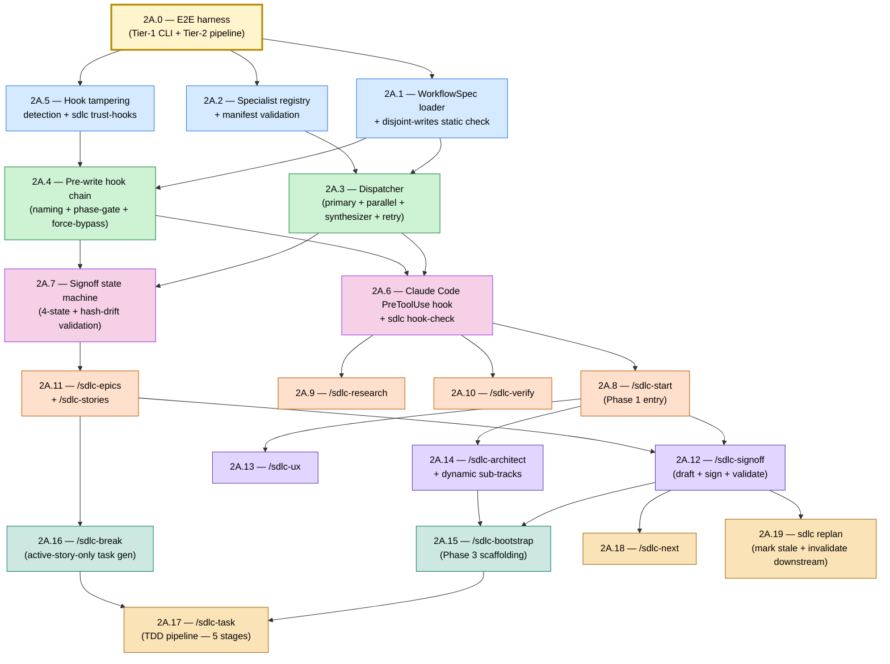

# Epic 2A — Story DAG & Parallelism Plan

**Epic:** 2A — Phase Orchestration Mechanics
**Status:** Draft (authored 2026-05-10 per Epic 1 retrospective action **A6**)
**Authors:** Charlie + Alice (per A6 owners) — review by Winston
**Source-of-truth:** `_bmad-output/planning-artifacts/epics.md` § "Epic 2A: Phase Orchestration Mechanics"
**Retrospective rationale:** `_bmad-output/implementation-artifacts/epic-1-retro-2026-05-09.md` §6.4

---

## 1. Purpose

Per Epic 1 retrospective action **A6** (Project Lead directive — Vuonglq01685): every epic must
begin with a story-DAG diagram identifying parallelism layers, the critical path, and worktree
assignments before Story `N.1` enters implementation.

This document is the canonical sprint-planning output for Epic 2A. It satisfies team agreement
**(F)** ("every epic begins with a sprint-planning session producing a story-DAG and parallelism
plan") and team agreement **(G)** ("worktree-per-story for stories at the same parallelism layer").

---

## 2. Story DAG (Mermaid)



---

## 3. Parallelism Layers

| Layer | Stories | Max parallel worktrees | Depends on |
|---|---|---|---|
| **Precursor** | 2A.0 | 1 (single critical task) | (none) |
| **Layer 1** | 2A.1, 2A.2, 2A.5 | **3** | 2A.0 |
| **Layer 2** | 2A.3, 2A.4 | **2** | 2A.1, 2A.2 (for 2A.3); 2A.1, 2A.5 (for 2A.4) |
| **Layer 3** | 2A.6, 2A.7 | **2** | 2A.3, 2A.4 |
| **Layer 4** | 2A.8, 2A.9, 2A.10, 2A.11 | **4** | 2A.6 (for 2A.8/9/10); 2A.7 (for 2A.11) |
| **Layer 5** | 2A.12, 2A.13, 2A.14 | **3** | 2A.8 + 2A.11 (for 2A.12); 2A.8 (for 2A.13/14) |
| **Layer 6** | 2A.15, 2A.16 | **2** | 2A.12 + 2A.14 (for 2A.15); 2A.11 (for 2A.16) |
| **Layer 7** | 2A.17, 2A.18, 2A.19 | **3** | 2A.15 + 2A.16 (for 2A.17); 2A.12 (for 2A.18/19) |

**Project-cap reminder:** `max_parallel_agents=4` (per project.yaml policy). Layer 4 saturates this.
Layers exceeding 4 in future epics must batch — see CONTRIBUTING.md "Worktree Workflow" §3.

---

## 4. Critical Path

The longest dependency chain through the DAG:

```
2A.0 → 2A.1 → 2A.3 → 2A.6 → 2A.8 → 2A.12 → 2A.15 → 2A.17
```

**Length:** 8 stories. Optimization beyond layer-parallelism (e.g. carving 2A.17 into pre-stages)
is out-of-scope for Epic 2A and revisited in Epic 4 retrospective.

---

## 5. Worktree Assignments (preliminary)

| Worktree branch | Story | Owner | Layer | Notes |
|---|---|---|---|---|
| `epic-2a/2a-0-e2e-harness` | 2A.0 | Dana (lead) + Charlie | precursor | Blocks every other 2A worktree from leaving WIP. |
| `epic-2a/2a-1-workflow-loader` | 2A.1 | Elena (with Charlie pair, A4) | 1 | TDD-first; depends on D2 (Pydantic strict ADR DOC1). |
| `epic-2a/2a-2-specialist-registry` | 2A.2 | Charlie | 1 | Manifest validation; integrates with 2A.1 specs. |
| `epic-2a/2a-5-hook-trust` | 2A.5 | Winston | 1 | Recovery slice; SHA-256 manifest pattern. |
| `epic-2a/2a-3-dispatcher` | 2A.3 | Charlie | 2 | Merges 2A.1 + 2A.2 via main-rebase before start. |
| `epic-2a/2a-4-prewrite-hooks` | 2A.4 | Elena (drives independently from here, A4 graduation) | 2 | Depends on D1 (canonicalization byte-stability) + 2A.5 trust mechanism. |
| `epic-2a/2a-6-claude-pretooluse` | 2A.6 | Charlie | 3 | Edge-of-substrate; high-risk path — review-C escalation expected. |
| `epic-2a/2a-7-signoff-state-machine` | 2A.7 | Winston | 3 | Recovery slice (signoff hash-drift); ADR cross-reference. |
| `epic-2a/2a-8 … 2A.11` | 2A.8/9/10/11 | round-robin (Elena/Charlie/Dana/Amelia) | 4 | 4-way worktree parallelism; saturates `max_parallel_agents`. |
| `epic-2a/2a-12-signoff-flow` | 2A.12 | Amelia | 5 | Hash + signoff merge ceremony; cite ADR-024. |
| `epic-2a/2a-13-ux` | 2A.13 | Alice | 5 | UX track entry. |
| `epic-2a/2a-14-architect-subtracks` | 2A.14 | Winston | 5 | Dynamic sub-track dispatch. |
| `epic-2a/2a-15-bootstrap` | 2A.15 | Charlie | 6 | Greenfield Phase-3 scaffold. |
| `epic-2a/2a-16-break` | 2A.16 | Elena | 6 | Active-story-only generation. |
| `epic-2a/2a-17-task-tdd-pipeline` | 2A.17 | Charlie + Dana | 7 | Five-stage TDD pipeline; ties Tier-1/2 E2E from 2A.0. |
| `epic-2a/2a-18-next` | 2A.18 | Elena | 7 | |
| `epic-2a/2a-19-replan` | 2A.19 | Amelia | 7 | Stale-marking + downstream invalidation. |

Owners are tentative — Sprint Planning meeting locks the roster.

---

## 6. Estimated Speedup

Per retrospective §6.2 estimate: **~30-40% epic duration reduction** versus strict serial
execution. Realised speedup depends on:

1. CI capacity (`ci.yml` matrix headroom; pin-drift gate on `uv.lock` per D4).
2. Reviewer availability for chunked review-A/B/C labels (per A2; CONTRIBUTING.md §"Chunked
   Review Workflow").
3. Linear-merge discipline on `main` (team agreement (H) — no parallel merges; rebase + CI re-run
   between merges).

Layer-by-layer expected wall-clock (rough — assumes 1 story-day per worktree, no rework):

| Layer | Wall-clock | Stories shipped |
|---|---|---|
| precursor | ~1 day | 2A.0 |
| 1 | ~1 day | 2A.1 + 2A.2 + 2A.5 |
| 2 | ~1 day | 2A.3 + 2A.4 |
| 3 | ~1 day | 2A.6 + 2A.7 |
| 4 | ~1 day | 2A.8 + 2A.9 + 2A.10 + 2A.11 |
| 5 | ~1 day | 2A.12 + 2A.13 + 2A.14 |
| 6 | ~1 day | 2A.15 + 2A.16 |
| 7 | ~1 day | 2A.17 + 2A.18 + 2A.19 |
| **Total** | **~8 days** | 20 stories |

**Compare:** strict serial = ~14-16 days for 20 stories at average Epic-1 cadence.

---

## 7. Risks & Mitigations

| Risk | Mitigation |
|---|---|
| 2A.0 (E2E harness) over-runs and starves all downstream worktrees | Time-box 2A.0 to 1 day; if exceeded, escalate to Project Lead and consider degraded Tier-1-only ship for first round of Layer-1 stories. |
| Layer-4 saturates `max_parallel_agents=4` and queues the rest | Confirm 4-agent CI capacity before Layer 4; consider splitting Layer 4 into 2+2 if CI slot contention measured. |
| Hash-drift between 2A.4 (pre-write hook chain) and 2A.7 (signoff state machine) | D1 (Hypothesis canonicalization byte-stability) lands before Layer 2 starts. |
| Linear-merge collisions on `main` between 2A.1/2A.2/2A.5 | Stage-merge order: 2A.1 → 2A.2 → 2A.5 (2A.5 touches mostly new files); rebase between each. |
| Junior dev (Elena) blocked at Layer 2 (`2A.4` solo) | Pair-mentoring (A4) Charlie ↔ Elena explicit on Stories 2A.1 + 2A.2; Elena drives independently from 2A.3 onward but Charlie remains review-C reviewer for 2A.4. |

---

## 8. Approvals

- [x] Charlie — DAG correctness + dispatcher dependency checks (2026-05-10: 2A.3→2A.1+2A.2 correct; 2A.7 decoupled from 2A.6 is architecturally sound — signoff state machine does not require Claude PreToolUse hook)
- [x] Alice — sprint capacity + reviewer assignment plan (2026-05-10: Layer 4 cap noted; worktree assignments tentative; A4 pair-mentoring must be scheduled before Layer 1 start)
- [x] Winston — architectural cross-reference (2026-05-10: ADR-012 module mapping verified; ADR-024 frozen contracts (WorkflowSpec + HookPayload) correctly scoped; **D1 Hypothesis byte-stability MUST complete before Layer 2 start**)
- [x] Vuonglq01685 (Project Lead) — directive sign-off on parallelism plan and worktree policy (2026-05-10)

---

## 9. Revision Log

| Date | Author | Change |
|---|---|---|
| 2026-05-10 | Charlie + Alice (drafted via sprint-planning skill) | Initial draft — DAG + 7 layers + critical path + worktree assignments |
| 2026-05-10 | Charlie, Alice, Winston | Approval review — all three approved; Winston flags D1 as hard gate before Layer 2 |
| 2026-05-10 | Vuonglq01685 + Claude (bmad-create-story) | Pre-Story 2A.1 §7.4 verification — all 7 checklist rows green: DAG approvals (4/4), retro A-actions closed, retro D-items closed (D1/D2 landed in `8498ac3`), retro DOC-items published (ADR-024/025/026/027 Accepted — ADR-026 promoted Proposed→Accepted as gate-clearing action), wire-format snapshots green, quality gate green. Story `2a-1-workflow-yaml-loader-schema-validation.md` created at status `ready-for-dev`. |
| 2026-05-10 | Vuonglq01685 + Claude (bmad-create-story) | Layer 1 batch prep — Stories 2A.2 (`2a-2-specialist-registry-manifest-validation.md`) and 2A.5 (`2a-5-recovery-hook-tampering-detection-trust-hooks.md`) created at status `ready-for-dev` under same §7.4 gate clearance as 2A.1. All 3 Layer 1 worktrees now eligible for parallel branch-off (`epic-2a/2a-1-workflow-loader`, `epic-2a/2a-2-specialist-registry`, `epic-2a/2a-5-hook-trust`); shared file `src/sdlc/errors/base.py` requires linear-merge per CONTRIBUTING.md §3.3. |
| 2026-05-10 | Vuonglq01685 + Claude (bmad-create-story) | Layer 3 batch prep — Stories 2A.6 (`2a-6-claude-code-pretooluse-hook-hook-check.md`) and 2A.7 (`2a-7-recovery-signoff-state-machine-hash-drift-validation.md`) created at status `ready-for-dev`. §7.4 hard gate N/A (neither is Story N.1; gate cleared at 2A.1 creation). Layer 2 deps green on `main b15a622` (2A.3 + 2A.4 + 2A.5 all `done`). Both worktrees eligible for parallel branch-off (`epic-2a/2a-6-claude-pretooluse` + `epic-2a/2a-7-signoff-state-machine`); shared file `src/sdlc/hooks/builtin/phase_gate.py` requires worktree-coordinated edit window per CONTRIBUTING.md §3.3 (2A.6 wires dispatcher → run_hook_chain at the pre-write site; 2A.7 refactors phase_gate to read `signoff.compute_state` via DI per AC11/D1 D2 recommendation). 2A.6 introduces a NEW `tests/parity/` directory with ≥20 fixture rows for engine-vs-Claude PreToolUse parity as a CI gate (AC5) plus a p95 ≤ 500ms latency benchmark (AC7). 2A.7 ships the `src/sdlc/signoff/` package skeleton (states.py, hasher.py, records.py, validator.py) with `SignoffRecord` private-by-default per AC9 + AC11/D2 D2 recommended (mirrors Story 2A.5's `_HookHashStore` posture; ADR-024 snapshot count remains 5). 2A.7 closes `EPIC-2A-DEBT-PHASE-GATE-READ` (opened by 2A.4 Task 4.5) via the Task 6 phase_gate refactor; opens `EPIC-2A-DEBT-REPLAN-INVALIDATION-WIRE` for Story 2A.19 owner. 2A.6 documents `EPIC-2A-DEBT-CLAUDE-HOOK-FAIL-CLOSED-V1.X` for the Claude-side fail-open → fail-closed graduation in v1.x per ADR-013 advisory posture. AC8 of 2A.7 is the FR32 + NFR-REL-3 audit-grade boundary: hypothesis property suite (≥400 examples) over (artifact-edit × signoff-edit × hash-record-edit × no-mutation) permutations with mandatory anti-tautology receipt at Task 4.4. Layer 4 (Stories 2A.8/9/10/11) remains `backlog` and will be created in the next batch after Layer 3 reaches `done`. |
