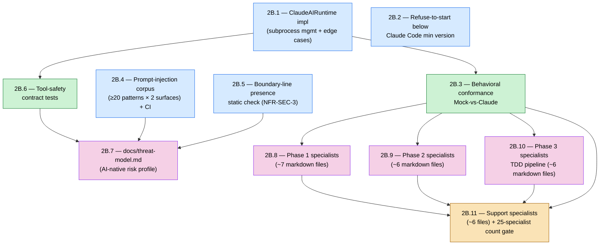

# Epic 2B — Story DAG & Parallelism Plan

**Epic:** 2B — Real Claude Dispatch + Safety Boundary (**FIRST EXTERNAL SHIP**)
**Status:** Draft (authored 2026-05-22 per Epic 2A retrospective action **DOC3** + CONTRIBUTING.md §7)
**Authors:** Alice + Charlie (per DOC3 owners) — review by Winston
**Source-of-truth:** `_bmad-output/planning-artifacts/epics.md` § "Epic 2B: Real Claude Dispatch + Safety Boundary"
**Retrospective rationale:** `_bmad-output/implementation-artifacts/epic-2a-retro-2026-05-21.md` §6.3 (DOC3) + §7

---

## 1. Purpose

Per CONTRIBUTING.md §7.3 (Mandatory DAG-First Rule — Team Agreement F) and Epic 2A
retrospective action **DOC3**, every epic must begin with a story-DAG diagram identifying
parallelism layers, the critical path, and worktree assignments before Story `N.1` enters
implementation.

This document is the canonical sprint-planning output for Epic 2B. It satisfies CONTRIBUTING.md
§7.1 row 1 (mandatory artifact: Story DAG document) and §7.3 (DAG-first rule).

**Gate status note.** This document being `Draft` is **not sufficient** to clear the §7.4
Pre-Story 2B.1 gate. The gate additionally requires (a) §8 below carrying all 4 approvals, and
(b) a green debt-decay strict run (`scripts/check_debt_decay_budget.py --target-epic 2b --mode
strict`). See §7 (Risks) for the currently-open gate items. Prep-sprint critical path C1–C8 is
**closed** (sprint-status `last_action`, 2026-05-21).

---

## 2. Story DAG (Mermaid)



**Note on roots.** Epic 2B has no in-epic precursor (unlike 2A.0 in Epic 2A). All Layer 1
stories depend on the Epic 2A `done` substrate (AIRuntime ABC + MockAIRuntime from Story 1.13,
abstraction-adequacy test from Story 1.14, WorkflowSpec loader from 2A.1, prompt builders +
boundary-line constant from 2A.8) and on the **closed prep-sprint** primitives C1
(`concurrency/io_primitives.py::atomic_write`) and C2 (`journal.append_with_seq_alloc`).

---

## 3. Parallelism Layers

| Layer | Stories | Max parallel worktrees | Depends on |
|---|---|---|---|
| **Layer 1** | 2B.1, 2B.2, 2B.4, 2B.5 | **4** | Epic 2A `done` substrate + prep-sprint C1/C2 |
| **Layer 2** | 2B.3, 2B.6 | **2** | 2B.1 (for both) |
| **Layer 3** | 2B.7, 2B.8, 2B.9, 2B.10 | **4** | 2B.4 + 2B.5 + 2B.6 (for 2B.7); 2B.3 (for 2B.8/9/10) |
| **Layer 4** | 2B.11 | **1** | 2B.8 + 2B.9 + 2B.10 + 2B.3 |

**Project-cap reminder:** `max_parallel_agents=4` (per project.yaml policy). **Layers 1 and 3
both saturate this cap** — confirm 4-agent CI capacity before each, or batch (per CONTRIBUTING.md
§3 Worktree Workflow).

**Dependency notes:**

- **2B.2** is an independent leaf — nothing in-epic depends on it. It is placed in Layer 1 for
  scheduling convenience; it could slot into any layer with spare capacity.
- **2B.6** depends on 2B.1 because the subprocess allow-list test
  (`tests/security/test_subprocess_allowlist.py`) whitelists `runtime/claude.py`, which 2B.1
  creates. The `no-outbound-http` AC is independent of 2B.1, but placing the whole story in
  Layer 2 avoids partial-rework.
- **2B.7** (`docs/threat-model.md`) needs the verification mechanisms (test paths) from 2B.4
  (corpus), 2B.5 (boundary-line check), and 2B.6 (tool-safety) — it documents them per surface.
  It carries no dependency on 2B.3 or the specialist-authoring stories, so it runs concurrently
  with 2B.8/9/10 in Layer 3.
- **2B.8 / 2B.9 / 2B.10** each have an AC requiring the abstraction-adequacy conformance test
  (2B.3) to exercise the new specialists Mock-vs-Claude — so they depend on 2B.3, not merely on
  the registry contract.
- **2B.11**'s count gate (`≥23, ≤27` specialists) and `docs/specialists-matrix.md` regeneration
  require 2B.8 + 2B.9 + 2B.10 complete; its final "first external ship signal" AC re-runs the
  2B.3 conformance test end-to-end.

---

## 4. Critical Path

The longest dependency chain through the DAG:

```
2B.1 → 2B.3 → 2B.10 → 2B.11
```

**Length:** 4 stories. (Equivalent-length chains exist via 2B.8 or 2B.9 in place of 2B.10;
2B.10 is named as the nominal critical path because the Phase-3 TDD-pipeline specialist set is
the most coupled to the `/sdlc-task` 5-stage gate logic.)

The secondary chain `2B.1 → 2B.6 → 2B.7` (length 3) is not critical but shares the 2B.1
foundation — any slip in 2B.1 delays both branches.

---

## 5. Worktree Assignments (preliminary)

| Worktree branch | Story | Owner | Layer | Notes |
|---|---|---|---|---|
| `epic-2b/2b-1-claude-runtime` | 2B.1 | Charlie | 1 | Substrate / high-risk; FIRST EXTERNAL SHIP foundation. Uses `append_with_seq_alloc` (C2) from day one; implements ADR-029 `mock: true` envelope + 4 collateral divergence fixes. |
| `epic-2b/2b-2-version-refuse` | 2B.2 | Elena | 1 | Compatibility pre-flight; `claude --version` parse + `CompatibilityError`. |
| `epic-2b/2b-4-injection-corpus` | 2B.4 | Dana | 1 | ≥20 patterns × 2 surfaces under `tests/security/corpus/`; auto-discovery harness. |
| `epic-2b/2b-5-boundary-line` | 2B.5 | Winston | 1 | NFR-SEC-3 static check; canonical boundary-line constant (documented later in 2B.7). |
| `epic-2b/2b-3-conformance` | 2B.3 | Charlie + Dana | 2 | Extends Story 1.14; golden state.json + unified-diff failure output. On critical path — gates all Layer 3 specialist authoring. |
| `epic-2b/2b-6-tool-safety` | 2B.6 | Winston | 2 | Subprocess allow-list (AST) + no-outbound-http + destructive-op re-confirmation. |
| `epic-2b/2b-7-threat-model` | 2B.7 | Winston + Amelia | 3 | `docs/threat-model.md`; SDLC-THREAT-NNN index linking corpus tests + mitigation code paths. |
| `epic-2b/2b-8-phase1-specialists` | 2B.8 | Alice | 3 | ~7 Phase-1 markdowns; names per frozen `docs/specialists-matrix.md` (C5 / ADR-030). |
| `epic-2b/2b-9-phase2-specialists` | 2B.9 | Winston | 3 | ~6 Phase-2 markdowns incl. sub-track architects. |
| `epic-2b/2b-10-phase3-specialists` | 2B.10 | Charlie | 3 | ~6 Phase-3 TDD-pipeline markdowns; `pr-author` reads `GH_TOKEN` only. |
| `epic-2b/2b-11-support-specialists` | 2B.11 | Elena | 4 | ~6 support markdowns; 25-count gate + matrix regen; runs 2B.3 as ship signal. |

Owners are tentative — the Sprint Planning meeting locks the roster. Specialist file naming
across 2B.8–2B.11 MUST follow the canonical `docs/specialists-matrix.md` (frozen in prep-sprint
C5; deviations require an ADR per ADR-030).

---

## 6. Estimated Speedup

Layer-by-layer expected wall-clock (rough — assumes ~1 story-day per worktree, no rework;
specialist-authoring stories are file-heavy and budgeted at ~1.5 days):

| Layer | Wall-clock | Stories shipped |
|---|---|---|
| 1 | ~1.5 days | 2B.1 + 2B.2 + 2B.4 + 2B.5 |
| 2 | ~1 day | 2B.3 + 2B.6 |
| 3 | ~1.5 days | 2B.7 + 2B.8 + 2B.9 + 2B.10 |
| 4 | ~0.5 day | 2B.11 |
| **Total** | **~4.5 days** | 11 stories |

**Compare:** strict serial = ~9–11 days for 11 stories at average Epic-2A cadence. Estimated
**~50% epic duration reduction** versus serial — consistent with the Epic 2A retro §6.2 range.
Realised speedup depends on CI matrix headroom for the two cap-saturating layers, reviewer
availability for chunked review-A/B/C, and linear-merge discipline on `main`.

---

## 7. Risks & Mitigations

| Risk | Mitigation |
|---|---|
| 2B.1 (ClaudeAIRuntime) over-runs — subprocess edge cases (kill -9 mid-stream, malformed JSON, timeout, orphan processes) are intricate — and starves the entire downstream DAG. | Time-box 2B.1 to ~1.5 days; leverage closed prep-sprint primitives (C1 `atomic_write`, C2 `append_with_seq_alloc`). Escalate to Project Lead if exceeded. |
| Layers 1 and 3 both saturate `max_parallel_agents=4`; CI slot contention queues stories. | Confirm 4-agent CI capacity before each layer; split into 2+2 batches if contention is measured. |
| 2B.3 (conformance harness) is on the critical path AND gates all Layer-3 specialist authoring — flaky golden-file diffs would stall 2B.8/9/10. | 2B.3 must land byte-stable golden `state.json` + deterministic unified-diff output before Layer 3 worktrees branch off. |
| MockAIRuntime ↔ ClaudeAIRuntime divergence (ADR-029): `SDLC_USE_MOCK_RUNTIME` default-flip is scheduled "post-2B.1". | 2B.1 implements the `mock: true` success-envelope flag + the 4 collateral divergence fixes inside its own scope per ADR-029 / prep-sprint C8. |
| `EPIC-2B-DEBT-MIGRATE-PROCESS-LOCAL-SEQ-CALLSITES` — 5 legacy callsites still use process-local seq allocation. | Forward rule (prep-sprint C2): Story 2B.1 `ClaudeAIRuntime` uses `append_with_seq_alloc` from day one; the 5 legacy callsites migrate per-story across Epic 2B. |
| Specialist name drift across 2B.8–2B.11 vs `architecture.md` / frozen matrix. | `docs/specialists-matrix.md` (C5) is canonical; ADR-030 governs reconciliation; 2B.11 count gate (`≥23, ≤27`) is the backstop. |
| **§7.4 GATE — debt-decay strict run currently FAILS.** Gate A (BLOCKING closed ≥5) reports 3/5, and the budget contains only 4 BLOCKING items total — the threshold is **structurally unreachable** without expanding `debt-budget.yaml` inventory. Gate C (N-2 zero-out) reports 3 open (Epic-1 D4/D5/D7). | **Escalate to Project Lead.** Two decisions needed: (1) expand BLOCKING inventory in `debt-budget.yaml` or amend the Gate A threshold; (2) resolve the contradiction between retro §7.2 (P1/P2/P3 = Epic-1 D4/D5/D7 run "concurrent with Story 2B.1") and §7.5 Gate C (N-2 items must be 0 open before Story N.1). |
| §7.4 GATE — §8 approvals (below) are not yet collected. | This document must be reviewed and signed by all 4 approvers before `bmad-create-story` is invoked for Story 2B.1. |

---

## 8. Approvals

Per CONTRIBUTING.md §7.1 rows 3–4 — minimum 3 reviewers + Project Lead directive sign-off.
**All 4 boxes must be checked before any Story 2B.1 story file is created via `bmad-create-story`.**

- [ ] Charlie — DAG correctness + dispatcher/runtime dependency checks (verify 2B.3→2B.1 and 2B.6→2B.1 edges; verify 2B.8/9/10→2B.3 conformance dependency)
- [ ] Alice — sprint capacity + reviewer assignment plan (Layers 1 & 3 saturate the 4-agent cap; confirm CI headroom and review-A/B/C reviewer roster)
- [ ] Winston — architectural cross-reference (ADR-029 mock-envelope scope inside 2B.1; ADR-031/032 primitives consumed; `runtime/` module boundary; ADR-030 specialist-roster canonical names)
- [ ] Vuonglq01685 (Project Lead) — directive sign-off on parallelism plan, worktree policy, and resolution of the §7 debt-decay gate items

---

## 9. Revision Log

| Date | Author | Change |
|---|---|---|
| 2026-05-22 | Alice + Charlie (drafted via Claude, per Epic 2A retro DOC3) | Initial draft — DAG (11 stories) + 4 parallelism layers + critical path `2B.1→2B.3→2B.10→2B.11` + preliminary worktree assignments + risk register. §8 approvals OPEN. Gate note: §7.4 Pre-Story 2B.1 gate remains blocked pending §8 4/4 approvals and a green debt-decay strict run (Gate A structurally unreachable — escalated to Project Lead in §7). |
