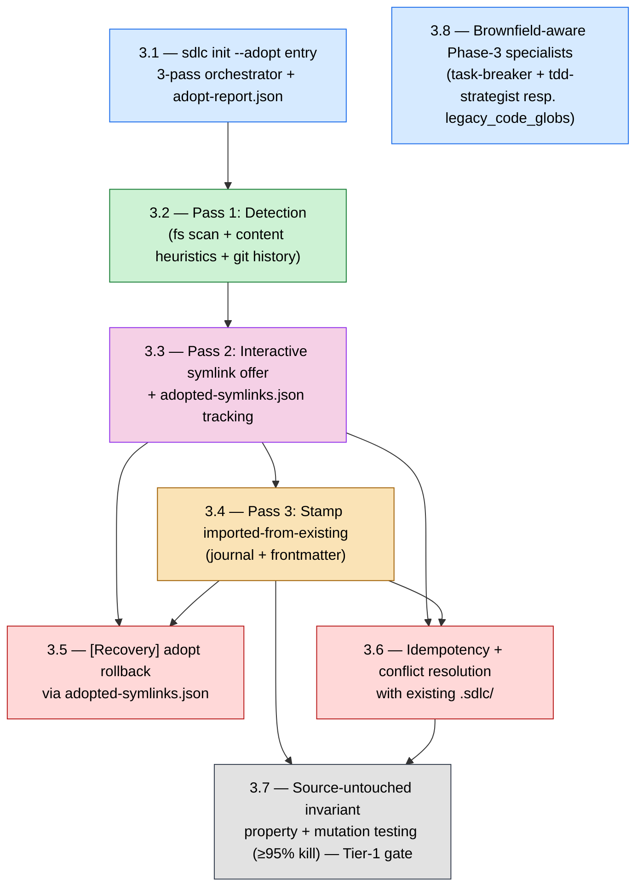

# Epic 3 — Story DAG & Parallelism Plan

**Epic:** 3 — Brownfield Adopt Mode (`sdlc init --adopt`)
**Status:** Draft (authored 2026-06-02 per CONTRIBUTING.md §7 + Epic 2B retrospective Epic-3 prep)
**Authors:** Alice + Charlie (drafted via Claude) — review by Winston
**Source-of-truth:** `_bmad-output/planning-artifacts/epics.md` § "Epic 3: Brownfield Adopt Mode" (lines 1757–2006)
**Retrospective rationale:** `_bmad-output/implementation-artifacts/epic-2b-retro-2026-06-01.md` §11 (Epic 3 prep) + §7–§8

---

## 1. Purpose

Per CONTRIBUTING.md §7.3 (Mandatory DAG-First Rule) and §7.1 row 1 (mandatory artifact: Story
DAG document), every epic begins with a story-DAG identifying parallelism layers, the critical
path, and worktree assignments before Story `N.1` enters implementation. This document is the
canonical sprint-planning output for Epic 3.

**Epic shape (key insight).** Unlike Epic 2B (four independent Layer-1 stories), Epic 3 is
**spine-heavy**: the three adopt passes are inherently sequential (Detection → Symlink Offer →
Stamp), forcing a serial chain `3.2 → 3.3 → 3.4`. Parallelism is therefore limited (**max 2
concurrent worktrees**, not 4), and the critical path is long (**6 stories**). The engineering
risk concentrates in **3.7** (novel mutation-testing harness + multi-fixture brownfield corpus —
the Tier-1 NFR-REL-6 source-untouched gate) and the net-new `src/sdlc/adopt/` module.

**Gate status note (2026-06-02).** The §7.4 Pre-Story 3.1 gate is **fully satisfied**:
- #6 wire-format snapshots green on `main` — ✅
- #7 quality gate green on `main` — ✅ (`pytest` 2899 pass / 0 fail, `mypy --strict`, `ruff`,
  `mkdocs --strict`, wire-format snapshots; the pre-existing wheel-build breakage was repaired in
  Epic 3 prep **P5**, `61c68f9`)
- #8 debt-decay strict run green for `--target-epic 3` — ✅ (Gate A + B + C all PASS; the Gate-C
  blocker `EPIC-2A-D4-PHASE2-PROMPT-BOUNDARY-CHECK` was closed in prep **P2**, `1f91ec1`)
- #1 this DAG exists — ✅ (this document)
- #2 §8 four approvals — ✅ **4/4** (3 technical reviewers + Project Lead directive sign-off,
  2026-06-02). **The §7.4 Pre-Story 3.1 gate is fully satisfied** — `bmad-create-story` may be
  invoked for Story 3.1.

---

## 2. Story DAG (Mermaid)



**Note on roots.** Epic 3 has two roots. **3.1** (the orchestrator) roots the adopt spine. **3.8**
(brownfield-aware specialists) is an **independent leaf** — it depends only on Story 2B.10's
Phase-3 specialists (`task-breaker`, `tdd-strategist` — both already on `main`) and the Story 1.8
`legacy_code_globs` config field, not on the adopt pipeline. Per `epics.md:2006`, Stories 3.1–3.7
depend only on the Epic 1 substrate (state, journal, atomic write, config); Story 3.8 depends on
Epic 2B Story 2B.10. **All external dependencies are satisfied on `main`.**

---

## 3. Parallelism Layers

| Layer | Stories | Max parallel worktrees | Depends on |
|---|---|---|---|
| **Layer 1** | 3.1, 3.8 | **2** | Epic 1 substrate (3.1); 2B.10 specialists + 1.8 config (3.8) |
| **Layer 2** | 3.2 | **1** | 3.1 (orchestrator + `adopt-report.json` schema) |
| **Layer 3** | 3.3 | **1** | 3.2 (Pass-1 `detected[]`) |
| **Layer 4** | 3.4 | **1** | 3.3 (`adopted-symlinks.json`) |
| **Layer 5** | 3.5, 3.6 | **2** | 3.3 + 3.4 (both) |
| **Layer 6** | 3.7 | **1** | 3.4 + 3.6 (complete adopt module + conflict paths) |

**Project-cap reminder:** `max_parallel_agents=4` (project.yaml). Epic 3 never saturates the cap —
its serial adopt spine (Layers 2–4) is the binding constraint, not CI headroom.

**Dependency notes:**

- **3.8** is an independent leaf — schedule it in Layer 1 alongside 3.1 to use otherwise-idle
  capacity while the spine is built. Its only coupling is to the (already-shipped) Phase-3
  specialist roster and `legacy_code_globs`; ADR-030's count band already pre-absorbs
  `tdd-strategist`, so 3.8 introduces no roster-gate churn.
- **3.2 → 3.3 → 3.4** is a forced serial chain: Pass 2 consumes Pass 1's `detected[]`; Pass 3
  stamps the symlinks Pass 2 produced. No parallelism is available inside the spine.
- **3.5** (rollback) needs `adopted-symlinks.json` (3.3) and the audit entries it reverts (3.4).
  **3.6** (idempotency) must recognise existing symlinks via `adopted-symlinks.json` (3.3) and
  no-op the completed passes (3.4). They are mutually independent → Layer 5 runs both in parallel.
- **3.7** is the Tier-1 NFR-REL-6 gate. Its property test runs post-adopt `git diff` across 5+
  brownfield fixtures, and its mutation testing targets `adopt/driver.py`, `adopt/passes/*.py`,
  `adopt/symlink.py` — so the adopt module must be feature-complete, including 3.6's conflict
  paths, before 3.7 branches. It is deliberately last.

---

## 4. Critical Path

The longest dependency chain through the DAG:

```
3.1 → 3.2 → 3.3 → 3.4 → 3.6 → 3.7
```

**Length:** 6 stories — the longest critical path of any epic to date, driven by the serial adopt
spine plus the terminal Tier-1 invariant gate. The `… → 3.5` branch (length 5) is off the critical
path but shares the `3.3/3.4` foundation — any slip in the spine delays rollback, idempotency, and
the invariant gate simultaneously. **3.7 is the single highest-risk story** (novel mutation harness
+ fixture corpus); protect its schedule by keeping 3.1–3.6 byte-stable before it branches.

---

## 5. Worktree Assignments (preliminary)

| Worktree branch | Story | Owner | Layer | Notes |
|---|---|---|---|---|
| `epic-3/3-1-adopt-orchestrator` | 3.1 | Charlie | 1 | Net-new `src/sdlc/adopt/driver.py`; `adopt-report.json` schema (resumable on pass failure); CLI `sdlc init --adopt` entry. Foundation of the spine. |
| `epic-3/3-8-brownfield-specialists` | 3.8 | Alice | 1 | `task-breaker` + new `tdd-strategist` honour `legacy_code_globs`; characterization-test path vs write-tests-first. Independent of the spine. |
| `epic-3/3-2-pass1-detection` | 3.2 | Dana | 2 | Filesystem scan + content heuristics + git-history signal → `kind`+`confidence`; golden multi-fixture corpus as CI gate. |
| `epic-3/3-3-pass2-symlink-offer` | 3.3 | Charlie | 3 | Interactive Y/n/edit offer; `adopted-symlinks.json` written atomically (C1 `atomic_write`); non-interactive auto-accept threshold. |
| `epic-3/3-4-pass3-stamp` | 3.4 | Winston | 4 | Journal `kind=imported_from_existing` (ADR-028 forward rule) + frontmatter `verifier_marker`; source never edited. |
| `epic-3/3-5-adopt-rollback` | 3.5 | Elena | 5 | `sdlc adopt rollback [--all\|--target]`; refuses if it orphans a downstream signoff. |
| `epic-3/3-6-idempotency-conflict` | 3.6 | Dana | 5 | Re-run `--adopt` is a no-op; conflict resolution (skip/backup/different-target) with existing `.sdlc/`. |
| `epic-3/3-7-source-untouched-invariant` | 3.7 | Winston + Charlie | 6 | Property test across 5+ brownfield fixtures (Java/Maven, Node, Python, monorepo, submodules, pre-existing symlinks) + mutation testing (`mutmut` or equiv) ≥95% kill on adopt module; report to CI artifacts. **Tier-1 gate.** |

Owners are tentative — the Sprint Planning meeting locks the roster. The net-new `src/sdlc/adopt/`
module's internal layout (`driver.py`, `passes/*.py`, `symlink.py`, `invariant.py`) is fixed by
3.1 and consumed by 3.2–3.7; agree it in 3.1's review before the spine branches.

---

## 6. Sequencing & Parallelism Profile

*(Absolute durations are intentionally omitted — AI-paced development makes calendar estimates
unreliable; see the retrospective facilitation convention. Effort is expressed as structure.)*

| Layer | Concurrency | Stories | Character |
|---|---|---|---|
| 1 | 2 | 3.1, 3.8 | Foundation + independent specialist work in parallel |
| 2 | 1 | 3.2 | Serial spine — Pass 1 |
| 3 | 1 | 3.3 | Serial spine — Pass 2 |
| 4 | 1 | 3.4 | Serial spine — Pass 3 |
| 5 | 2 | 3.5, 3.6 | Recovery + idempotency in parallel |
| 6 | 1 | 3.7 | Terminal Tier-1 invariant gate |

**Profile:** depth-6 critical path, peak width 2. The serial Layers 2–4 dominate wall-clock; there
is **no** layer that saturates the 4-agent cap. The realistic acceleration lever is **front-loading
3.8 into Layer 1** (independent) and **running 3.5 ‖ 3.6 in Layer 5**. Everything else is
spine-bound. Contrast Epic 2B (peak width 4, depth 4) — Epic 3 trades parallelism for sequential
depth, so schedule risk lives in spine slippage, not CI contention.

---

## 7. Risks & Mitigations

| Risk | Mitigation |
|---|---|
| **3.7 mutation-testing harness is novel substrate** — no `mutmut`/equivalent exists in `pyproject.toml`/CI today; ≥95% kill on the adopt module is the highest unknown. | Spike the harness during Layer 1 (parallel with 3.1/3.8) so the tooling is proven before the module is complete; scope mutation to the adopt module only (not the whole tree) per `epics.md:1952`. |
| **Brownfield fixture corpus is large authoring effort** and gates both 3.2 (detection golden corpus) and 3.7 (property test). | Author `tests/fixtures/brownfield/` (Java/Maven, Node, Python, monorepo, submodules, pre-existing symlinks) as a shared asset early; 3.2 and 3.7 consume the same corpus. |
| **NFR-REL-6 hard invariant** — any adopt path that writes to a source file is a Tier-1 failure; `git diff` must be empty for source paths. | Symlink-only mapping (never copy-into-source); 3.7 mutation testing exists specifically to kill source-mutating bugs; CI gate blocks merge on a non-empty source diff. |
| **Serial spine slippage** — a slip in 3.1/3.2/3.3/3.4 stalls 3.5, 3.6, and 3.7 simultaneously (depth-6 path). | Keep each pass byte-stable and reviewed before the next branches; treat 3.1's `adopt/` module layout + the two JSON schemas as frozen contracts before Layer 2. |
| **New on-disk contracts** (`adopt-report.json`, `adopted-symlinks.json`, journal `imported_from_existing`) drift across versions. | **Decision D1 (below)** — treat the two JSON contracts as ADR-024 wire-format (StrictModel + JSON-Schema snapshot); the journal kind extends ADR-028's taxonomy via its forward rule. |
| **Symlink/TOCTOU/cross-platform edge cases** in Pass 2 + rollback (Win32 symlink semantics differ). | POSIX-only v1 (consistent with ADR-034 D7B Win32 deferral); document the Win32 posture; rollback refuses to orphan a downstream signoff. |
| **§7.4 GATE — §8 approvals. RESOLVED 2026-06-02.** All 4 signoffs collected (3 technical reviewers + Project Lead) and Decision D1 ratified = (a) wire-format. | The §7.4 Pre-Story 3.1 gate is fully satisfied — `bmad-create-story` may be invoked for Story 3.1. |
| Carry-forward HIGH debt (`EPIC-2B-DEBT-COVERAGE-90`, `EPIC-2B-DEBT-MIGRATE-PROCESS-LOCAL-SEQ-CALLSITES`) could regress Gate B (currently 4/6 PASS) if other closures shift. | Slot both into Epic 3 per-story budgets; D1/D2 from the 2B retro already schedule the coverage reconcile and EPIC-1 MED-debt closure. |

---

## Decision D1 — ADR-024 snapshot ceremony for Epic 3 contracts (prep item P4)

**Question.** Do Epic 3's new on-disk contracts enter the ADR-024 wire-format snapshot ceremony
(`tests/contract_snapshots/v1/`) as frozen contracts, or are they exempt as internal state?

**Affected shapes:** `.claude/state/adopt-report.json`, `.claude/state/adopted-symlinks.json`, the
journal `imported_from_existing` kind + `verifier_marker: imported-from-existing` frontmatter.

**Recommendation (a) — RATIFY as wire-format (ADR-024/025):** `adopt-report.json` is read back on
resume (3.1/3.6) and `adopted-symlinks.json` is read back by rollback (3.5) and idempotency (3.6).
Their shape is a cross-invocation compatibility surface, so both should be `StrictModel` pydantic
contracts in `src/sdlc/contracts/` with `schema_version=1` JSON-Schema snapshots under
`tests/contract_snapshots/v1/`, governed by the ADR-024 mutation-taxonomy ceremony. The journal
`imported_from_existing` kind extends ADR-028's taxonomy via its documented forward rule (no new
ceremony). **Alternative (b):** treat the two JSON files as internal state (like `state.json`,
rebuilt-not-frozen) — lighter, but loses the freeze guarantee on a surface that *is* read back.

**RATIFIED 2026-06-02 — option (a).** The Project Lead's §8 directive sign-off ratifies
wire-format treatment. Stories 3.1 / 3.3 must add `AdoptReport` + `AdoptedSymlinks` `StrictModel`
contracts under `src/sdlc/contracts/` with `schema_version=1` JSON-Schema snapshots in
`tests/contract_snapshots/v1/`, each paired with a snapshot-regeneration ceremony per the ADR-024
mutation taxonomy. The journal `imported_from_existing` kind extends ADR-028 via its forward rule.

---

## 8. Approvals

Per CONTRIBUTING.md §7.1 rows 3–4 — minimum 3 reviewers + Project Lead directive sign-off.
**All 4 boxes must be checked, and Decision D1 ratified, before any Story 3.1 file is created via `bmad-create-story`.**

- [x] Charlie — DAG correctness + dependency checks (verified the serial spine `3.1→3.2→3.3→3.4`, the `3.5`/`3.6`→`3.3`+`3.4` edges, `3.7`→`3.4`+`3.6`, and that `3.8` is an independent leaf depending only on the already-shipped 2B.10 specialists + Story 1.8 config)
- [x] Alice — sprint capacity + reviewer assignment (peak width 2; no cap saturation; 3.8 front-loaded into Layer 1, 3.5 ‖ 3.6 in Layer 5; review-A/B/C roster fits the low concurrency)
- [x] Winston — architectural cross-reference (net-new `src/sdlc/adopt/` module boundary; NFR-REL-6 symlink-only invariant; ADR-028 forward rule for the `imported_from_existing` journal kind; ADR-024/025 applicability to the two JSON contracts per Decision D1; ADR-030 roster already absorbs `tdd-strategist` for 3.8)
- [x] **Vuonglq01685 (Project Lead)** — directive sign-off recorded 2026-06-02: parallelism plan + worktree-per-layer policy approved; **Decision D1 ratified = (a) wire-format ADR-024**. §8 is now **4/4 approved** — the §7.4 Pre-Story 3.1 gate is fully satisfied; `bmad-create-story` may be invoked for Story 3.1.

---

## 9. Revision Log

| Date | Author | Change |
|---|---|---|
| 2026-06-02 | Alice + Charlie (drafted via Claude, per Epic 3 prep) | Initial draft — DAG (8 stories) + 6 parallelism layers + critical path `3.1→3.2→3.3→3.4→3.6→3.7` (depth 6, peak width 2) + preliminary worktree assignments + risk register + Decision D1 (ADR-024 ceremony for adopt contracts, folded from prep P4). §8: 3 technical-reviewer signoffs recorded; Project Lead directive sign-off OPEN. Gate note: §7.4 #6/#7/#8 satisfied (prep P2 closed Gate-C blocker, P5 repaired wheel build, P3 green main); #1 satisfied by this doc; #2 pending the Project Lead box. |
| 2026-06-02 | Vuonglq01685 (Project Lead) + Claude | §8 Project Lead directive sign-off recorded — parallelism plan + worktree-per-layer policy approved; **Decision D1 ratified = (a) wire-format ADR-024** for `adopt-report.json` + `adopted-symlinks.json` (StrictModel + v1 JSON-Schema snapshots). §8 now **4/4 approved**; §1 gate note + D1 updated to the satisfied state. The §7.4 Pre-Story 3.1 gate is **fully satisfied** — Story 3.1 creation may proceed via `bmad-create-story`. |
| 2026-06-02 | Vuonglq01685 (Project Lead) + Claude (code-review 3.1, Decision 1a) | **D1 boundary erratum.** The Story 3.1 `adopt` module-boundary `depends_on` seed `{errors, state, journal, signoff, config}` silently omitted the foundation modules the orchestrator provably imports. Ratified correction (CONTRIBUTING §5): `depends_on` = `{errors, contracts, ids, concurrency, state, journal, signoff, config}` (`scripts/module_boundary_table.py`); `forbidden_from` `{engine, dispatcher, runtime}` unchanged (Architecture Rule 6). No change to D1's wire-format ratification — this only records the boundary allow-set as implemented + reviewed. |
