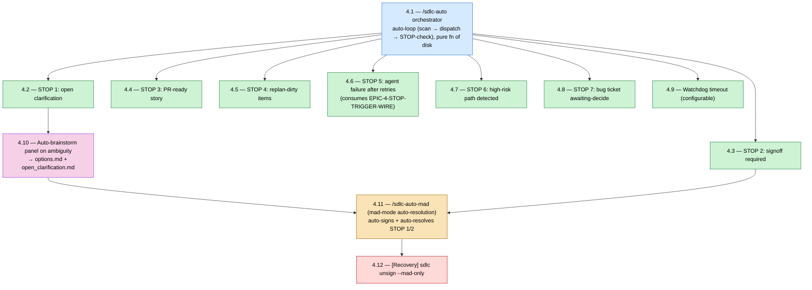

# Epic 4 — Story DAG & Parallelism Plan

**Epic:** 4 — Auto-Mode & Autonomous Execution (`/sdlc-auto`)
**Status:** Draft (authored 2026-06-09 per CONTRIBUTING.md §7 + Epic 3 retrospective Epic-4 prep P1)
**Authors:** Alice + Charlie (drafted via Claude) — review by Winston
**Source-of-truth:** `_bmad-output/planning-artifacts/epics.md` § "Epic 4: Auto-Mode & Autonomous Execution" (lines 2010–2356)
**Retrospective rationale:** `_bmad-output/implementation-artifacts/epic-3-retro-2026-06-09.md` §11 (Epic 4 prep) + §7–§8

---

## 1. Purpose

Per CONTRIBUTING.md §7.3 (Mandatory DAG-First Rule) and §7.1 row 1 (mandatory artifact: Story
DAG document), every epic begins with a story-DAG identifying parallelism layers, the critical
path, and worktree assignments before Story `N.1` enters implementation. This document is the
canonical sprint-planning output for Epic 4.

**Epic shape (key insight).** Epic 4 is the **inverse of Epic 3**. Where Epic 3 was a deep serial
spine (depth-6, peak-width-2), Epic 4 is a **fan-out / converge** graph: a single auto-loop root
(`4.1`) feeds **eight independent Layer-2 stories** — the 7 STOP triggers plus the watchdog — which
**saturate the 4-agent cap** (the first epic to do so since Epic 2B), then the graph **converges**
through auto-brainstorm (`4.10`) → mad-mode (`4.11`) → the mad-only recovery slice (`4.12`).
Critical path is **5 stories** (`4.1 → 4.2 → 4.10 → 4.11 → 4.12`); peak width is **4**. Schedule
risk lives in **Layer-2 batching** (8 stories, cap 4 → two batches) and in `4.1`'s loop contract,
not in spine slippage.

**Substrate is the story (not adopt).** Per `epics.md:2355`, Stories 4.1–4.10 depend on the Epic 1
substrate (state, journal, atomic write, scan) + Epic 2A (signoff state machine `2A.7`, dispatcher
`2A.3`, replan `2A.19`, sign flow `2A.12`) + Epic 2B (real specialists for the brainstorm panel);
`4.11` depends on `4.10` + `2A.12`; `4.12` depends on `2A.7`. **Epic 4 does not depend on Epic 3
(adopt) at all** — the two were designed in parallel on the Epic-1 substrate. A pre-wired seam
already exists: `dispatcher.core._emit_stop_trigger()` (Story 2A.3) writes
`kind=stop_trigger_raised` with `epic_4_placeholder=True`; Story 4.6 consumes it
(`EPIC-4-STOP-TRIGGER-WIRE`, `deferred-work.md`).

**Gate status note (updated 2026-06-09).** The §7.4 Pre-Story 4.1 gate is **satisfied except one
manual admin step** — the **A2 branch-protection toggle** (ADR-006 `gh api`). Every other item is
**verified green** as of 2026-06-09 (not green-washed, per the Epic 3 retro's belief→evidence
lesson). Once the A2 required-checks toggle lands, `bmad-create-story` may be invoked for Story 4.1.

- #1 this DAG exists — ✅ (this document, Draft)
- #2 §8 four approvals — ✅ **4/4** (three persona-reviewer signoffs + Project Lead directive
  sign-off recorded 2026-06-09); Decisions **D1 = (a)**, **D2 = (a)**, **D3 = (a)** ratified.
- Previous-epic (Epic 3) retro "Before Story 4.1" closure:
  - **A1** (merged-before-done gate) — ✅ shipped `8b004b5` (`scripts/check_story_merged_before_done.py`).
  - **A2** (POSIX pre-merge gate) — ✅ code shipped `d54bbf3` (`scripts/check_posix_suite_ran.py` +
    `posix-adopt-ran` CI job + ADR-006 required-checks); ⏳ **branch-protection toggle is a manual
    GitHub-admin step still pending** (the `gh api` command in ADR-006).
  - **P3** green `main` + wire-format snapshots — ✅ **verified 2026-06-09** (the pre-existing 3.7
    ruff-format drift on `test_invariant_mutations.py` was fixed in `557bd3f`).
  - **P4** assess `sdlc unsign --mad-only` (net-new; `sdlc unsign` does not exist — Story 3.5 mapped
    the `replan` seam) + the real-dispatch debt impact on the auto-loop — see **Decision D3**.
  - **D-COV / D-RIDE** — ✅ **resolved 2026-06-09** (COVERAGE-90 retired to the 87 floor; MIGRATE-SEQ
    reclassified HIGH→MED). **D-CHAR** still open — register `EPIC-3-DEBT-CHARACTERIZATION-REAL-DISPATCH`
    in `debt-budget.yaml` per Decision D3 (load-bearing for `4.1`/`4.6`).
- #6 wire-format snapshots green on `main` — ✅ at last check (A1/A2 touched no contracts; Epic 4
  adds **zero** new wire-format contracts per **Decision D1**).
- #7 quality gate green on `main` — ✅ **GREEN** (verified 2026-06-09: ruff format/check + mypy
  --strict clean, **3570 passed / 4 skipped**, coverage ≥87, wire-format 7/7, mkdocs --strict).
- #8 debt-decay strict run green for `--target-epic 4` — ✅ **PASS** (verified 2026-06-09; Gate
  A/B/C all PASS). Gate C was RED (2 open HIGH epic-2b items) and was cleared by retiring
  `EPIC-2B-DEBT-COVERAGE-90` to the 87 floor (retro D-COV) + reclassifying
  `EPIC-2B-DEBT-MIGRATE-PROCESS-LOCAL-SEQ-CALLSITES` HIGH→MED (retro D-RIDE — v1-unreachable race).

---

## 2. Story DAG (Mermaid)



**Note on edges.** For readability the graph draws the *structural* edges only. `4.11` (mad-mode)
additionally requires **all of Layer 2 complete** — its AC "mad-mode encounters any of the OTHER 5
STOP triggers → the loop still halts" is only testable once `4.4–4.8` exist, and it "respects the
watchdog" (`4.9`). Treat `4.11` as a **convergence/synchronization point** after Layers 2 + 3, not
merely after `4.10` + `4.3`. See §3 dependency notes.

---

## 3. Parallelism Layers

| Layer | Stories | Max parallel worktrees | Depends on |
|---|---|---|---|
| **Layer 1** | 4.1 | **1** | Epic 1 substrate + 2A.3 dispatcher + scan/journal/state |
| **Layer 2** | 4.2, 4.3, 4.4, 4.5, 4.6, 4.7, 4.8, 4.9 | **4 (cap-bound; 8 stories → 2 batches)** | 4.1 (loop + STOP-check interface) |
| **Layer 3** | 4.10 | **1** | 4.2 (open_clarification surface) + 2A.3 `dispatch_panel` + 2B specialists |
| **Layer 4** | 4.11 | **1** | Layer 2 complete (esp. 4.2 + 4.3) + 4.10 (options) + 2A.12 sign flow |
| **Layer 5** | 4.12 | **1** | 4.11 (mad-signoff format `approved_by: ai-mad-mode`) + 2A.7 state machine |

**Project-cap reminder:** `max_parallel_agents=4` (project.yaml). **Layer 2 is the first
cap-saturating layer since Epic 2B** — 8 independent stories against a 4-worktree cap means **two
batches**. The DAG depth is 5, but Layer-2 width is the binding wall-clock constraint.

**Dependency notes:**

- **4.1** roots everything. It must first freeze the `engine/auto_loop.py` iteration contract +
  the `engine/stop_triggers.py` STOP-check interface (the `scan → dispatch_next → STOP_check`
  pure-function-of-disk loop, per AC `iteration is fully derived from disk`). Layers 2–5 plug into
  that interface, so it is a **frozen contract before Layer 2 branches** (mirrors 3.1's `adopt/`
  layout discipline).
- **4.2–4.8** are the 7 STOP triggers — each a single check against `4.1`'s interface, mutually
  independent (each reads a distinct disk signal: clarification file / signoff state / story state /
  dirty items / dispatch failure count / tool-call pattern / bug-ticket state). They parallelize
  fully; only the 4-agent cap batches them. **4.6** is special: it consumes the pre-wired
  `stop_trigger_raised` journal entries (2A.3, `EPIC-4-STOP-TRIGGER-WIRE`).
- **4.9** (watchdog) is independent of the STOP triggers (wall-clock timer + 2B.1 subprocess
  termination) → scheduled in Layer 2 to use otherwise-idle cap.
- **4.10** (auto-brainstorm) depends on **4.2** specifically: it *produces* the
  `open_clarification.md` that STOP trigger 1 detects ("STOP trigger 1 fires because the
  open_clarification.md now exists"), plus `dispatch_panel` (2A.3) and the 2B panel specialists
  (`product-strategist` + `technical-researcher` + `devil-advocate` + `synthesizer`).
- **4.11** (mad-mode) is the convergence point: it auto-resolves STOP 1 (clarification — picks
  `4.10`'s synthesizer first option) and STOP 2 (signoff — writes `approved_by: ai-mad-mode`), and
  must demonstrably **halt** on the other 5 STOPs + respect the watchdog. It therefore needs all of
  Layer 2 + 4.10 complete.
- **4.12** (recovery) reverts `approved_by: ai-mad-mode` signoffs while preserving human ones — it
  consumes the mad-signoff format `4.11` defines. See **Decision D2** for whether it sequences after
  `4.11` (Layer 5, conservative) or parallelizes once the sentinel format is frozen.

---

## 4. Critical Path

The longest dependency chain through the DAG:

```
4.1 → 4.2 → 4.10 → 4.11 → 4.12
```

**Length:** 5 stories. Shorter than Epic 3's depth-6 spine, but with **peak width 4** (Layer 2),
so wall-clock is dominated by the **two-batch Layer-2 fan-out**, not the depth. `4.11` is the
convergence bottleneck — it cannot branch until every STOP trigger (`4.2–4.8`), the watchdog
(`4.9`), and auto-brainstorm (`4.10`) have merged. **Protect `4.11`'s schedule** by keeping `4.1`'s
loop + STOP-check interface byte-stable so the eight Layer-2 stories don't churn it. The two
highest-risk stories are **`4.1`** (novel pure-function-of-disk loop + crash-resume at 5 kill
points, NFR-REL-5) and **`4.7`** (high-risk-path interception — security-sensitive, adversarial
fixtures: force-push, `rm -rf src/`, `DROP TABLE`).

---

## 5. Worktree Assignments (preliminary)

| Worktree branch | Story | Owner | Layer | Notes |
|---|---|---|---|---|
| `epic-4/4-1-auto-loop-orchestrator` | 4.1 | Charlie | 1 | Net-new `engine/auto_loop.py` + `engine/stop_triggers.py` (STOP-check interface); pure-fn-of-disk loop; `auto_loop_iteration` journal kind + `correlation_id`; crash-resume at 5 kill points (NFR-REL-5) + <1s/iter benchmark (NFR-PERF-6). **Freeze the loop + STOP interface before Layer 2.** |
| `epic-4/4-2-stop-clarification` | 4.2 | Dana | 2 | STOP 1; `.claude/state/clarifications/<id>/open_clarification.md`; 4-cell matrix. Foundational STOP (4.10 + 4.11 consume it). |
| `epic-4/4-3-stop-signoff` | 4.3 | Winston | 2 | STOP 2; reads 2A.7 signoff state (`awaiting-signoff`/`drafted-not-approved`); 4-cell matrix. |
| `epic-4/4-4-stop-pr-ready` | 4.4 | Elena | 2 | STOP 3; story `pr-ready` state from 2A.16/2A.17 task completion; 4-cell matrix. |
| `epic-4/4-5-stop-replan-dirty` | 4.5 | Alice | 2 | STOP 4; reads `state=dirty` items from `sdlc replan` (2A.19); 4-cell matrix. |
| `epic-4/4-6-stop-agent-failed` | 4.6 | Dana | 2 | STOP 5; consumes 2A.3 retry chain + `stop_trigger_raised` (EPIC-4-STOP-TRIGGER-WIRE); 4-cell matrix. |
| `epic-4/4-7-stop-high-risk` | 4.7 | Winston | 2 | STOP 6; tool-call pattern match vs `docs/threat-model.md` (2B.7); adversarial fixtures; `--confirm-tool-call`; 4-cell matrix. **Security-sensitive.** |
| `epic-4/4-8-stop-bug-awaiting` | 4.8 | Charlie | 2 | STOP 7; `.claude/state/bugs/<id>.yaml` `state: awaiting-decide` (net-new state shape — see D1); 4-cell matrix. |
| `epic-4/4-9-watchdog-timeout` | 4.9 | Elena | 2 | Configurable `watchdog_timeout_minutes` (project.yaml, default 30); 2B.1 subprocess termination; testable at 0.05 min. |
| `epic-4/4-10-auto-brainstorm-panel` | 4.10 | Alice | 3 | `dispatcher.dispatch_panel` (2A.3) 4-member panel → `options.md` (≥2 options + tradeoffs, FR26 synthesizer contract) + `open_clarification.md`; `auto_brainstorm: false` bypass. |
| `epic-4/4-11-auto-mad-mode` | 4.11 | Charlie + Winston | 4 | `/sdlc-auto-mad`; auto-signs `approved_by: ai-mad-mode` + auto-resolves clarifications (4.10 first option); `mad_resolution` journal; must halt on the other 5 STOPs + respect watchdog. **Convergence point.** |
| `epic-4/4-12-unsign-mad-only` | 4.12 | Winston | 5 | `sdlc unsign --mad-only` (net-new; `sdlc unsign` does not exist — reuse 3.5's `replan` invalidation seam); removes `ai-mad-mode` signoffs, preserves human; `--include-clarifications`; `signoff_unsigned` journal. Recovery slice. |

Owners are tentative — the Sprint Planning meeting locks the roster. The net-new `engine/auto_loop.py`
+ `engine/stop_triggers.py` interface (+ `engine/auto_brainstorm.py`, `engine/auto_mad.py`) is fixed
by 4.1 and consumed by 4.2–4.12; agree it in 4.1's review before Layer 2 branches.

---

## 6. Sequencing & Parallelism Profile

*(Absolute durations are intentionally omitted — AI-paced development makes calendar estimates
unreliable; see the retrospective facilitation convention. Effort is expressed as structure.)*

| Layer | Concurrency | Stories | Character |
|---|---|---|---|
| 1 | 1 | 4.1 | Loop root — freeze the iteration + STOP-check contract |
| 2 | 4 (×2 batches) | 4.2–4.9 | Fan-out: 7 STOP triggers + watchdog, cap-saturating |
| 3 | 1 | 4.10 | Auto-brainstorm panel (depends on 4.2) |
| 4 | 1 | 4.11 | Convergence: mad-mode (needs all of Layer 2 + 4.10) |
| 5 | 1 | 4.12 | Recovery: mad-only unsign |

**Profile:** depth-5 critical path, **peak width 4 (cap-saturating)**. Unlike Epic 3 (spine-bound,
no cap pressure), Epic 4's binding constraint is **Layer-2 throughput** — 8 stories through a
4-worktree cap is two batches, and `4.11` is a hard barrier that waits for the slowest of all eight.
The realistic acceleration levers are: (1) **front-load 4.9 (watchdog)** into the first Layer-2
batch since it is fully independent; (2) **batch the 7 STOP triggers by reviewer load** (each is a
self-contained 4-cell story, so review-A/B/C can pipeline); (3) keep `4.1`'s interface frozen so no
Layer-2 story forces a spine churn. Contrast Epic 3 (depth-6, width-2): Epic 4 trades sequential
depth for fan-out width, so schedule risk lives in cap contention + the `4.11` convergence barrier.

---

## 7. Risks & Mitigations

| Risk | Mitigation |
|---|---|
| **Real-dispatch debt bites the auto-loop.** `4.1`'s `dispatch_next` + `4.6`'s agent-failure path dispatch agents for real, but `EPIC-3-DEBT-CHARACTERIZATION-REAL-DISPATCH` + `EPIC-2A-DEBT-TASK-REAL-TEST-EXECUTION` record that real dispatch is *nominal-only* in places (always `test-author` → RED). | **Decision D3.** Assess before 4.1: either close the debt first, or scope the auto-loop's tests against the mock runtime (`SDLC_USE_MOCK_RUNTIME=1`) and defer real-dispatch wiring with an explicit pre-emptive guard (the 3.8 pattern). Register `EPIC-3-DEBT-CHARACTERIZATION-REAL-DISPATCH` in `debt-budget.yaml` (currently only in `deferred-work.md`) — D-CHAR. |
| **`4.1` pure-function-of-disk loop is novel substrate** — crash-resume at 5 kill points (NFR-REL-5) + <1s/iter (NFR-PERF-6) are the highest unknowns; an in-memory continuation would break resume (Decision A4). | Build `4.1` solo in Layer 1 with the 5-kill-point integration harness first; freeze the iteration contract before any STOP trigger branches; reuse the chaos-test kill-point idiom (Story 1.10) + `pytest-benchmark` gate (existing CI `benchmarks` job). |
| **Layer-2 fan-out saturates the 4-agent cap** (8 stories, 2 batches) — the first cap-bound layer since Epic 2B; `4.11` is a hard convergence barrier waiting on the slowest. | Batch by reviewer capacity (each STOP is a self-contained 4-cell story); front-load the independent watchdog (`4.9`); keep `4.1`'s STOP-check interface byte-stable so Layer-2 stories never churn the root. |
| **`4.7` high-risk-path interception is security-sensitive** — false negative = a destructive op (force-push, `rm -rf src/`, `DROP TABLE`) runs unconfirmed in auto-mode. | Adversarial fixtures per pattern (the AC mandates them); cross-reference `docs/threat-model.md` (2B.7) for the documented pattern set; the `--confirm-tool-call` resume path must journal `high_risk_confirmed` explicitly; route through `security-reviewer` at review-B. |
| **`4.12` net-new command** — `sdlc unsign` does not exist (Story 3.5 confirmed; the realised seam is the `replan` invalidation pattern, `invalidate_record` + `signoff_invalidated`). | Reuse the 3.5-mapped `replan` seam; do not hallucinate a `sdlc unsign` base command. `--mad-only` filters by `approved_by: ai-mad-mode`; preserve human signoffs (the AC's core invariant). |
| **New on-disk shapes** (`auto_loop_status`/`stop_reason` in state.json; `bugs/<id>.yaml`; `clarifications/<id>/{open_clarification,options}.md`) drift across versions. | **Decision D1** — auto-loop state is rebuilt-from-journal internal state (like `state.json`); the bug-ticket schema is internal state, not a frozen wire-format contract; new journal kinds extend ADR-028 via its forward rule. Epic 4 adds **zero** new ADR-024 contracts (stays 7/7). |
| **Mad-mode audit-trail integrity** — every auto-resolution must be byte-distinguishable from human action and fully reversible (FR20/FR23). | `approved_by: ai-mad-mode` sentinel + `mad_resolution` journal kind on every auto-resolution; `4.12` reversal test asserts human signoffs survive; `4.11`'s integration test asserts byte-distinguishability. |
| **Coverage carry-forward** (`EPIC-2B-DEBT-COVERAGE-90` rode through Epic 3 unclosed; floor still 87 vs CLAUDE.md ≥90). | Resolve in Epic 4 prep per retro D-COV: close 87→90 or formally retire to 87 (stop the doc drift). Slot into per-story budgets; do not let it ride a fourth epic silently. |
| **§7.4 GATE — A2 toggle only (2026-06-09).** §8 4/4 ✅, D1/D2/D3 ratified ✅, #6 snapshots ✅, #7 quality gate ✅ (3570 passed, coverage ≥87), #8 debt-decay target-4 ✅ (Gate A/B/C PASS), P3 green `main` ✅. Sole remaining item — the **A2 branch-protection toggle** (a GitHub-admin action). | Before `bmad-create-story 4.1`: toggle the A2 required checks `mutation-tests` + `posix-adopt-ran` on `main` (ADR-006 `gh api`). All other gate items verified green. |

---

## Decision D1 — Wire-format vs internal-state for Epic 4's new on-disk shapes (prep)

**Question.** Do Epic 4's new on-disk shapes enter the ADR-024 wire-format snapshot ceremony
(`tests/contract_snapshots/v1/`) as frozen `StrictModel` contracts, or are they internal state?

**Affected shapes:** `auto_loop_status` + `stop_reason` fields in `state.json`; the bug-ticket
`.claude/state/bugs/<id>.yaml`; `clarifications/<id>/{open_clarification.md, options.md}`; new
journal kinds (`auto_loop_iteration`, `stop_triggered`, `mad_resolution`, `signoff_unsigned`,
`high_risk_confirmed`).

**Recommendation (a) — internal state, ZERO new wire-format contracts (stays 7/7).** Auto-loop
state lives in `state.json`, which is **rebuilt from the journal** (not a frozen cross-invocation
surface). The bug-ticket and clarification files are operational state managed within Epic 4, not a
compatibility surface external tools consume at v1. The new journal kinds extend ADR-028's taxonomy
via its documented **forward rule** (no new ceremony). This is the **opposite of Epic 3** (which
added `AdoptReport` + `AdoptedSymlinks` because they are read back across invocations) — and that
asymmetry is deliberate and correct. **Alternative (b):** freeze the bug-ticket schema as an 8th
ADR-024 contract if Epic 5's dashboard (which renders STOP banners + bug state) is to consume it as
a frozen surface — heavier, but gives the dashboard a stable contract. *Recommendation: (a); revisit
the bug-ticket schema at Epic 5 if the dashboard needs it frozen.*

**RATIFIED 2026-06-09 — option (a).** Epic 4 adds **zero** new ADR-024 wire-format contracts (stays
7/7); auto-loop state, bug tickets, and clarifications are internal state; new journal kinds extend
ADR-028 via its forward rule. The Epic-5 dashboard revisit of the bug-ticket schema is deferred.

## Decision D2 — `4.12` sequencing (Layer 5 after `4.11`, vs parallel)

**Question.** Does `4.12` (`unsign --mad-only`) sequence strictly after `4.11`, or run parallel
once the mad-signoff sentinel format is frozen?

**Recommendation (a) — Layer 5, after `4.11` (conservative).** `4.12` reverts the
`approved_by: ai-mad-mode` signoffs that `4.11` defines + produces; sequencing it after `4.11`
keeps the format dependency real and the recovery slice small. The parallelism gain is marginal
(`4.12` is one small command). **Alternative (b):** freeze the `approved_by: ai-mad-mode` sentinel
in a `4.11` spec first, then run `4.11 ‖ 4.12` in Layer 4 using fixtures (matches `epics.md:2355`,
which lists `4.12` as depending on `2A.7`, not `4.11`). *Recommendation: (a) unless the roster needs
the extra width.*

**RATIFIED 2026-06-09 — option (a).** `4.12` sequences in **Layer 5 after `4.11`**; the
mad-signoff format dependency is kept real and the recovery slice stays small.

## Decision D3 — Real-dispatch debt posture before `4.1` (prep P4 carry-in)

**Question.** Must `EPIC-3-DEBT-CHARACTERIZATION-REAL-DISPATCH` + `EPIC-2A-DEBT-TASK-REAL-TEST-EXECUTION`
close before `4.1`, or is the auto-loop tested against the mock runtime with the debt deferred?

**Recommendation (a) — defer-with-guard + register the debt.** Scope `4.1`/`4.6` tests against
`SDLC_USE_MOCK_RUNTIME=1` (the existing conformance posture) and carry a pre-emptive actionable
guard for the real-dispatch path (the Story 3.8 pattern), rather than blocking Epic 4 on a
cross-cutting dispatch-wiring refactor. **Register** `EPIC-3-DEBT-CHARACTERIZATION-REAL-DISPATCH` in
`debt-budget.yaml` (it is currently only in `deferred-work.md` — a tracking gap) and pair it with
`EPIC-2A-DEBT-TASK-REAL-TEST-EXECUTION`. **Alternative (b):** close the debt first (a dedicated
real-dispatch wiring story before `4.1`) — cleaner, but front-loads a large refactor onto the Epic 4
critical path. *Recommendation: (a).*

**RATIFIED 2026-06-09 — option (a).** `4.1`/`4.6` are tested against the mock runtime with a
pre-emptive real-dispatch guard; `EPIC-3-DEBT-CHARACTERIZATION-REAL-DISPATCH` is to be **registered
in `debt-budget.yaml`** (currently only in `deferred-work.md`) and paired with
`EPIC-2A-DEBT-TASK-REAL-TEST-EXECUTION`. Epic 4 is not blocked on a dispatch-wiring refactor.

---

## 8. Approvals

Per CONTRIBUTING.md §7.1 rows 3–4 — minimum 3 reviewers + Project Lead directive sign-off.
**All 4 boxes must be checked, and Decisions D1/D2/D3 ratified, before any Story 4.1 file is created
via `bmad-create-story`.**

- [x] Charlie — DAG correctness + dependency checks (verified the fan-out root `4.1 → {4.2..4.9}`,
  the `4.2 → 4.10` clarification-surface edge, `4.11` as the convergence point requiring all of
  Layer 2 + `4.10`, and `4.12 → 4.11` for the mad-signoff format; cross-checked against
  `epics.md:2355` external-dependency statement)
- [x] Alice — sprint capacity + reviewer assignment (peak width 4 — **first cap-saturating layer
  since Epic 2B**; Layer 2's 8 stories batch 4+4; watchdog `4.9` front-loaded; the `4.11`
  convergence barrier flagged as the wall-clock bottleneck; review-A/B/C pipelines across the
  self-contained 4-cell STOP stories)
- [x] Winston — architectural cross-reference (net-new `engine/auto_loop.py` +
  `engine/stop_triggers.py` + `engine/auto_brainstorm.py` + `engine/auto_mad.py`; pure-fn-of-disk
  loop per Decision A4; `EPIC-4-STOP-TRIGGER-WIRE` pre-wiring from 2A.3; ADR-028 forward rule for
  the new journal kinds; Decision D1 = internal-state / zero new ADR-024 contracts; `4.12` reuses
  the 3.5 `replan` seam; Decision D3 real-dispatch-debt posture)
- [x] **Vuonglq01685 (Project Lead)** — directive sign-off recorded 2026-06-09: parallelism plan +
  worktree-per-layer policy approved; **Decisions D1 = (a) internal-state / zero new wire-format
  contracts (7/7), D2 = (a) 4.12 in Layer 5 after 4.11, D3 = (a) defer-with-guard + register the
  real-dispatch debt** all ratified. §8 is now **4/4 approved**. **NOTE — the §7.4 Pre-Story 4.1
  gate is still NOT fully satisfied:** `bmad-create-story` must **not** be invoked for Story 4.1
  until the remaining §1 gate items are green — **#7** full quality gate on `main` (re-run
  post-A1/A2), **#8** debt-decay strict for `--target-epic 4`, and the **A2 branch-protection
  toggle** (ADR-006 `gh api`). The DAG is approved; the gate waits on `main` state, not on this
  document.

---

## 9. Revision Log

| Date | Author | Change |
|---|---|---|
| 2026-06-09 | Alice + Charlie (drafted via Claude, per Epic 3 retro P1) | Initial draft — DAG (12 stories) + 5 parallelism layers + critical path `4.1→4.2→4.10→4.11→4.12` (depth 5, peak width 4, first cap-saturating layer since Epic 2B) + preliminary worktree assignments + risk register + Decisions D1 (internal-state / zero new wire-format contracts), D2 (4.12 sequencing), D3 (real-dispatch-debt posture). §8: 3 technical-reviewer signoffs recorded; **Project Lead directive sign-off OPEN**. Gate note states the §7.4 Pre-Story 4.1 gate is **NOT yet satisfied** — pending §8 #4, P3 green-main, #7 quality gate, #8 debt-decay-for-4, and the A2 branch-protection toggle (honest posture per the Epic 3 retro belief→evidence lesson; not green-washed). |
| 2026-06-09 | Vuonglq01685 (Project Lead) + Claude | §8 Project Lead directive sign-off recorded — parallelism plan + worktree-per-layer policy approved; **Decisions D1 = (a) internal-state / zero new wire-format contracts (7/7), D2 = (a) 4.12 Layer-5 after 4.11, D3 = (a) defer-with-guard + register real-dispatch debt** all ratified. §8 now **4/4 approved**; §1 gate note #2 + the three Decision sections updated to the ratified state. **The §7.4 Pre-Story 4.1 gate remains NOT fully satisfied** — `bmad-create-story 4.1` is still blocked until #7 (full quality gate on `main`, re-run post-A1/A2), #8 (debt-decay strict for `--target-epic 4`), and the A2 branch-protection toggle are green. The DAG is approved; the gate waits on `main` state. |
| 2026-06-09 | Vuonglq01685 + Claude (Epic 4 prep — gate verification) | §7.4 gate items #7 + #8 + P3 verified GREEN on `main`. #7 quality gate: ruff format/check + mypy --strict clean, 3570 passed / 4 skipped, coverage ≥87, wire-format 7/7, mkdocs --strict (pre-existing 3.7 ruff-format drift on `test_invariant_mutations.py` fixed in `557bd3f`). #8 debt-decay strict (target 4): Gate A/B/C all PASS — **Gate C was RED** (2 open HIGH epic-2b items) and was cleared by retiring `EPIC-2B-DEBT-COVERAGE-90` to the 87 operational floor (retro D-COV; reconciled CLAUDE.md/CONTRIBUTING/ADR-004/006/007/027) + reclassifying `EPIC-2B-DEBT-MIGRATE-PROCESS-LOCAL-SEQ-CALLSITES` HIGH→MED (retro D-RIDE; ground-truth ~23 callsites not 5, multi-process race v1-unreachable, forward rule recorded). §1 gate note + §7 GATE row updated. **Sole remaining gate item: the A2 branch-protection toggle (ADR-006 `gh api`).** |
