# Epic 5 — Story DAG & Parallelism Plan

**Epic:** 5 — Local Dashboard & DORA Visibility (`sdlc dashboard --port`)
**Status:** Draft (authored 2026-06-22 per CONTRIBUTING.md §7 + Epic 4 retrospective Epic-5 prep A3)
**Authors:** Charlie + Alice (drafted via Claude) — review by Winston
**Source-of-truth:** `_bmad-output/planning-artifacts/epics.md` § "Epic 5: Local Dashboard & DORA Visibility" (lines 2359–2911)
**Retrospective rationale:** `_bmad-output/implementation-artifacts/epic-4-retro-2026-06-22.md` §6 (Epic 5 preview) + §7 (action plan A1–A4 / D1–D4) + §8 (significant discovery)

---

## 1. Purpose

Per CONTRIBUTING.md §7.3 (Mandatory DAG-First Rule) and §7.1 row 1 (mandatory artifact: Story DAG
document), every epic begins with a story-DAG identifying parallelism layers, the critical path, and
worktree assignments before Story `5.1` enters implementation. This document is the canonical
sprint-planning output for Epic 5.

**Epic shape (key insight).** Epic 5 is **data-readiness-gated**, not purely dependency-gated. Its 22
stories split into three waves by *when their data source exists*: **5A** (5.1–5.12) builds every
component against synthetic fixtures and is gated on Epic 1 only; **5B** (5.13–5.18) swaps in real
engine data and is gated on Epic 2A + 2B; **5C** (5.19–5.22) renders real auto-mode / Epic-4 STOP
state + disconnection. Within 5A the graph fans out hard (peak width 4, cap-saturating) from two
zero-indegree roots (`5.1` server, `5.2` tokens), converges on the a11y/forbidden-patterns gate
`5.12`, then each 5B story is a thin 1:1 real-data swap onto its 5A twin. The schedule risk lives in
two places: the **wave boundaries** (5B cannot start until upstream epics actually emit the expected
shapes) and the **terminal release gate `5.22`** (axe-core + manual screen-reader on the full
real-data surface).

**Substrate is the story (not Epic 4).** Epic 5's true Epic-4 coupling is narrow: only **`5.19`
(STOP banner)** reads the 7 trigger types from Epic-4 STOP-trigger state, and **`5.20`
(honest-disconnection)** pairs with the auto-loop liveness model. Most data dependencies trace
elsewhere — `agent_runs.jsonl` ← Epic 2B (2B.10), signoff 4-state ← Epic 2A (2A.7), Epic→Story→Task
hierarchy ← 2A.11, `ResumeToken` + `sdlc status` ← Epic 1 (1.7 / 1.17), id regex ← 1.6. Crucially,
`5.19` does **not** require real auto-loop dispatch (the `EPIC-4-DEBT-AUTO-REAL-DISPATCH` mock-only
posture rides to its own future epic per the Epic 4 retro D-RETRO-2); it requires STOP state to be
correctly persisted and **sticky** — i.e. it is gated on the Epic-4 retro **D4 / CR4.2-W3
sticky-halt fix** (mandatory before Epic 5), not on real dispatch.

**Epic 5 introduces an entirely new technology layer** absent from Epic 1–4: a localhost-bound HTTP
server (`sdlc dashboard`, Python micro-router, no framework), a vanilla HTML/CSS/JS frontend
(self-hosted fonts, SVG sprite, CSS design tokens, content-delta polling), a DORA computation engine,
and an accessibility toolchain. The existing Python-substrate gate (ruff / mypy --strict / pytest /
wire-format snapshots) covers the **server**; the **frontend** needs net-new CI gates (stylelint,
axe-core, forbidden-patterns, no-UI-framework, no-Google-Fonts, perf benchmarks) stood up by the
foundation stories. See Decision D2.

**Gate status note (updated 2026-06-22).** The §7.4 Pre-Story-5.1 gate is **NOT yet satisfied** — this
is an honest pre-gate posture, not green-washed. Open items:

- #1 this DAG exists — ✅ (this document, **Draft**).
- #2 §8 four approvals — ⏳ **OPEN** (this is a fresh draft; technical-reviewer + Project Lead
  directive sign-off not yet collected). Decisions **D1 / D2 / D3** proposed, **not yet ratified**.
- Previous-epic (Epic 4) retro "Before Story 5.1" closure — ⏳ **OPEN** (the gating dependency for
  this whole epic; tracked in the Epic 4 retro action plan):
  - **A1** (fix CI gate-signal: phantom `setup-uv` tag + "CI-never-started ≠ green" guard) — ⏳ OPEN.
  - **A2** (cp1252 `encoding="utf-8"` on the merged-before-done / fresh-context-review guards + install commit-msg hooks) — ⏳ OPEN.
  - **A4** (CR4.2-W1: split/waive the 5 adopt-mutation files >400 LOC → green `main`) — ⏳ OPEN.
  - **D1** CR4.12-W1 symlink/path-containment — ⏳ OPEN. **D2** CR4.7-W1 secret_exfil regex/ReDoS — ⏳ OPEN. **D3** CR4.8-W2 cross-trigger precedence — ⏳ OPEN. **D4** CR4.2-W3 sticky-halt (load-bearing for `5.19`) — ⏳ OPEN.
  - DOC: ADRs from retro-D1 (atomic-write containment) + retro-D4 (sticky-halt projection) must reach `Accepted` — ⏳ OPEN.
- #6 wire-format snapshots green on `main` — ✅ (freeze 7/7; re-verify at gate time).
- #7 quality gate green on `main` — ⏳ blocked by A4 (`pre-commit --all-files` red on the pre-existing Epic-3 adopt-LOC cap); full pytest / coverage ≥87 otherwise green per the 4.12 close-out CI run.
- #8 debt-decay strict run green for `--target-epic 5` (lineage N-1=4, N-2=3) — ⏳ to run after the Epic-4 defers are inventoried/dispositioned in `debt-budget.yaml`.

**This DAG unblocks §7.1 row 1 only.** Story 5.1 remains blocked until §8 reaches 4/4, the Epic-4
retro A/D/DOC items above close, and #7/#8 verify green.

---

## 2. Story DAG (Mermaid)

```mermaid
graph TD
  %% ---- Wave 5A roots (synthetic data; gated on Epic 1) ----
  S1["5.1 — Dashboard server skeleton<br/>micro-router · localhost-bind · read-only · 405-on-write · ETag/304"]:::layer1
  S2["5.2 — Design token foundation<br/>color/type/spacing/motion · stylelint gate"]:::layer1

  %% ---- Wave 5A components ----
  S3["5.3 — Self-host fonts + 12-icon sprite"]:::layer2
  S4["5.4 — Focus ring + reduced-motion + no-framework guard"]:::layer2
  S5["5.5 — Live-dot family + freshness footer (cross-cutting)"]:::layer2
  S6["5.6 — Masthead + tab-title automation"]:::layer2
  S7["5.7 — KPI strip + KPI value cell"]:::layer2
  S8["5.8 — Resume card + copy button"]:::layer2
  S9["5.9 — Phase tracker + signoff 4-state cell"]:::layer2
  S10["5.10 — Backlog tree + pill family"]:::layer2
  S11["5.11 — Tabs + activity feed + empty state"]:::layer2

  %% ---- Wave 5A convergence gate ----
  S12["5.12 — Forbidden-patterns + WCAG 2.2 A baseline + axe harness"]:::layer3

  %% ---- Wave 5B real-data swaps (gated on Epic 2A + 2B) ----
  S13["5.13 — DORA backend + 30s cache + /api/dora"]:::layer3
  S14["5.14 — Phase tracker: real signoff 4-state"]:::layer3
  S15["5.15 — Backlog tree: real hierarchy"]:::layer3
  S16["5.16 — Activity feed: real agent_runs.jsonl"]:::layer3
  S17["5.17 — KPI strip: real DORA 7d/30d"]:::layer3
  S18["5.18 — Resume card: real you-are-here + next"]:::layer3

  %% ---- Wave 5C real auto-mode / Epic-4 state ----
  S19["5.19 — STOP banner (all 7 trigger types)"]:::layer4
  S20["5.20 — Honest-disconnection state"]:::layer4
  S21["5.21 — Below-1280px degradation banner"]:::layer4
  S22["5.22 — Per-release a11y gate (axe + screen-reader + keyboard)"]:::layer5

  %% ---- External wave gates ----
  E1["Epic 1 substrate<br/>(synthetic host)"]:::ext
  E2A["Epic 2A — 2A.7 / 2A.11 / 2A.19<br/>+ Epic 1 1.6 / 1.7 / 1.17"]:::ext
  E2B["Epic 2B — 2B.10 agent_runs.jsonl"]:::ext
  E4["Epic 4 STOP state<br/>+ retro D4 / CR4.2-W3 sticky-halt"]:::ext

  %% ---- 5A token/foundation edges ----
  S2 --> S3
  S2 --> S4
  S2 --> S5
  S2 --> S7
  S2 --> S8
  S2 --> S9
  S2 --> S10
  S3 --> S8
  S3 --> S9
  S4 --> S5
  S4 --> S10
  S4 --> S12

  %% ---- 5.5 live-dot is the high-fanout cross-cutting node ----
  S5 --> S6
  S5 --> S7
  S5 --> S8
  S5 --> S11
  S5 --> S12
  S5 --> S19
  S5 --> S20

  %% ---- 5B real-data swaps onto their 5A twins ----
  S1 --> S13
  S7 --> S13
  S7 --> S17
  S13 --> S17
  S9 --> S14
  S10 --> S15
  S11 --> S16
  S8 --> S18

  %% ---- 5C banners / disconnection / release gate ----
  S11 --> S19
  S6 --> S20
  S8 --> S20
  S19 --> S20
  S19 --> S21
  S12 --> S22
  S18 --> S22
  S19 --> S22

  %% ---- External wave gates (data readiness) ----
  E1 --> S1
  E1 --> S2
  E2A --> S14
  E2A --> S15
  E2B --> S13
  E2B --> S16
  E4 --> S19

  classDef layer1 fill:#d6eaff,stroke:#1f6feb,color:#000
  classDef layer2 fill:#cdf2d4,stroke:#1a7f37,color:#000
  classDef layer3 fill:#f5d0e6,stroke:#9333ea,color:#000
  classDef layer4 fill:#fae3b6,stroke:#a16207,color:#000
  classDef layer5 fill:#ffd8d8,stroke:#b91c1c,color:#000
  classDef ext fill:#eee,stroke:#999,color:#000,stroke-dasharray:4 3
```



**Note on edges.** Colors group the four *phases* (roots → 5A components → 5A-gate + 5B real-data →
5C), while the **Parallelism Layers** table (§3) schedules the precise topological layers. The
dashed `ext` nodes are **data-readiness wave gates**, not stories: 5A needs only Epic 1; **5B cannot
start until Epic 2A (2A.7/2A.11/2A.19) and Epic 2B (2B.10) actually emit the expected shapes into
`state.json` / `agent_runs.jsonl`** — verify those contracts before branching 5B. The `E4 → S19`
edge is the load-bearing Epic-4 coupling: it depends on STOP state being **sticky** (retro D4 /
CR4.2-W3), *not* on real-loop dispatch (which rides per retro D-RETRO-2). `5.22` is drawn with three
representative in-edges (`5.12`, `5.18`, `5.19`) but conceptually fans-in from the **entire** 5B/5C
real-data surface (5.14–5.19) — it is the terminal release-blocking node.

---

## 3. Parallelism Layers

| Layer | Stories | Max parallel worktrees | Depends on |
|---|---|---|---|
| **L1 (5A)** | 5.1, 5.2 | **2** | Epic 1 substrate (synthetic data) |
| **L2 (5A)** | 5.3, 5.4 | **2** | 5.2 |
| **L3 (5A)** | 5.5, 5.9, 5.10 | **3** | 5.2, 5.3, 5.4 |
| **L4 (5A)** | 5.6, 5.7, 5.8, 5.11 | **4 (cap-saturating)** | 5.5 (+ 5.2 / 5.3) |
| **L5 (5A)** | 5.12 | **1** | all of 5A (a11y / forbidden-patterns convergence gate) |
| **L6 (5B)** | 5.13, 5.14, 5.15, 5.16, 5.18 | **4 (cap-bound; 5 stories → 2 batches)** | Epic 2A (2A.7/2A.11/2A.19) + Epic 2B (2B.10) + Epic 1 (1.6/1.7/1.17); each ← its 5A twin |
| **L7 (5B)** | 5.17 | **1** | 5.7, 5.13 |
| **L8 (5C)** | 5.19 | **1** | Epic 4 STOP state + **retro D4 / CR4.2-W3 sticky-halt** + 5.5, 5.11 |
| **L9 (5C)** | 5.20, 5.21 | **2** | 5.19 (+ 5.6 / 5.8 for 5.20) |
| **L10 (5C)** | 5.22 | **1** | 5.12 + 5.18 + the full 5.14–5.19 real-data surface (terminal release gate) |

**Project-cap reminder:** `max_parallel_agents=4` (project.yaml). **L4 saturates the cap** (4 stories)
and **L6 exceeds it** (5 stories → batch 4 + 1, or 3 + 2) — confirm 4-agent CI capacity before each, or
batch per CONTRIBUTING.md §3 Worktree Workflow. The binding wall-clock constraints are the **two wave
boundaries** (5A→5B waits on real upstream data; 5B→5C waits on Epic-4 sticky STOP state) and the
**terminal `5.22`** release gate.

**Dependency notes:**

- **5.1 and 5.2 are the two true zero-indegree roots** and are mutually independent — start both
  immediately. `5.2` roots the entire CSS/component tree; `5.1` roots the server + `/api/dora` (5.13).
- **5.5 (live-dot) is the single most load-bearing component node** — a convergence of the foundations
  (5.2 + 5.4) that then fans out to 5.6, 5.7, 5.8, 5.11, 5.19, 5.20 and owns the color-only-signaling
  contract enforced project-wide by 5.12.
- **5.12 is the 5A convergence gate** — it scans the whole synthetic SPA for WCAG 2.2 Level A + forbidden
  patterns; it cannot run until every 5A component lands.
- **5B is a 1:1 real-data swap layer** — 5.13↔(5.1+5.7), 5.14↔5.9, 5.15↔5.10, 5.16↔5.11, 5.17↔(5.7+5.13),
  5.18↔5.8. These are mutually independent leaves once their upstream data sources are confirmed.
- **5.22 is the terminal release gate** — depends on 5.12 + 5.18 + the full real-data surface; any a11y
  regression blocks release. 5.20 / 5.21 should land before it so the gate covers disconnection + the
  degradation banner.

---

## 4. Critical Path

The longest dependency chain through the DAG:

```
5.2 → 5.4 → 5.5 → 5.11 → 5.19 → 5.20            (depth-6 component → STOP → disconnection spine)
                                  ↘ 5.22         (terminal release gate: also fans-in from 5.12 + 5.18 + 5.14–5.19)
```

**Length:** 6 stories to `5.20`; 7 to the terminal release gate `5.22`. Unlike Epic 4's single serial
spine, Epic 5's critical path is **gated by data-readiness wave boundaries** more than by raw
dependency depth — the wall-clock bottleneck is waiting for Epic 2A/2B to emit real shapes (5B) and for
the Epic-4 sticky-halt fix (5C), not the within-wave chain. Protect the schedule by (1) front-loading
5A entirely against synthetic fixtures while upstream data matures, (2) verifying the upstream
contracts (2A.7 / 2A.11 / 2A.19 / 2B.10 shapes) **before** branching 5B, and (3) landing retro-D4
(CR4.2-W3 sticky-halt) before 5C. The two highest-risk stories are **`5.1`** (the security keystone —
a net-new localhost-bound, no-auth, no-write HTTP server; `0.0.0.0` blocked with `SecurityError`,
`405` on writes, the entire trusted-local-user threat model — SECURITY-SENSITIVE) and **`5.13`** (the
net-new DORA computation engine under a hard `<30s` perf gate on a 200-story / 1000-task / 90-day
fixture — the only real algorithmic risk). Honorable mention: the **a11y hard gates `5.12` / `5.22`**
(zero WCAG 2.2 Level A violations, release-blocking).

---

## 5. Worktree Assignments (preliminary)

| Worktree branch | Story | Owner | Layer | Notes |
|---|---|---|---|---|
| `epic-5/5-1-dashboard-server-skeleton` | 5.1 | Amelia | 1 | Net-new `sdlc dashboard` micro-router (Python, no framework); localhost-bind + 405-on-write + ETag/304; `pytest-benchmark` `<100ms`. **Security-sensitive — review-B + security-reviewer.** **Freeze the server/route contract before 5.13.** |
| `epic-5/5-2-design-token-foundation` | 5.2 | Sally | 1 | `tokens.css` color/type/spacing/motion; **stands up stylelint gate + DD-09 no-`data-theme` guard.** Root of the CSS tree — **freeze token names before L2.** |
| `epic-5/5-3-self-host-fonts-sprite` | 5.3 | Sally | 2 | `@font-face` + 12-icon SVG sprite; **no-Google-Fonts CI grep gate**; ADR if sprite >12 icons. |
| `epic-5/5-4-focus-ring-reduced-motion` | 5.4 | Sally | 2 | Focus ring (WCAG A contrast) + `prefers-reduced-motion`; **no-third-party-UI-framework guard + transition grep gate.** |
| `epic-5/5-5-live-dot-freshness-footer` | 5.5 | Sally | 3 | Cross-cutting `<live-dot>` family + freshness footer; **owns the color-only-signaling contract.** Highest-fanout component. |
| `epic-5/5-6-masthead-tab-title` | 5.6 | Sally | 4 | Masthead + tab-title sync (3s poll, Decision E2); owns 60s `aria-live` rate-limit reused by 5.20. |
| `epic-5/5-7-kpi-strip-value-cell` | 5.7 | Sally | 4 | KPI strip + value cell incl. no-data `n/a` state (consumed by 5.13/5.17). |
| `epic-5/5-8-resume-card-copy-button` | 5.8 | Sally | 4 | Resume card + clipboard copy (icon-swap from 5.3 sprite). |
| `epic-5/5-9-phase-tracker-signoff-cell` | 5.9 | Sally | 3 | Phase tracker + signoff 4-state cell (synthetic; 4-state vocabulary mirrors 2A.7); committed `signoff-states.html` fixture. |
| `epic-5/5-10-backlog-tree-pills` | 5.10 | Sally | 3 | Backlog tree (collapsible, keyboard-reachable) + pill registry. |
| `epic-5/5-11-tabs-activity-feed-empty` | 5.11 | Sally | 4 | Tabs (full ARIA pattern) + activity feed + empty state (consumed by 5.16 / 5.19). |
| `epic-5/5-12-forbidden-patterns-wcag-baseline` | 5.12 | Murat | 5 | **5A a11y convergence gate.** Net-new `tests/dashboard/` — forbidden-patterns + axe-core harness + keyboard-only test + color-only static analysis. **HARD GATE.** |
| `epic-5/5-13-dora-backend-cache` | 5.13 | Amelia | 6 | Net-new DORA engine; `/api/dora` real compute + 30s cache; `docs/api/dora-schema.json`; **`<30s` perf benchmark CI gate.** See Decision D1. |
| `epic-5/5-14-phase-tracker-real-signoff` | 5.14 | Sally | 6 | Real 4-state from `state.json` (2A.7 + 2A.19 invalidate-by-replan). |
| `epic-5/5-15-backlog-tree-real-hierarchy` | 5.15 | Sally | 6 | Real Epic→Story→Task (2A.11) + id regex (1.6); URL-hash persistence. |
| `epic-5/5-16-activity-feed-real-runs` | 5.16 | Sally | 6 | Real `agent_runs.jsonl` (2B.10); only changed sections re-render (NFR-PERF-4). |
| `epic-5/5-17-kpi-strip-real-dora` | 5.17 | Sally | 7 | Real `/api/dora` (5.13) + deltas; insufficient-data → `n/a` per 5.7. |
| `epic-5/5-18-resume-card-real-you-are-here` | 5.18 | Sally | 6 | Real `ResumeToken` (1.7) + suggested-next (`sdlc status` logic, 1.17). The full-real-data baseline 5.22 builds on. |
| `epic-5/5-19-stop-banner-7-triggers` | 5.19 | Amelia | 8 | Renders all 7 Epic-4 trigger types from STOP state; trigger→severity mapping test. **Load-bearing on retro D4 / CR4.2-W3 sticky-halt.** See Decision D3. |
| `epic-5/5-20-honest-disconnection` | 5.20 | Sally | 9 | Recovery slice — N-consecutive-poll-fail → disconnected state on masthead/resume/banner; `aria-live` enter+leave. |
| `epic-5/5-21-below-1280-degradation-banner` | 5.21 | Sally | 9 | Viewport degradation banner (reuses 5.19 treatment, `--blue` info); sessionStorage dismiss. |
| `epic-5/5-22-per-release-a11y-minimum` | 5.22 | Murat | 10 | **Terminal release gate.** Per-release axe-core (real-data) + NVDA/VoiceOver manual smoke → `docs/a11y/release-<version>.md`; a11y regression blocks release. |

Owners are tentative — the Sprint Planning meeting locks the roster. The net-new interfaces frozen by
`5.1` (server/route contract) and `5.2` (design-token names) are consumed by the rest of the epic;
agree both in their review before L2/L6 branch. Frontend file naming under `dashboard/static/`
(components, pills, fixtures) MUST follow a single committed layout convention established in 5.2/5.5.

---

## 6. Sequencing & Parallelism Profile

*(Absolute durations are intentionally omitted — AI-paced development makes calendar estimates
unreliable; see the retrospective facilitation convention. Effort is expressed as structure.)*

| Layer | Concurrency | Stories | Character |
|---|---|---|---|
| 1 | 2 | 5.1, 5.2 | Two independent roots: server/security keystone + design-token tree |
| 2 | 2 | 5.3, 5.4 | Token consumers + frontend CI-gate stand-up |
| 3 | 3 | 5.5, 5.9, 5.10 | Cross-cutting live-dot + standalone components |
| 4 | 4 (cap-saturating) | 5.6, 5.7, 5.8, 5.11 | 5A component fan-out (peak width) |
| 5 | 1 | 5.12 | 5A a11y / forbidden-patterns convergence gate |
| 6 | 4 (×2 batches) | 5.13, 5.14, 5.15, 5.16, 5.18 | 5B real-data swaps (gated on Epic 2A/2B) |
| 7 | 1 | 5.17 | Real KPI strip (component + DORA API join) |
| 8 | 1 | 5.19 | STOP banner (gated on Epic-4 sticky STOP state) |
| 9 | 2 | 5.20, 5.21 | Disconnection recovery + viewport banner |
| 10 | 1 | 5.22 | Terminal per-release a11y gate |

**Profile:** depth-7 critical path to the release gate, **peak width 4** (L4 cap-saturating; L6
cap-exceeding → batch). The binding constraint is **data-readiness at the two wave boundaries**, not
within-wave dependency depth — 5A is fully front-loadable against synthetic fixtures. Acceleration
levers: (1) run all of 5A in parallel batches while upstream Epic 2A/2B data matures; (2) the six 5B
stories are independent 1:1 real-data swaps — batch them as soon as their upstream contracts are
verified; (3) land retro-D4 (sticky-halt) early so 5C is unblocked the moment 5B completes. Contrast
with Epic 4's single deep serial spine: Epic 5 is **wider and more wave-gated** — its risk is upstream
data availability + the new frontend toolchain, not loop-correctness.

---

## 7. Risks & Mitigations

| Risk | Mitigation |
|---|---|
| **New technology layer with no existing review/CI coverage.** Epic 1–4 patterns (mypy --strict, pytest, wire-format snapshots) do not cover JS/CSS/HTTP — first HTTP server + browser frontend + a11y toolchain in the project. | **Decision D2.** Server rides the existing Python gate; frontend gets net-new CI gates (stylelint 5.2, no-Google-Fonts 5.3, no-framework + transition 5.4, color-only 5.5, forbidden-patterns + axe-core + keyboard 5.12, perf benchmarks 5.1/5.13) stood up by the foundation/gate stories. Single CI surface, added incrementally. |
| **Cross-epic data coupling — 5B/5C stall if upstream shapes drift.** 5B reads real 2A.7 / 2A.11 / 2A.19 / 2B.10; 5C reads Epic-4 STOP state. If any upstream contract isn't emitting the expected shape, the synthetic→real swap stalls. | Verify the upstream contracts (signoff 4-state, hierarchy, `agent_runs.jsonl`, STOP-trigger state) **before branching each wave** (§3 dependency notes). 5A is fully decoupled (synthetic) so it proceeds regardless. Confirm the 2A.3 `EPIC-4-STOP-TRIGGER-WIRE` placeholder is resolved into real recorded STOP state. |
| **`5.19` STOP banner reads non-sticky halt (the Epic-4 retro CR4.2-W3).** `state.json` can read `idle` while a clarification stays open (last-write-wins fold) → the banner would flicker/lose the halt. | **Decision D3.** `5.19` is gated on the Epic-4 retro **D4 / CR4.2-W3 sticky-halt fix** (mandatory before Epic 5), NOT on real-loop dispatch (which rides per retro D-RETRO-2). The banner renders whatever STOP state exists (mock or real); the fix makes it persist. |
| **DORA compute correctness + `<30s` perf gate.** Four metrics over git log + `agent_runs.jsonl`, 7d/30d windows, with insufficient-data branching, under a CI-gated `<30s` benchmark on a large fixture. | Story 5.13 owns the benchmark + `docs/api/dora-schema.json`. **Decision D1** keeps the schema internal (no ADR-024 wire contract, freeze stays 7/7) unless an external consumer appears. 30s server-side cache bounds repeat cost. |
| **a11y hard gate vs editorial-design ambition.** Zero WCAG 2.2 Level A violations + forbidden-patterns (no modals/toasts/forms/client-routing/skeletons) + no color-only signaling, gated per-release with manual NVDA/VoiceOver. | 5.5 owns the color-only contract; 5.12 is the 5A convergence gate (axe-core + keyboard + forbidden-patterns); 5.22 is the per-release gate. Manual screen-reader smoke is a designated-reviewer signoff in `docs/a11y/release-<version>.md` — schedule the human reviewer as a release dependency. |
| **Vanilla-JS-at-scale maintainability.** 22 stories of interactive components (tabs, collapsible tree, clipboard, polling, aria-live, content-delta render) with zero UI framework, under the <800-line/file + review discipline. | Cross-cutting components (live-dot 5.5, pill registry 5.10, tabs 5.11) are built once and reused; the no-framework guard (5.4) keeps the constraint honest; component fixtures (`signoff-states.html` 5.9) enable visual review without a heavy test rig. |
| **§7.4 GATE — Epic 5 is NOT gate-ready (2026-06-22).** §8 **OPEN** (0/4), D1/D2/D3 **proposed not ratified**, the Epic-4 retro "Before Story 5.1" items A1/A2/A4 + D1–D4 + DOC **all OPEN**, #7 quality gate blocked by A4 (Epic-3 adopt-LOC cap), #8 debt-decay target-5 not yet run. #1 DAG exists ✅; #6 snapshots 7/7 ✅. | Before `bmad-create-story 5.1`: (1) collect §8 4/4 approvals + ratify D1/D2/D3; (2) close the Epic-4 retro A1/A2/A4 + D1–D4 prep items (with evidence) and land the two ADRs to `Accepted`; (3) re-verify #7 green on `main` + run #8 `--target-epic 5` strict. Do NOT proceed under "I'll backfill later" (CONTRIBUTING §7.4). |

---

## Decision D1 — `/api/dora` schema: internal vs frozen ADR-024 wire contract (prep)

**Question.** Is the `/api/dora` response (and `docs/api/dora-schema.json`, Story 5.13) a frozen
ADR-024 wire-format contract (StrictModel + snapshot ceremony, freeze → 8/8), or an internal/
documentary schema (freeze stays 7/7)?

**Affected shapes:** the `/api/dora` JSON envelope (deployment_frequency / lead_time /
change_failure_rate / MTTR over 7d/30d), `docs/api/dora-schema.json`, and whether
`src/sdlc/contracts/` gains a new StrictModel subject to the ADR-024 mutation ceremony.

**Recommendation (a) — internal/documentary schema (no ADR-024 contract).** The dashboard is
read-only and localhost-bound; `/api/dora` is consumed only by the bundled frontend, never by an
external integrator — exactly the boundary Epic-4 D1 used for internal state ("zero new ADR-024
contracts"). Keep freeze at **7/7**, document the shape in `docs/api/dora-schema.json` as a
non-frozen reference, no StrictModel. **Alternative (b):** freeze it as the 8th wire contract if a
real external consumer of `/api/dora` ever appears (CI tooling, external DORA aggregator). *Recommendation:
(a); revisit if an external `/api/dora` consumer materializes.*

**PROPOSED 2026-06-22 — option (a), pending §8 ratification.**

---

## Decision D2 — New frontend tech-stack gating & review model

**Question.** Where do the net-new JS/CSS/HTTP quality gates live, and what is the review model for a
layer the Python-substrate gates don't cover?

**Affected shapes:** CI workflow(s), the foundation stories that own each new gate, and the
adversarial-review roster for frontend + a11y stories.

**Recommendation (a) — single CI surface, gates added incrementally by the foundation stories.** The
`sdlc dashboard` server is Python (stdlib micro-router) → it rides the existing ruff / mypy --strict /
pytest gate. The frontend gets net-new gates stood up by the stories that introduce the concern:
stylelint + DD-09 (5.2), no-Google-Fonts (5.3), no-UI-framework + transition grep (5.4), color-only
static analysis (5.5), forbidden-patterns + axe-core + keyboard (5.12), `<100ms`/`<30s` perf
benchmarks (5.1/5.13) — all running in the same CI matrix. Review uses the existing 3-layer adversarial
model, with **security-reviewer on 5.1** (HTTP boundary) and an **a11y-focused review on 5.12/5.22**.
**Alternative (b):** a separate frontend CI workflow + separate review track. *Recommendation: (a) —
keep one gate surface; isolating the frontend invites drift between two CI systems.*

**PROPOSED 2026-06-22 — option (a), pending §8 ratification.**

---

## Decision D3 — 5C's Epic-4 dependency: sticky STOP state, not real dispatch

**Question.** 5C (esp. `5.19` STOP banner) depends on Epic-4 STOP-trigger state. Epic 4 ships
mock-only dispatch (`EPIC-4-DEBT-AUTO-REAL-DISPATCH` rides to its own epic). Does 5C wait for real
dispatch, or proceed on the STOP state that already exists?

**Affected shapes:** the gating precondition for L8–L10 (5.19–5.22) and the Epic-4 retro action
linkage.

**Recommendation (a) — 5C is gated on the retro D4 / CR4.2-W3 sticky-halt fix, independent of
real-dispatch.** `5.19` reads STOP state from the `state.json` projection; it renders whatever STOP
state exists (mock or real). The real requirement is that the state be **correctly persisted and
sticky across runs** — which is exactly the Epic-4 retro **D4 (CR4.2-W3 sticky-halt)** mandatory
prep item. Real auto-loop dispatch (`CR4.7-W6` etc.) rides to a dedicated real-dispatch epic per
retro **D-RETRO-2** and is NOT a 5C precondition. **Alternative (b):** defer 5.19 until real-dispatch
lands (couples the dashboard to an unscheduled epic). *Recommendation: (a) — render STOP state now;
gate only on the sticky-halt fix.*

**PROPOSED 2026-06-22 — option (a), pending §8 ratification.**

---

## 8. Approvals

Per CONTRIBUTING.md §7.1 rows 3–4 — minimum 3 reviewers + Project Lead directive sign-off.
**All 4 boxes must be checked, and Decisions D1/D2/D3 ratified, before any Story 5.1 file is created
via `bmad-create-story`.** This is a fresh Draft — all four boxes are **OPEN**.

- [ ] Charlie — DAG correctness + dependency checks (verify the two zero-indegree roots `5.1`/`5.2`,
  the `5.5` high-fanout cross-cutting edge, the `5.12` 5A convergence gate, the 1:1 5B real-data swaps,
  the `5.19 → 5.20/5.21/5.22` 5C edges, and the `E4 → 5.19` sticky-halt coupling; cross-check the
  wave-gate external edges against `epics.md` Epic 5 ACs)
- [ ] Alice — sprint capacity + reviewer assignment (peak width 4 at L4; L6 exceeds cap → batch 4+1 or
  3+2; the two wave boundaries flagged as the wall-clock bottleneck; security-reviewer on `5.1`, a11y
  review on `5.12`/`5.22`; review-A/B/C pipelines across the 22 stories)
- [ ] Winston — architectural cross-reference (net-new `sdlc dashboard` Python micro-router +
  `dashboard/static/` vanilla frontend + DORA engine; Decision D1 = internal `/api/dora` schema / zero
  new ADR-024 contracts / freeze 7/7; Decision D2 = single CI surface + incremental frontend gates;
  Decision D3 = 5C gated on retro-D4 sticky-halt not real-dispatch; confirm the 2A.3
  `EPIC-4-STOP-TRIGGER-WIRE` seam is resolved before 5C)
- [ ] **Vuonglq01685 (Project Lead)** — directive sign-off (NOT yet recorded): on approval, ratify
  **Decisions D1 = (a), D2 = (a), D3 = (a)**, approve the parallelism plan + worktree-per-layer policy,
  and flip §8 to **4/4**. **NOTE — §7.4 gate is NOT satisfied:** §8 approval is necessary but not
  sufficient; Story 5.1 also requires the Epic-4 retro A1/A2/A4 + D1–D4 + DOC items closed and #7/#8
  re-verified green (see §1 + §7 gate row).

---

## 9. Revision Log

| Date | Author | Change |
|---|---|---|
| 2026-06-22 | Charlie + Alice (drafted via Claude, per Epic 4 retro A3) | Initial draft — DAG (22 stories) + 10 parallelism layers across 3 data-readiness waves (5A synthetic / 5B real-engine-data / 5C real-auto-mode) + critical path `5.2 → 5.4 → 5.5 → 5.11 → 5.19 → 5.20` (depth 6; depth 7 to terminal release gate `5.22`; peak width 4 — L4 cap-saturating, L6 cap-exceeding) + preliminary worktree assignments + risk register + Decisions D1 (`/api/dora` internal schema), D2 (single-CI-surface frontend gating), D3 (5C gated on retro-D4 sticky-halt not real-dispatch). §8: **all 4 approvals OPEN**; **Project Lead directive sign-off OPEN**; D1/D2/D3 **proposed, not ratified**. Gate note states the §7.4 Pre-Story-5.1 gate is **NOT yet satisfied** — pending §8 4/4 + the Epic-4 retro "Before Story 5.1" items (A1 gate-signal CI fix, A2 cp1252 encoding fix, A4 adopt-LOC green main, D1 symlink/path-containment, D2 secret_exfil regex, D3 cross-trigger precedence, D4 CR4.2-W3 sticky-halt) + two ADRs to `Accepted` + #7/#8 re-verification (honest posture per the belief→evidence lesson; not green-washed). |
